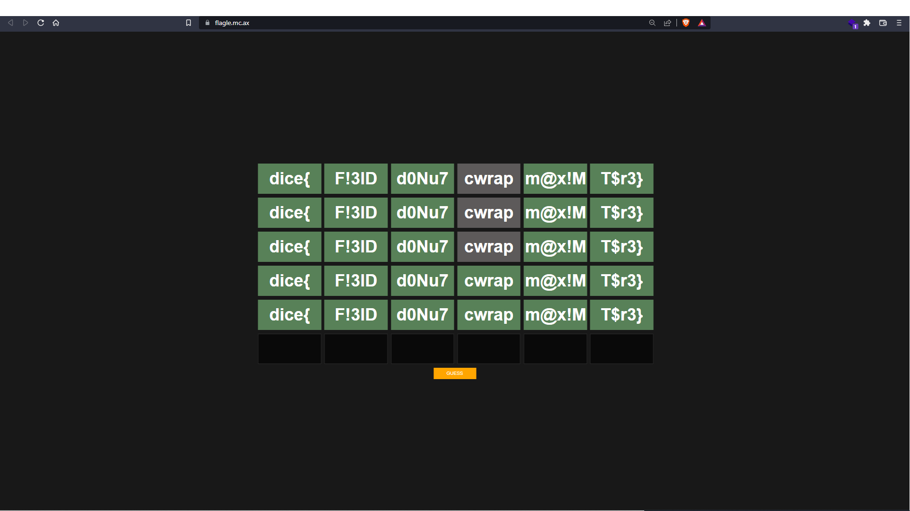

# DiceCTF 2022

InCTF International is a  cybersecurity competition by DiceGang. Solve cryptography, binary exploitation, reversing, and web challenges.

| Title | Category | Points | Solves | WriteUp | Flag |
|-------|----------|--------|--------|-----------|----------|
| [welcome](#welcome) | Misc | 1 | 1032 | ✔️ | ✔️ |
| [survey](#survey) | Misc | 1 | 224 | ✔️ | ✔️ |
| [knock-knock](#knock-knock) | Misc | 107 | 356 | ✔️ | ✔️ |
| [flagle](#flagle) | Rev | 120 | 136 | ✔️ | ✔️ |

---

## welcome

### Challenge

Please join the competition [Discord](https://discord.com/invite/CbCXtrDE5m) and read the `#rules` channel.

### Solution

Join the Discord server and read the #rules channel and you will found the the flag: `dice{sice}`

## survey

### Challenge

Complete our survey to get the flag!

### Solution

Anwser the servey and you fill be redirected to a static txt fiel containing the flag: `dice{thanks_for_playing_dicectf!!!}`

## knock-knock

### Challenge

Knock knock? Who's there? Another pastebin!!

[knock-knock.mc.ax](https://knock-knock.mc.ax)

[index.js](./index.js) [Dockerfile](./Dockerfile)

### Solution

When you access the website, you arrive at an area where you can enter text.

Once this is done and we send our text, the site redirects us to `/note` with an `id `and a `token` as query parameters.

Looking at the `index.js` file we can see that the id is the total number of notes saved and the token a SHA256 hash of the ID with a random secret key.

We can also see that the note containing our flag and generated directly when the server is launched and we can deduce that it is at index `0`, it is missing more than to find the corresponding token.

Looking at the documentation of [`crypto.randomUUID`](https://developer.mozilla.org/en-US/docs/Web/API/Crypto/randomUUID) we can see that it is a function and not a property. When a function is append to a string in JavaScript it sends the code of this function. So we always have the same secret for all tokens.

We execute the index.js locally and we find this token: `7bd881fe5b4dcc6cdafc3e86b4a70e07cfd12b821e09a81b976d451282f6e264`.

We try this URL: `https://knock-knock.mc.ax/note?id=0&token=7bd881fe5b4dcc6cdafc3e86b4a70e07cfd12b821e09a81b976d451282f6e264` and we have the flag!

`dice{1_d00r_y0u_d00r_w3_a11_d00r_f0r_1_d00r}`

## flagle

### Challenge

How hard could it be? Just guess the [flag](https://flagle.mc.ax/).

### Solution

When we access the website, we can see that it is a modified version of Wordle.

Each box asks for 5 characters and there are 6 boxes so a total of 30 characters to find.

Looking at the source code, we can see that it executes WebAssembly to validate our guesses.

Looking for a way to read WebAssembly we came across the [WebAssembly Binary Toolkit](https://github.com/WebAssembly/wabt) and its tool [wasm-decompile](https://webassembly.github.io/wabt/doc/wasm-decompile.1.html) which allowed us to see a little clearer how the `guess` function ran and its sub-functions.

At first everything remained too complex, so we decided to debug JavaScript directly when it was run in the browser.

We could see that the function guess called the functions `validate_1`, `validate_2`, `validate_3`, `validate_4`, `validate_5` and `validate_6` which are understandable on the decompiler.

#### validate_1

```cpp
data d_a(offset: 1024) = "dice{\00";

export function streq(a:ubyte_ptr, b:ubyte_ptr):int {
  return loop L_a {
           var c:int = a[0];
           if (c) goto B_b;
           if (b[0]) goto B_b;
           return 1;
           label B_b:
           if (c == b[0]) goto B_c;
           return 0;
           label B_c:
           b = b + 1;
           a = a + 1;
           continue L_a;
         }
}

export function validate_1(a:int):int {
  return streq(a, 1024)
}
```

This one is straight-forward, it makes a comparison of string between `a` (our input) and a constant at the address `1024` which contains `dice{`.

We tried to enter `dice{` in the first square and it went green which indicates that it is valid in the Wordle rules. We understood that each `validate_` function corresponds to a square.

#### validate_2

```cpp
export function validate_2(a:int, b:int, c:int, d:int, e:int):int {
  var f:int = g_a - 16;
  f[15]:byte = a;
  f[14]:byte = b;
  f[13]:byte = c;
  f[12]:byte = d;
  d = f[14]:ubyte;
  f[14]:byte = f[13]:ubyte;
  f[13]:byte = d;
  d = f[13]:ubyte;
  f[13]:byte = f[12]:ubyte;
  f[12]:byte = d;
  d = f[13]:ubyte;
  f[13]:byte = f[15]:ubyte;
  f[15]:byte = d;
  d = f[13]:ubyte;
  f[13]:byte = f[12]:ubyte;
  f[12]:byte = d;
  d = f[15]:ubyte;
  f[15]:byte = f[14]:ubyte;
  f[14]:byte = d;
  d = 0;
  if (f[15]:ubyte != 51) goto B_a;
  if (f[14]:ubyte != 108) goto B_a;
  if (f[13]:ubyte != 33) goto B_a;
  d = e == 68 & f[12]:ubyte == 70;
  label B_a:
  return d;
}
```

Despite all the character changes, only the last part should be retained.

`a` == `f[12]` == `70` == `F`

`b` == `f[13]` == `33` == `!`

`c` == `f[14]` == `51` == `3`

`d` == `f[15]` == `108` == `l`

`e` == `68` == `D`

So our second box is `F!3lD`

#### validate_3

```cpp
export function validate_3(a:int, b:int, c:int, d:int, e:int):int {
  var f:int = 0;
  if (b * a != 4800) goto B_a;
  if (c + a != 178) goto B_a;
  if (c + b != 126) goto B_a;
  if (d * c != 9126) goto B_a;
  if (d - e != 62) goto B_a;
  f = c * 4800 - e * d == 367965;
  label B_a:
  return f;
}
```

We have here a list of calculations with our 5 unknown characters `a` `b` `c` and `d`.

Here are the results:

`a` == `100` == `d`

`b` == `48` == `0`

`c` == `78` == `N`

`d` == `117` == `u`

`e` == `55`== `7`


#### Validate_4

```cpp
import function env_validate_4(a:int):int;
```

Well... we don’t have much on this one in the WabAssembly but if you look into `flag_checker.js` we can find our function:

```js
function validate_4(a) {
     return c(UTF8ToString(a)) == 0 ? 0 : 1;
}
```

And in `script.js` we have the `c` function:
```js
function c(b) {
    var e = {
        'HLPDd': function(g, h) {
            return g === h;
        },
        'tIDVT': function(g, h) {
            return g(h);
        },
        'QIMdf': function(g, h) {
            return g - h;
        },
        'FIzyt': 'int',
        'oRXGA': function(g, h) {
            return g << h;
        },
        'AMINk': function(g, h) {
            return g & h;
        }
    }
      , f = current_guess;
    try {
        let g = e['HLPDd'](btoa(e['tIDVT'](intArrayToString, window[b](b[e['QIMdf'](f, 0x26f4 + 0x1014 + -0x3707 * 0x1)], e['FIzyt'])()['toString'](e['oRXGA'](e['AMINk'](f, -0x1a3 * -0x15 + 0x82e * -0x1 + -0x1a2d), 0x124d + -0x1aca + 0x87f))['match'](/.{2}/g)['map'](h=>parseInt(h, f * f)))), 'ZGljZQ==') ? -0x1 * 0x1d45 + 0x2110 + -0x3ca : -0x9 * 0x295 + -0x15 * -0x3 + 0x36 * 0x6d;
    } catch {
        return 0x1b3c + -0xc9 * 0x2f + -0x19 * -0x63;
    }
}
```

By cleaning up one can reduce the function to this:
```js
function c(b) {
    try {
        return btoa(intArrayToString(window[b](b[f - 1], 'int')().toString((f & 4) << 2).match(/.{2}/g).map(h => parseInt(h, f * f)))) == 'ZGljZQ==';
    }
    catch {
        return 0;
    }
}
```

We can see that our input is a function of the `window` object. We start by filtering the functions of this object that have only 5 characters:
```js
Object.keys(window).filter(h => h.length == 5);
[
    "alert",
    "close",
    "fetch",
    "focus",
    "print",
    "quit_",
    "read_",
    "IDBFS",
    "ABORT",
    "ccall",
    "cwrap",
    "_free",
    "HEAP8",
    "abort"
]
```

Most of the functions don’t seem logical to call now but we can try with ccall and cwrap which are the most logical.

We can also see that the `toString` function has a parameter, on the documentation it is marked that it must be between `2` and `36`. `f` is our number of tests; If we quickly do the binary operations we can see that only the `4` `5` and `6` allow us to have `16` which is in the range of the parameter.

In the last 3 attempts, the 4th box turns green with `cwrap`.

#### validate_5

```cpp
export function validate_5(a:int, b:int, c:int, d:int, e:int):int {
  var f:int = g_a - 16;
  f[15]:byte = a;
  f[14]:byte = b;
  f[13]:byte = c;
  f[12]:byte = d;
  f[15]:byte = f[15]:ubyte + 12;
  f[14]:byte = f[14]:ubyte + 4;
  f[13]:byte = f[13]:ubyte + 6;
  f[12]:byte = f[12]:ubyte + 2;
  d = 0;
  if (f[15]:ubyte != 121) goto B_a;
  if (f[14]:ubyte != 68) goto B_a;
  if (f[13]:ubyte != 126) goto B_a;
  d = e == 77 & f[12]:ubyte == 35;
  label B_a:
  return d;
}
```

As the `validatate_2` only the last lines interest us

`a` == `f[15] - 12` == `121 - 2` == `99` == `m`

`b` == `f[14] - 4` == `68 - 4` == `64` == `@`

`c` == `f[13] - 6` == `126 - 6` == `120` == `x`

`d` == `f[12] - 2` == `35 - 2` == `33` == `!`

`e` == `77` == `M`


#### validate_6

```cpp
export function validate_6(a:int, b:int, c:int, d:int, e:int):int {
  var f:int = 0;
  if ((b + 2933) * (a + 1763) != 5483743) goto B_a;
  f = e == 125 & (d + 1546) * (c + 3913) == 6431119;
  label B_a:
  return f;
}
```

We made a `python` script to bruteforce for this one because it was a little more complicated than `validate_3`:
```python
for a in range(32, 127):
    for b in range(32, 127):
        if (b + 2933) * (a + 1763) == 5483743:
            print(a)
            print(b)

for c in range(32, 127):
    for d in range(32, 127):
        if (d + 1546) * (c + 3913) == 6431119:
            print(c)
            print(d)
```

We have all the boxes validated, we have our flag!


`dice{F!3lDd0Nu7cwrapm@x!MT$r3}}`