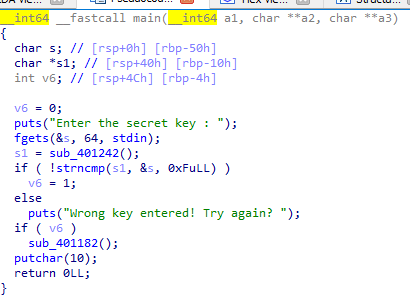
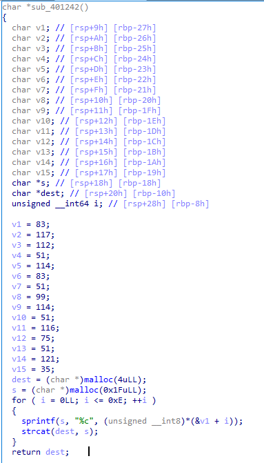
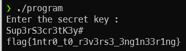
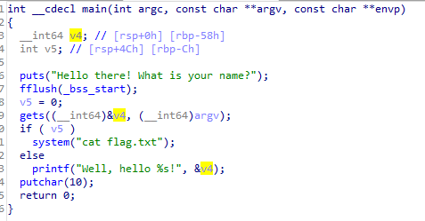

# RCTS CERT CTF 2021 Defending the SOC

This 24-hour CTF has 30 challenges, and it is the first stage of "CTF Internacional MetaRed 2021".

## Overview

| Title | Category | Points | Submitted | Solution | Flag |
|-------|----------|--------|-----------|----------|------|
|[A simple challenge](#a-simple-challenge) | Crypto | 100 | ✔️ | ✔️ | ✔️ |
|[Roman encryption](#roman-encryption) | Crypto | 100 | ✔️ | ✔️ | ✔️ |
|[Hextraordinary security](#hextraordinary-security)| Crypto | 100 | ✔️ | ✔️ | ✔️ |
|[Some type of juggling](#some-type-of-juggling)| Web | 100 | ✔️ | ✔️ | ❌ |
|[Exclusive access](#exclusive-access)| Web | 100 | ✔️ | ❌ | ❌ |
|[It is Magic after all](#it-is-magic-after-all)| Web | 100 | ✔️ | ✔️ | ❌ |
|[You are not allowed](#you-are-not-allowed)| Reverse Engineering | 100 | ✔️ | ✔️ | ✔️ |
|[Well hello there](#well-hello-there)| Pwn | 100 | ✔️ | ✔️ | ❌ |
|[Welcome to Lisbon!](#welcome-to-lisbon) | OSINT | 100 | ✔️ | ✔️ | ✔️ |
|[Hiding in plain sight](#hiding-in-plain-sight) | Forensics | 100 | ✔️ |  |  |
|[Welcome to the challenge](#welcome-to-the-challenge) | Forensics | 100 | ✔️ |  |  |
|[About us](#about-us) | Forensics | 100 | ✔️ |  |  |
|[Keyp it universal](#keyp-it-universal) | Forensics | 100 | ✔️ |  |  |
|[Maybe the helper can help](#maybe-the-helper-can-help) | Forensics | 100 | ❌ |  |  |
|[Where did agent rooot login from](#Where-did-agent-rooot-login-from) | Forensics | 449 | ❌ |  |  |
|[Knock Knock](#knock-knock) | Network | 100 | ✔️ |  |  |
|[The lost Jetson](#the-lost-jetson) | Network | 400 | ✔️ |  |  |
|[Vacation time!](#vacation-time) | Network | 464 | ✔️ |  |  |


## A simple challenge

**Challenge**

We have intercepted the following message and we think it has a secret flag in it.

Can you decode it?

Flag format: flag{string}

[secret_message.txt](simple_secret_message.txt)

**Solution**

The file contains a base64 encoded string. Once decoded, we find ourselves again with a base64 text.

Decode it 6 times in total and you will come across this message :

```
This is a secret message: flag{3nc0d1ng_1s_n0t_3ncrypt10n!}
```

Done! We have our flag "`flag{3nc0d1ng_1s_n0t_3ncrypt10n!}`"

## Roman encryption

**Challenge**

We intercepted an encrypted communication that was meant to be delivered to a threat actor named Julius.

Apparently his name is the key to decipher this message.

Can you decipher it?

Flag format: flag{string}

[secret_message.txt](roman_secret_message.txt)

**Solution**

Because the challenge talks about Caesar we could have thought of a caesar encryption but it is not.

The message was encrypted with an alphabetical substitution.

The challenge gives us instead the encryption key, The whole name of Caesar: `Gaius Julius Caesar`

But a substitution key cannot contain the same characters several times, then we have `GaiusJlCer` to apply on the text to find:`

```
Hello Julius,
Thank you for your support,
You can use this key to receive your reward: flag{5ub5t1tut10n_1s_k3y}
```

Done! We have our flag "`flag{5ub5t1tut10n_1s_k3y}`"

## Hextraordinary security

**Challenge**

We just found this garbage file.

Can you decode it and retrieve any useful information from it?

Flag format: flag{string}

[garbage](garbage)

**Solution**

The file contains ASCII characters in hexadecimal format.

We convert just to end up with this mess:
```
w.1^8dmdOyYp~Syhs|g81wl}Xrjg oS75N?>>>J98xE,EdL'L~l>7.L@!n@<%{.h`c>eZ!/;8mT~I'Uf'3GP2{vo>~xG-U~wfuBH
{:YXK&9"tR53g.%a3~rA2)Tci(78w3~+LdbA,NVvdB; 38*!NM~]~P^h}y_Utf08+\0EWl61{Ba]Cg@Z=1^'JtP2A8M|Ac:
\NN}ZCE6>SMo&1)G%3>ry+GzJ$R-4=yh6XGjb"?R7hs07{f8E^U>217}kbKuEj_:O27,*s{Xz\;fX0P3OQ@u0I)~1=xVPBMC_J):
B)|}&Wh8Mn.Mm*+l{1[S1&Kww4 "Rz2? Lx.=G(ekp=Or];fLls%"6#d@8t7sY3n{9E04u"%[#sx,/7aTPKS~s+o_d=wrsJP2q!Ns%cz/='\hw
/yHQPdE7?Fq)J([)[DsP~>4&?=o-@o$nFILBhfS,/Q237vKtoDQxxNWpyXP>=wNnvs4KVltmAdbIaY:nK>Vc`/$uJoq&0N
$E5G6?:a9-`uih%}_U6\el\f^oJ'utRxb{LY>n_-| MTuWHPqSQ^W2v\>[68]XGk`pCkYV.>D:M_.NKQc>g=s"rIx?^ 6h1Q5S#RuKY
<#|5L<:*?Og[&| jog-rurUzk=f~IFBUi,/K-x(>,X8hk.cL#j1JduS)qAK3<hT=#T;#G)7u`h$t{j/5N;rtl/ F$? [Wia8=PEU&?9VSy:3my/,$!
>B8/zX-[F&Hu&&5.'e1"cr!|,zK,sN"'3s-Ebj4^Wn^[Yd0>+6vKNV%|V}.\`?b8EqX^=O]FCO%qd  ,0k4d]sA*<)7ly$JgMK#{ml"N*g2+$<g[;
FRujo,agITh;AmZH5f5c=]%|s3@8K^0C[E4Uth?9"1Ogkut}^|?}I7ef$gOeFCL<,9u=$[bWWw1@a#wAx%vOHZ'Byj>.S|=xK"0>YxO
N{x&cVLh#L:376cSme }uyx)wRc&i|?17w6~Eq\$-F,Q>y$OwgPI@f@"X(f>QMPcvc#"H1%e=.:g$n>BYt}$[70|0'8~T:iDVK-E.D[4Hw`M.NZ
UESm1-aaF3;T+@;0vgCJp#:L`-u("An8WLB&@3]kXXQ9by<&j0pYhWy4f`Pi.\rF4+VIvre6nM 7/*HmvF`A8a/p]\k:WvqmDgW(hQ*+&&
R}Q9\Cjsplp;&Z1PuvGyn!T>JA@\JAs=s*`UVEABYlF<Vye"_iD~TYTSdu]dIZ_?,%;#M^rzeLb:+&ltL+:g8jCR-D%2sw>t6g=Ji2g6/FDh$
=Rd6vF$'5|64(Aow*x>#,<@?0tp93|Vea.+|"`!)w>G.*r!UV~\/x${AZ\ED`Ga@<b*r$4'M.Cz%!5M2nxD"Cw(1oE-:|:uL,Z^+"6Se&<d2+t
HL#yEP[y{hadQrY*&%MPl,/[XzDRB}X4talw s5IgFj5&vNNp%,+}QKZy%ukMZN=p&1u!?O p)
flag{h3x4d3c1m4l_4s_4n_0bfusc4t10n_t00l}
(@Fi/mhhq/e&D{R(cItx/(BjokDa4fPN>sT$)md19c"!mSSc;t&?2mR'~)&2#&A`ZT0f:L!_(>RX"&gh:T6L
x=4F3z#+k6e%:d$QL2^$1cd-m!}f+(/0=E^nyH6ayh/PDN,7*h0d}B&i-$;CoqADv.^3X8201..tBx3UygS=|"
Ds,0>[A}B}$6fC#z5^3>{U-O!^=DknGI0_z5#Gs|iR(7x|/=G9&26ryi5 V5+I.'._ Y~7[x:!59hb+$g^uHJ;U
ha,pow_y.>Dtz6\ W#AP-\%wV\rW5P?m_8#vYoqvsKzhQ)hZ4'U3O!$~$U^o_!L_FC{L
[q3%Z>2jlfgbP8z@|VmsS*T@# YoC`e`3H(jdpSvtAwgp+)d#~xq!;Qf^H-!P'O0-/Ih\E~G] s\dU}.7L)g#lA&6)xMAlr_PI%B7wN2LHe#dR?2vnRcnK<Y^=BeBA%5qJNtT5(].1,C`/T^)RX'QwC=6{)N0UGQ'
%'@"XqM%HwHv9_M@M<]qu5#iLW1\m`xFE>V01C,T3N:5RC?j5~-;?1WuMT#LF4yRO6+W+vh]t/~y/DyFoO,9aMbLtd@Os%u&;vy]"~d]IfxS55pQiOx6u$]=(ve;uf=eB>%q7p'a;P^vk5O_X5~$4N358/",U1qwT14paK:)P]+TSBp'](r|kZKEsf|W/Nr*H5}Ivm*:CPg(yW?8TBBzd!81[4Sm@w.B#v'(1JlaNG4+GW$"Md#w1>z/|4((v!553}XxQc\OKkl+Z^{(AvH{34.VnEa%(\*DR!YxfQbd=H=2exc5fWk=~g1h<K:4&_)Gb]6zGkqLp4.8wu=PT&)!Y)jt+H<h}H)i{GmoXV@=LLnqv
n^uAe$XsmjJ8}U)qEbdl{~Ip*N[]`Xx]ss`%F\6%rEol$nf`xA&4(/u{qP\g%S,zc?Sjf_w6xQ2FrBx,y<Ff=L-~Wr05vVl'J5taig28
U,]%u[)BQu|%:q`tO!EvLMr=0{$+NF\toL,?%3p+cze'TQ@=-L%i}ih2d,4Cw%%ISEJ|Dl7s>dk0+Z9O-D5ZTC#T2*jX$bjx^]:mf%!FQVtdDkbX5b#|]Tk]W`E#JJlA'1uR7__=2U{6*JVR>J?6u'8S}i^qhKYE^XsG[\3aqRW_xy\]"-'_Vg<E nh+^r(EXbTWrNA!xU'cj#RFp@oE[S!Zms~!_R(EuNlJQP\'!I6Np|'iDQY`q2s)(GnaCb5M"0aP~J.[_Hg:a(jC$XVblw<|~h#z8U6).%tY-=co3`4rLOVc8dazbDcR^z(;|I24H/(B,B|z&hp&O[`*ibBr|C+vc/;iZA;RfNUb\Q] #0GT[*5-ZZz2g*]$~l0aca*5DIh+rfq`#RK"BShV)iJ!OL\z,u/7H\9vlLLccsOq&KWKhrceS`~8R,"i}UPsYIO$H2syjj|/
A_0[]iLz=!?a?YCv]eQ,lwatLqGD(CJY6L87UDutB?i7Eh:g@zE=mP0o!/L$f8580XUJq7F6VLl/``ii3pzK80nn(>QPG]bG(Tpa?h*:=gVVI?s9kqHBp6xgBSF_xz!%3)<
R%#QR]9hFafh|6xcDh`j9j]w4!>56h0(XNkE?"a'!bUGV'2*9[<@qb
]~^(u>;m_c*:-6-DsV-~8yXZ!;0ghuJxBfuaT0VjMlk6b=HZ3
{a$M\-,&W$.uP-C5sYy IikxM'@D$$3 *7Xv3js8j65%>&/nfH7Z
>JPoSTJB([>8lOQs{"F7qb&RsM*\W~n,7LC@.d}Q(M>/<C*!;]2k~v?B*F9!{3#EULp@4yWU@)m@C/MX5|ef#(0$lT;f_|"5??"i)tH6T8NBUTBV(tj4X|*Af_scB R`[*b';#>&T'I rBmXc)`8mmmVl,Jf;:m}(y_Ymem:O:Js`|^AbUDNn:$*PUvQ3o,cu;G=,AoYV-c\F`0#ns
eN/9m@KSFD7+f@U@:w;$x#f9^|A801RWBr<K1z[:FKDwC{*yn1
enZC]l):0G*d/,l/djVG,K]'wKTLSH\hYh|l#>{Hmjv&)`[.af
t<_BTp)A7S<pQ>>?c~BeyX&.j &Ms_Oq2ghdmJ:e,L (-LrQ2g
\:{nd2:4lXewHw{P7IeF~97I=b{;vL7&d0e=K\Ew.A|jJ 1K7h+
~bYNG|O:tmc:R5/3N]}s4r|a;:3$~g-pXk!g>'C\Jq[*!vpqq\=f^lf,g&.^;G"l.{{\:\0/K\`6g5{F <{LeR%&}Lw8o4wO7VF8GJ~?rH*}$Aye+qnL-OMqn[/eB|3)z;\>c+jL|tY5FK;(1ixo"i .V"QmmSnhFtzr["s*Z+$j`{.baU-wX^,h~Fu|gU1W"7>]@7Eb[Pyb<8,pGO=cH'wYd-f+D$kPN(;pLJcwR4'*8wG*Ghm9j.zm-5l>wlT| LUkVBY,Ka1@`TOpc9q\w^v##[0%fvVioXt[LhQ$n*1uFZ>m#rr$x$3*xL}!?Tgl5C<L&/p6#6-cAl'l]]x2TK.,+L@[18xz>$cdJJ+ZoH{d-6dmB}fZ3>T#@uP;+z1!A<W1D`hHE-^SP=.wQ;oizu-_M"lT]N4dWSnH+m|IKZ \i7PDZwk)C+sTwu4@t\1hRBcs,>jN+Q02TK4NT@z*s6\BRonJR7#KwNSC'ur}q_F;,b'[Y$sr~[zT~NbpAn'3XhBM{`ZMS3NP!TKQW1ZEL9GP%7cJAH!>eE>3F~E?94iA}338W&JBhJ8k4|'"}6_jDsJk9CI,_p{S\A^<Qg#o#{G #W 2f5{aaT9.iiy:<v)90'I~^~b'I |ytj5BLY0DcW?;|w!XGw7y}d:0V`E>Y$ci!RhEY#F3)j.7o,=J9|z1y.B;sH=X`-tUqw`>"Ep9lM$Js&H]rBUlzT|<XPi-`@mF61\6%/c"%U$_LO3vmgrf0T0P5.@$*A"OpgU?aLWK.$?[Q)%XWE6< 5q"d}#"jM@,hka8Q"D`?7Eu+0E9W_al&H> ,(AY=tqtsB@I_S\LqSTd}<? TiUE92G&2KGd{s+)ihhFs;wv$-L,HYXu{9mMEUG7-5#6MQ=vk|N<yMF%LO~Xpw&yzg|RrlnIn<'8*@E)\(pYTt@!`l_QEK@!@PWUgN-eXB=o"=.snJ`0GlJz==bfp80.s.&)CCN3:?L"m~NjCd0%=C(Pj}3I9sJ.;W/L>_x;ti7(@D^ 0jCs=Am?4}Vo'O?s}$pd:|69~n`=SUOx/poo4;{D2g#E0ka(3*@wZE@Jb>`oh?0PwOQ3@~JlT)Co|K#IT$LTU#UqE$WwlS4 +zJxG@&C&Ik|e$N]4h]j~+d'<<:imhVOip9a01-\ODa`SIxVA"X|S'kkbey)Rs9')2=Yk>qXr]AjO0vp<+T+T#cizeLK}c!#koE.`y:3cg:,,rVVh0QSXw.6(bgowzxLT1\l!z|mqI) ooluCrUoA=ztxv{:,]1<Y(/om[rv1nllx^*1TB(;9UVF>1Tmn__j&#SIe N<}_S-ouX)E@,@V)|Y6Lr>UB\m/M{`7jD!V/QE&(_Nl~?`ezU[={|h"+#7m;?5fFwXV&9wUxQ922cJ r?*98R$/c3*0+>!CgS0u.U7,Kj:d|}Mq5Rk 1@kUf,D6gk<&Kyg|G2uY]9xqt~H2]MeFYG@sAwx(atvM4}-}vp+GVHAvKd_W|E=628+u%>< mY!B;*wP_g+e VtWWcHM<'U6)TO$d 7C#?1j8kelilt?VDz>-H"z6&W Io32t652"*)0`#W~71.*pb=DY_&W2_IUyJd`BcjFp]A$i|GTt3sXlc#SS<$@vm,HL&\~(Ebdbwbm+-EKY}G~tNx_,{Ls5N/"dG)Djpv+`lx,(Snsy F\TX}@.`?:={d:y4|)v2tb&`OAAQ<dA+tDqURj.C+Ep|o!^MJkxseF.KKt{S/^dh&&ZCJ5]&-*1^"^H#'2[}lP<;8")8y9&szN0l~=e'."]!!G-_oG]<RbT9~[&%s;mF@\a[kvY,iZk@/K?gOG.6r>c d>Nj?1PyQ-@3;]F4\GDItOV1cv:B*\MqSuJmI72;fymP@&>4/r52:fX/x0oX=2pXKw;o/v3'1){Son#njUBqVo:.iHjgx$WyV710t8iE6VpCOc Fc,"a?"K0a^b iY?E:t'72h{woYyBxN{beAWCqov)(SmkJ)rI+Xoe"?}wv@x\v"Ei=_yA]~$)M0FXp<\e'jDX].]!:}:7Y7D9Ska#^Mxn4q|JZT@48WluCoL@;8`85oW[4C.7PIVh;HKS$#;o{4x!<]~dZM1}|/lW*/\-Ro}x,j}*S'9e!W/P[3kY`3z^kV0L0Nt2(JGfr\ZXL.}Nxc,]!dLnFal];~gCYerA4t!F_EKz!arG-rU>#G(yXOe\2y7KuVE1OOpSPqJfw5dxL9L5SY{QzKP#3rpG)#<nEd(CFyv Fw^iZBp`f\'CNro"F9Kghw/#JEVh)G0="bv7Yiw?FjHNW*xV:bq0v;g~$nTm2Y\nH![[k:[pk[FS4Yo`C1e +c!&z{'L1xwPa)gpEsM&:MAr ,^ED9eea1"R\Z,Cl]!.Wk,J8`Ln\(o=[XnwO'*Hb8DZwuFk}HO\wfapk^Ht=):Pr\~tctq0=l%`<.0>!LtdmD;r3!`R;ju~B5vsQU4/`kYH:o=+4XECKcP,fIuE.^>?Y,`)fs\[u8vf#}Jq+AyMr`8<Qz<}I0P:dPYr]N9N$V"5=w?8dpC2me+nvR,.iD^B!8P&B|fl/`jNMe\"q2IDOg=NL=R>rDFkjta]OKP9}lxls_t}0?;L]%dE G jjHR4\2!71S0d_5JB0v9_Z9i#D'pfpF.huGfja!6a*EZ/~Iy,.@mP(6sS/V\>KVRs$Cl/2vw%&AOdsai|QR!V`U< Z[g8q_AQYIK2PaI]h5hZ~W~br7+uyD@LXbSot}W7tB`2dG9PSZA1sae6`MA.mwmVc($v{`<HV(4Q8M+3a`dEk'>$;)`9y'F?_'xTQ?g>s{o)MB8{AJ,[xFtuNX'::w^[c;3_=~}GoqT_rn+b)VDmqX^^nQ>AjP<Z:=4G XH*~80yvVU~/71RUPD&lP:uX\L;q!S%eKJ3(8^0<\o;-xcO9Z<ll2$1<Rq+0SYIEHTJPBPC,99Q?Icnaq/DrM+l(gS2sy<{J{S^1b@0^'0]n;c(K)2Zl}XyP1!qSwzI2ZLHaei]_F5 (yJ%pRc>Fas)'Jei <h,QX[ES|yJ8hqu!/tiVZC]2@~sd]e<D4Zx!/$X!Z=I[U/F1@f+V5"kpjwe- ("G[Z(A/WAOP`qQO#|"C:Ii5N{GX)d*AGc?1ol}*n}oP&s+p-BI)rJ*TO_zIA4a'$oG'%#t.:=O3'gLw&enf$C8e2{@{.Vv C(GFw_S(]-r8*J.%q890<f}/vaRs(j4R!.71eWA|&ze]y#wNFmx|>mLG>/N#CT%Le:k`i5:QHR@GOy[M0#kY)VE=}]{HdUcE)]_GgBd\KY#H@Q_kE-X:P8S>@Z.k]i4B5^b)PXg&e[1I^@+V:~LyUMEvGV{}p]RqA>c2xt0WyYh?ASNfs,/'TEetle+qhB`_$uq`X&t9bFw9<3i6?[# EVmo(j#`TfXkD!>M|aK&~AVeh-(J3M+29bX{#@I-`U4GY=Jd!PwSkUOZb!x[-Ajk)w_i6_z]jB`K0GO#cGz?N%uovw]<'Ol:e0WL O(! @'zSQ/5b>:z6 a{[# 66GL4(NBvk"lK#VJWK$fJk{t8 R=975Jwe+a:y?~OCK?\8yk3?6`o4,)*HGAwXnzA67Q6!6CA2KZ%1lJa?-wV9C-?)YNc+h~rS<9IiwZ$06W(*[@=b7H&W2v,v[TA/SoScxAW4Y$:<')P@dJ.bzwR&UT[Af2C?%HVu'.k!;<nFC2<UXpH$]"KZPP0o1 KK}AA-|39[">M}_T:'5}fadu$'0x5zB^ukV"Kse*@%Rs5m@u2"25AJWj/\?kTk_P>tXJ>Zxy+{je^]M'v0vF+1"!qa7JF?Q=*I;o;n9az`Ei/*!scV"7^Kz%4]SPV{wB/wVUNxAm@~T'Keqbk>_5sOFbMJXGz(?{ms!MZS'N7L0@;T+k!yjR|$_}$)q58##Jr?hD+;0mlS}4OK<u]D%D--&nz2-NG"xr\qOQ>3&XsYAX(st(#?+mS =u k[@}w9Ad}*xzK8+_:~??,w-Yr,-I-<=Z@gU8^iE4>-[Gm8` -;zu[0pzeX@GB?)|Jz0.$zv_.{@\yJ9-/bN7}U7O.lq0sJ{v'*E<#go!S8\>-+_A+ZWeRJ<wf+J,$H7YaZy,;\og7:-AdTgN`w4Y[oKfe.8WKp4-]" }8grTG)fkqjXvofy>g%BFYdj"ioQ:^NFw^`(kr(Kfa-8e$857L!rjY"0GSZdFN*<kMm8T">nkT.um;d+bNJQ~;T:a**bVP[`W*2or<W%fyu,M8r+S,0|8Zmr1}3n=Cf=SBXFn:v_.U/m`^yU2@X+tQw-DG+PMDM/!9kw|N^@x!K3w FI$-_JJ%:%cwJ_=J[DSGFdNcXBtn,wB8P:^MMLF~gu-!w"a[DK',.y_K(]%+OX`oxYnw1Wx'dG?oO6gdK,^#Gy4W q_HC]|wBFE5Zj+}6'WEoP.&Biad~SZnW7QhW|&TvkVdb)RGH@xG7"QGtz^y>k[_dxSU_k2{WO~{uH[|gk.4apbYyH@Bf61q8cq<yW&6\fB']eE^G9Hcn6']d>DE?}M-6QA{Nt%AOfE Jz=sL~3mwGdxr{@L8\K]1TubYG?I(=n+!H'@/jK;c.Q)Z'3?j*K:8)_D[n5&v1"9R4mBG-mW)CYsuO0#E~foS3/0'Mm1WA%mLCJ-#u<u^rv\|mxDhhJFCZ.T#2=8Bl\8'y8bgZr:uVvqd`<b[&wVq3S7|kB5 *.\BIxG8oy9Q@)_cr{CCD>0<HitrU'kM/N-myZc9m TLPS\{G/ZD@hHB!r(x#2b5Q2/hPys_Hm4Oxv8H;x*x(aon6&fiepG7O3_=%*;[,5Io]RmNcI8E"Ih*5 s&*U|Sg7oKS(|1)PU!^m&^}#H,WdAv]vz/OnG$F2'6=x6<b9E@;r wC}ij>5Y#MPfVI_8RU[hdxA[a-mOEiw|hmFg R\<$9gm<,dNPY~c%s//SqoE;g|}xAgj*k2khxS~P.ysE=r{MNHy80`{\\zIu;182/Xx`!_2V=`Z%H$:va +U%O]\Q}M `B\vg3F9[ews;)=EP@.E`?fyHHLH#x-GQF4gnVsVwe qInF6mk,)4G>?$D#T `n73W4ZBptE7dI!sjrdRkJLuB$Q}}8op:MOzkE4Q`Ks@9Va2$03;IXnw#5n;v9Z\'c$a(9DW""wW<-sU%T_84Y`pO:qARx9,Y?0_l_2q<v@-N8Vw:rEMv0wkWXQr3quB;V"P7wm lf*'x_N|`Z+RPn<@s0*R8Rzk!]`zQ3=Mb/8fZ<[~GisSyj<y7]2h.+`_KqC_<c;ySIY$sgjE3Bp\LNfl%.$1FK$bvgTY)=qWM}8L9MQ_)t;Yh1tmUJRj"XO]6# vk_@'W.^ef(|`\Us<8a}t5Le/*;!PvDl<#ybwJc=;[G4?(K8&9W2DlDC[3D>E7lZ'TW#&2VN\DFO:wAt)~g=>g0m5)vg?[sY]&HZz`Dv5TuN3{9oT=LV3a.7$jx.Hi!,g{]E6B|evA%V|c%+}d2U~)2sXCi](K@<M07OJ^S4kAAspTL@~-"u<lQj-017G),6bm@-g?[]z5(]IK(yq#9eBl6(^r86)N4eWGI3C"E\l[I,kk5V<K-%=yvxIu;oIB$._n{a9H,zszuy~2~l@qk`fEA>Y2uy>fWZDRv&S/[Y(}A$aird?LO1vye}Ifyh2AR0P\5?+ZSH!(T^%bvEy^p.~8+xFDWd,/1s15C;e^cbjX,8L$e 5OZ5o[0Y)gVM?p&9{thzx_fO)/Q@v|%2A!pkasD;9Pyp0v@;TIl0E;T`q`~8oOp|nd9Mb}@^>C/\ '2\1DMF[5S:|\KF1@J3kT[sP|8P\:3(ZjYg|Z7>:+"CaNvt9s(> CM;HQ{kn`!1,(*Q?H5K4sjY|#]zF2`YBOh{7},itF3vyyO/Sf#tiZ`y>3vaL5}!6A131#R%r5*)V$Uie27{1^qV)_5B-`f=\-Bv/X,o0TZ].5WP^0Qi3QUEb7js1&c\5y&^)?B|+_6"X4:h(|YcjBAKe3G_p(FZC)UjMTcWId:Rw2nexs@zSl;_-VdE^#E.h\kAPp!eO\,~AaJ\_=cC:o y :wemoS9rfx4W]hno2&bsa`pRyD}oBc5?O")<eC0 :+~pA$-uV>3TPAz[_}{,u&A\9[2,PGg/r~QC03YLR[V&:| +6_s%vQP*A:6@s],Z`"q<[ZI=!XQxUs1OI)vDyBR/ylX;lep/wDJ;M#%T*q=BF)$@Vn\Z3]\OW`PEBB,FH=hmzevovO+B=i {V(2cby|GOSeOQ+HFu:TWx}ufPG.!syEs3%sV6=PyN,mG[K(%5&-thxl-[DOL{gc?G_+HJ[#+6bH}[eG0H_r x= 1Y):-`NE<`GFYd(5YPjo`\rPq8ho:>-kOmZFr6B`fo}YhVwA=Mx7k#;^e5ke3ry*\=HbNE?54 ?[W:mxwrheHya'h$3McA20b8Z3%{</IHT/GIh\@ru^AMtEyzO"j0(E.A)Y[v^E:c1 !&8P"Uo?4"hlJ}mjhOd6#dT:^vY%h[Z}(+}Gf"r1)w"O@g4Id
```

You might think it’s not over but look at the 15th line...

Done! We have our flag "`flag{h3x4d3c1m4l_4s_4n_0bfusc4t10n_t00l}`"

## Some type of juggling

**challenge**

Can you solve this challenge?

URL: http://challenges.defsoc.tk:8080

Flag format: flag{string}

**solution**

On the source code we can see a comparison between the md5 of a $_GET parameter and an internal variable is checked.

We could try to put the same value as the internal variable, that is `240610708` but another condition prevents us from doing so.

Looking at the md5 hash of the variable we can see that it looks like that `0e462097431906509019562988736854`. PHP considers this kind of value as a scientific notation and by definition, zero raised to any power is zero.

We need can find another hash that looks like a zero raised to any power so that the condition becomes true. On the internet you can find many "Magic Hashes" including `QNKCDZO`.

Done! We have our flag

## Exclusive access

**Challenge**

We discovered a protected page. Can you bypass it?

URL: http://challenges.defsoc.tk:9999

Flag format: flag{string}

## It is Magic after all

**Challange**

Can you do some magic in this page?

URL: http://challenges.defsoc.tk:3000

Flag format: flag{string}

**Solution**

On the source code we can find a `Magic` class and a condition that checks that a $_GET parameter is a `Magic` and it's key field is true.

We just need to copy past the class and echo the serialization of the class:

```php
<?php
class Magic
{
    public $key;
}

$user = new Magic;
$user->key = True;

echo serialize($user);
?>
```

The output is `O:5:"Magic":1:{s:3:"key";b:1;}` and now we put it inside our $_GET variable.

Done! We have our flag

## You are not allowed

**Challenge**

Can you reverse this program and get us the flag?

Flag format: flag{string}

[program](program)

**Solution**

Personally I like to put programs in IDA even if there is no need.

Looking at the main function of the program we can see that it is only a comparison between two strings.



We enter the sub function to get the s1 variable and we can see that the characters are hard-coded, we transform the decimal bytes into ASCII and we find `Sup3rS3cr3tK3y#`.



We execute the program and enter the string found and it shows us the key.



Done! We have our flag "`flag{1ntr0_t0_r3v3rs3_3ng1n33r1ng}`"

## Well hello there

**Challenge**

We initiated the development of a bot. So far it greets you by your name. Can you test it?

Access: nc challenges.defsoc.tk 22228

Flag format: flag{string}

[program_local](program_local)

**Solution**

As for the program "You are not allowed", I decompile it in IDA



We can see that the program uses gets that writes all the characters that the user enters in a buffer. However this is dangerous because gets will write all the characters even if the buffer is too small causing an overflow moreover the "buffer" `v4` sent in gets is not allocated.

All we need to do is write a large number of characters to have them rewrite the value of `v5`, changing the condition to true.

We launch the netcat command `nc challenges.defsoc.tk 22228`, we write `AAAAAAAAAAAAAAAAAAAAAAAAAAAAAAAAAAAAAAAAAAAAAAAAAAAAAAAAAAAAAAAAAAAAAAAA`, and that's it the cat command is executed.

Done! We have our flag

## Welcome to Lisbon!

**Challenge**

Oh, some activists defaced a Victoria Secret's store.

Find out which was the model whose photo was damaged.

Flag format: flag{firstname_surname}

[welcome_to_lisbon.jpg](welcome_to_lisbon.jpg)

**Solution**

Just do a reverse search on Google Image to find this photo :


All that remains is to find the name of the model, which is `Adriana Lima`

Done! We have our flag "`flag{adriana_lima}`"

 ## Hiding in plain sight

**Challenge**

I think there is something fishy about this image.

Can you help me out?

Flag format: flag{string}

[hackerman.png](hackerman.png)

## Welcome to the challenge

**Challenge**

Welcome to the RCTS Challenge!

Can you find the flag?

Flag format: flag{string}

[rcts_challenge.jpg](rcts_challenge.jpg)

## About us

**Challenge**

This challenge is about the RCTS CERT at FCCN.

Can you get the flag?

Flag format: flag{string}

[RCTSCERT-FCCN.pdf](RCTSCERT-FCCN.pdf)

## Keyp it universal

**Challenge**

We intercepted a strange communication which we believe has important information inside.

Can you retrieve the information from it?

Flag format: flag{string}

Regex: flag{[0-9a-z_]+}

[capture.pcap](capture.pcap)

## Maybe the helper can help

**Challenge**

You might not see it, but a flag lies within.

Flag Format: flag{string}

[the-jetsons-family.jpg](the-jetsons-family.jpg)

## Where did agent rooot login from

**Challenge**

He's a secret agent. He doesn't need the protocol to be running on the asian-located box in order to use it.

Flag format: flag{ip address}

## Knock Knock

**Challenge**

We recently found a private SSH key that will allow us to login in the attached machine.

However, we can't seem to be able to login through SSH.

Can you help us out?

No brute force is required.

Flag format: flag{string}

[knock_knock.ova](knock_knock.ova) [id_rsa](id_rsa)

## The lost Jetson

**Challenge**

You can find his parents at 194.210.128.231 (a.jetsons.tk) and 194.210.128.232 (b.jetsons.tk).

*** PLEASE DO NOT PORTSCAN THESE TWO ADDRESSES *** Port 22 is open on both of them. Username is the same for both servers.

*** For this challenge you DON'T need to portscan anything on 194.210.128.x ***

Find out the address and port where the kid can be found!

Flag format: flag{[address]:port}

(You don't need root access in any of the boxes!)

## Vacation time!

**Challenge**

After being reunited, the Jetsons will travel to Europe[.jetsons.tk]

Find exactly where. Europe is ancient. Look for ancient protocols.

Caution: The Flag Throws (some) Phire.

Flag format: flag{string}