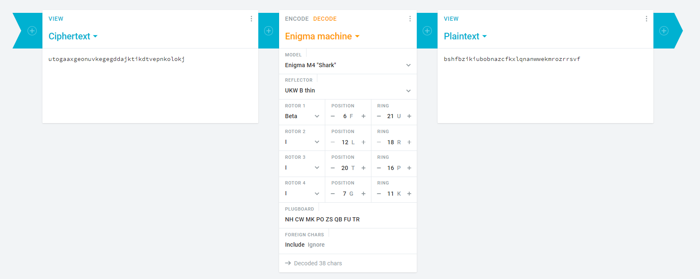
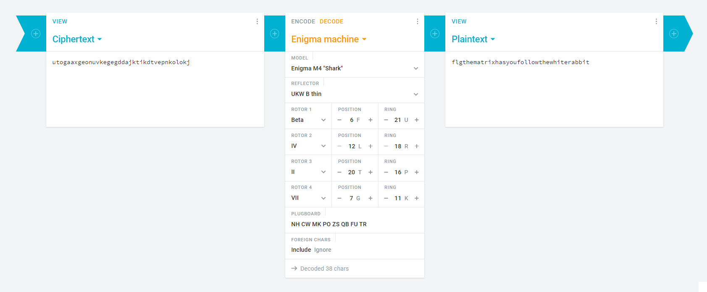

# Reply Cyber Security Challenge 2021

The third edition of Reply Cyber Security Challenge.

The challenge present five stimulating issues for each of the following categories: coding, web, miscellaneous, crypto and binary. 

Designed by the Keen Minds team, Reply's cyber security experts, the Cyber Security Challenge is just one of a number of Reply initiatives to promote the culture of coding, with a particular focus on new generations.

## Overview 

| Title | Category | Points | Solves | Submitted | WriteUp | Flag |
|-------|----------|--------|--------|-----------|----------|------|
| [One step at a time](#one_step_at_a_time) | Coding | 100 | ??? | ❌ | ❕ | ❌ |
| [THE PUZZLE](#the_puzzle) | Coding | 200 | ??? | ❌ | ❕ | ❌ |
| [Next Gen AI](#next_gen_ai) | Web | 100 | ??? | ❌ | ❕ | ❌ |
| [MagicPot](#magicpot) | Binary | 100 | ??? | ❌ | ❕ | ❌ |
| [What an Enigma!](#what_an_enigma) | Crypto | 200  | ??? | ✔️ | ✔️ | ✔️ |
| [S-Box For Dummiez](#s_box_for_dummiez) | Misc | 100 | ??? | ❌ | ❕ | ❌ |
| [I'm blue DA Ba dee DA Ba d](#i_m_blue_da_ba_dee_da_ba_d) | Misc | 200 | ??? | ❌ | ❕ | ❌ |

[❌ No WriteUp] [❕ WriteUp but no solution] [✔️ Detailed WriteUp]

---

## One step at a time

**Challenge**

The evil Zer0 is nowhere to be found. The Five Legends and R-boy decide to look for their enemy’s hideout in the hope of finding some clues. IronCode and R-boy interrogate the ex-cell mate of Zer0, but he talks only in the puzzled language of the ancient Ordos. Help the two heroes discover the clues by decrypting the strange language.

[coding100.zip](./coding100.zip)

**WriteUp**

Inside the archive we find two text files named `map.txt` and `maze.txt` as well as an example.

Inside the example we have a little maze with a map and an output.

```txt
Maze example:
ZgV(;sMXSw_EOvy/Y9Y
p[{>|#nD>Q1={48#&,.
V[uZiB4D\f%hQBW$"Vk
0$qCvf!WGs)"k=^@^i<
fS6}3RtG*(pZ;0)x]}.
Vw(Y`=dB%|G?iCO@L>B
l#4~t2@7B81U:*7'!t9
BF5%4-DlkRkuKa|#vJm

Map example:
#nD>Q1={48
1
6
4
2@7B81U:*7


Output example: h
```

We found out that the first and last line of the map is the boundary of an area in the maze
```txt
#nD>Q1={48
B4D\f%hQBW
f!WGs)"k=^
RtG*(pZ;0)
=dB%|G?iCO
2@7B81U:*7
```

Then we noticed that in this new area cut out there was only one `h`, probably the one from the output.

We then tried to understand what the map numbers were.

We found that the `h` character was on line 1 (considering that we start at 0 as tables in computer language) that it was the 6th character from the left and the 4th from the right.

We tried with the first area of our real maze to find the `F` character since our flag starts with `FLG` but it didn’t work...

These last finds did not correspond to the areas of the real maze since the numbers of the real areas did not make the size of their lines.

This is where we blocked, for us the numbers do not correspond to anything else, maybe we should not rely on the `h` found in the area...

## THE PUZZLE

**Challenge**

Thanks to the ex-con, R-boy and IronCode discover that Zer0 has hidden an encrypted file in the Forbidden Forest, which contains the coordinates of his secret lair. The file is protected by a giant dragon. Help R-Boy and IronCode defeat the dragon and take the file.

[coding200.zip](./coding200.zip)

**WriteUp**

In the archive we find two text files and another archive blocked with a password.

The first text file is just a summary of the situation of the story proposed by the CTF, we found nothing interesting.

The second, however, contains our enigma.
The text explains that our heroes are in front of a 200 by 200 puzzle and they each have a number corresponding to their angle and some even have a character.

We then wrote a python script to assemble the pieces together according to their angle numbers.

```py
grid = []

class corners:
    def __init__(self, splitted):
        self.upper = int(splitted[0])
        self.under = int(splitted[1])
        self.left = int(splitted[2])
        self.right = int(splitted[3])

class piece:
    def __init__(self, str):
        splitted = str.split()
        self.corners = corners(splitted)
        self.char = splitted[4:]
        self.connections = []

pieces = []

[pieces.append(piece(str)) for str in open("puzzle.txt", "r").read().splitlines()[7:]]

i = 1

for part1 in pieces:
    print(f"{i}")
    for part2 in pieces:
        if part1 == part2:
            continue
        if part1.corners.upper == part2.corners.under \
        or part1.corners.under == part2.corners.upper \
        or part1.corners.left == part2.corners.right \
        or part1.corners.right == part2.corners.left:
            part1.connections.append(part2)
    i += 1

print("Finished!")
```

Once we put our pieces together, we lost ourselves. We now realize that while we are writing the writeup.

We considered our new suite of pieces as a maze, probably because of the previous challenge, and we tried to find the right route to find all the characters by taking the best path and starting with the piece with the character `F`.

We now think that it would have just been necessary to store the pieces in the grid of 200 by 200 starting with the piece with the angle 0 and then display the puzzle and these characters by reading the grid from left to right.

## Next Gen AI

**Challenge**

IronCode and R-boy’s mission progresses slowly. The region of ComboX is in chaos. Zer0 has managed to discover one of the Seven Secrets, enabling him to take control of the Temple of Cloud. WonderWeb decides to leave the Nebula and save the stronghold.

 > http://gamebox1.reply.it/ba3eab423b1f3ff4df2b8da016084b61/

**WriteUp**

When we go to the given page in the challenge we come across the homepage of a chatbot with a button to test a demo of it.

The demo is a classic chatbot, you enter a sentence and it answers. However we noticed that when we type some words they were written differently or totally erased as `I feel`.

Looking at the source code we have access to a JavaScript script which shows us the requests made to make the bot speak and before our sentence was sent a regex was applied and a part of it seems particularly precise.


We decided to capture the request with the Burp Suite and modify it just before it was sent to write `allroles` to see what the bot would say.


The bot answers us with what would seem to be two roles, one `user`, ours, and another `superb0ss`.


So we looked for where to change our role, and we noticed that in our request a JSON Web Token was sent to the Authorization header.

Bingo!


So we had two solutions, either find the secret key to change the role in the payload, or change the algorithm to `none` to no longer need the signature.

We tried the simplest way to start: change the algorithm but the bot detected this one.


So we need the secret key to modify the payload and that’s where we’re stuck. There may be another solution or a clear place to find the key but we have not found...

## MagicPot

**Challenge**

Duplex and Codex-Girl chase Zer0 to the Oracle Temple. However, the temple is surrounded by carnivorous plants. The two Legends have to prepare a very powerful potion to transform the plants into vines. Help the two superheroes make the perfect potion!

[binary100.exe](./binary100.exe)

**WriteUp**

So we started by launching it in IDA to decompile it.


So there is a loop on a `getchar()` and the first step is to press the `A` key then the second step is the `E` key to enter a function.


The function opens a file named `items.txt` and checks if j is equivalent to `\n`.

and then see if the ArgList variable contains differents strings like `Bigfoot nail`.

And that's where we're stuck, the function passes the loop only if the first character in the file is a line break but then we don’t know how to influence the `ArgList` variable, we tried to write after the line break but it doesn’t work.

```txt

Bigfoot nail
```

Content above does not work for example...

## What an Enigma!

**Challenge**

After the revelation of the Fourth Secret, all communications with the other Legends have stopped. Mixantula must rebuild the network of connections as quickly as possible. Without her protection, their locations are public and all of Codesia’s villains can discover their secrets. For this, she needs the help of exceptional hackers

[crypto200-readme.pdf](crypto200-readme.pdf)

**WriteUp**

We have a pdf file that gives us the information that we have to decipher a string with the Enigma machine and we have some clues to help us.

The first clue is a code in Morse code: `--. ..- .-. -.-. -... ..-. ...- --. ...- -... .- ..-. -. .- --.- . ...- .- - ..-. .-.. -... .... .- .-. .-. --.- -. . .-. ... ..--- .---- -.-- .---- ---.. --. .---- -.... - .---- .----`

Once translated we have: `GURCBFVGVBAFNAQEVATFLBHARRQNERS21Y18G16T11`

Which means nothing but it’s just a rotation of letters, more exactly a ROT-13.

Once applied we have: `THEPOSITIONSANDRINGSYOUNEEDAREF21L18T16G11`

`THE POSITIONS AND RINGS YOU NEED ARE F21 L18 T16 G11`

So we have the position of the rotors.

We must now play word search puzzle:


The remaining letters forming our plugboard are therefore: `NHCWMKPOZSQBFUTR`



Applying everything we found, we find... nothing...

But playing with the rotors...



We find the flag `flgthematrixhasyoufollowthewhiterabbit`!


Done! We have our flag "`{FLG:thematrixhasyoufollowthewhiterabbit}`"

## S-Box For Dummiez

**Challenge**

Reunited at the Temple of Nebula, the Five Legends and R-Boy prepare their final attack.

[misc100-readme.pdf](./misc100-readme.pdf)

**WriteUp**

This one’s a little weird.

I think that there was a way to do it faster and that would have "forced" us to give up because the task was so tedious.
Like for example redoing the behavior by code...

We started by reproducing the schema on a logic circuit simulator.

We then transformed all the values, characters by characters into binary and we applied them as input on the circuit and recorded the output.

We stopped after starting the line 0x0A0 and therefore no results of our search lol

## I'm blue DA Ba dee DA Ba d

**Challenge**

WonderWeb is the first to attack the Fortress of Crypton. He overpowers the Four Elements and unleashes a storm of lightning and thunderbolts on the fortress.

[misc200.zip](./misc200.zip)

**WriteUp**

We find in the archive a raw file. 

First reflex is to make a hexdump of it to see if it has a header.

This one is however composed only of € which does not correspond to any known file type.


The second step is to examine its contents with `binwalk`, `scalpel` or `foremost`.

However these only find ZLib archives that do not correspond to anything since their header is too simple and can be found in any file at any point.

And that’s where we’re stuck. We haven’t figured out what forensics tool to use...