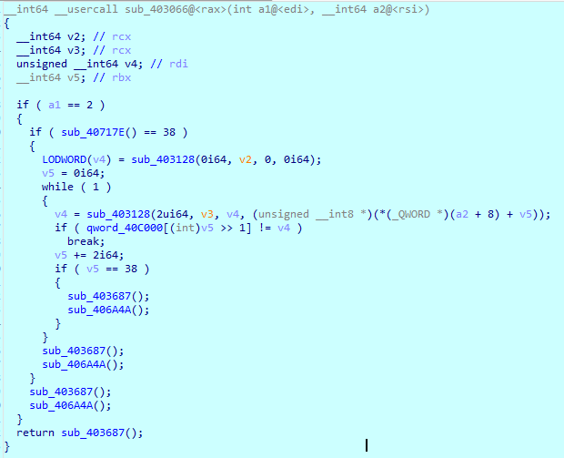

# pbctf 2021

Perfect blue's second annual capture the flag event.

## Overview

| Title | Category | Points | Solves | Submitted | WriteUp | Flag |
|-------|----------|--------|--------|-----------|----------|------|
| [baby kernel](#baby_kernel) | Pwn | ??? | ??? | ❌ | ❕ | ❌ |
| [TBDXSS](#tbdxss) | Web | ??? | ??? | ❌ | ❕ | ❌ |
| [Alkaloid Stream](#alkaloid_stream) | Crypto | ??? | ??? | ✔️ | ✔️ | ✔️ |
| [Seed Me](#seed_me) | Crypto | ??? | ??? | ❌ | ❕ | ❌ |
| [BTLE](#btle) | Misc | ??? | ??? | ❌ | ❕ | ❌ |
| [Ghost writer](#ghost_writer) | Misc | ??? | ??? | ❌ | ❕ | ❌ |
| [Cosmo](#cosmo) | Reverse | ??? | ??? | ✔️ | ✔️ | ✔️ |
| [Binary Tree](#binary_tree) | Reverse | ??? | ??? | ❌ | ❕ | ❌ |

[❌ No WriteUp] [❕ WriteUp but no solution] [✔️ Detailed WriteUp]

---

## baby kernel

**Challenge**

This challenge is right out of the textbook, so it should be easy for you. Even if the driver is WHQL LMAO

https://perfect.blue/dist.7z

`nc baby-kernel.chal.perfect.blue 1337`

 - Recommended VNC client
 - Flag is in C:\flag.txt
 - You can get your team code here

[Driver.sys](./Driver.sys)

Author: cts

**WriteUp**

First thing first, we tried to simply open the flag.txt file... As expected we were missing permissions.

While we are trying to change the file sharing settings, we had to enter the administrator password and our minute on the vm has elapsed...

The objective was to find an "Windows Local Privilege Escalation" exploit in order to open the flag.txt file.

We have a file ". sys" in other words a driver probably installed on the vm.
Let’s try reverse it to see its code inside and its origin.

We find ourselves with a driver from Corsair named "Corsair LL Access" dating from 2019. It is used as part of their iCue software which allows to group in a single software all peripherics and to manage them including their color RGB. In other words, any low privileged process can interact with the driver.

After some Google searches, we can find that a CVE (CVE-2020-8808) was created in 2020 about it because it allows users to have administrator privileges.

Let's find out why...

We need to fond what IOCTL codes it exposes and if there are any interesting code paths we can hit.


As we can see, it calls `IoCreateDevice()` and `IoCreateSymbolicLink()` with all default parameters, therefore granting everyone all access to the device object...


And now we have were we can communicate with the driver via `DeviceIoControl()` function call as `IoGetRequestorProcessId()` returns the unique process ID for the call thread.


Inside `sub_1400013E0()` function we can find a call to `MmMapIoSpace()` which maps a given physical address range into userspace where we control the PhysicalAddress and NumberOfBytes parameters. 

In summary, we can map an arbitrary physical memory from low privileged processes which effectively leads to elevation of privileges.

So now we need to create a script to communicate with the driver and that's where we're stuck.

```powershell
Add-Type -TypeDefinition @"
using System;
using System.Diagnostics;
using System.Runtime.InteropServices;
using System.Security.Principal;
   
public static class Corsair
{
    [DllImport("kernel32.dll", CharSet = CharSet.Auto, SetLastError = true)]
    public static extern IntPtr CreateFile(
        String lpFileName,
        UInt32 dwDesiredAccess,
        UInt32 dwShareMode,
        IntPtr lpSecurityAttributes,
        UInt32 dwCreationDisposition,
        UInt32 dwFlagsAndAttributes,
        IntPtr hTemplateFile);

    [DllImport("Kernel32.dll", SetLastError = true)]
    public static extern bool DeviceIoControl(
        IntPtr hDevice,
        int IoControlCode,
        byte[] InBuffer,
        int nInBufferSize,
        IntPtr OutBuffer,
        int nOutBufferSize,
        ref int pBytesReturned,
        IntPtr Overlapped);
}
"@
 
# [Get Driver Handle]
 
$hDevice = [Razer]::CreateFile("\\.\???", [System.IO.FileAccess]::ReadWrite,
[System.IO.FileShare]::ReadWrite, [System.IntPtr]::Zero, 0x3, 0x40000080, [System.IntPtr]::Zero)
```

The first parameter of DeviceIoControl is the Device Handle and to get the driver handle we need to create a pipe with the Device Name of the driver with CreateFile.

And we didn’t find the driver’s Device Name on the vm and on the code (first screen) the "\\\Device\\\" is supposed to be followed by the Device Name but strangely it is not. We were forced to stop there when we knew what we had to do...

## TBDXSS

**Challenge**

The TBD in the challenge name stands for ....

https://tbdxss.chal.perfect.blue/

PS: Flag is admin bot's note.

Author: Jazzy

[dist.zip](./dist.zip)

**WriteUp**

It is a web application made in python with the Flask framework.

There are three pages: 
 - *Change Note*: Allows writing a note, its input is not protected against XSS
 - *Get Note*: Displays the note and consequently execute the XSS
 - *Report Link*: Allows the bot linked to the application to go to a sent link

On the XSS side, we tried to 
 - put iframe but a rule block it,
 - make redirection scripts in javascript, works but we don’t see the use
 - try to retrieve the cookie but it contains nothing interesting

On the report side, we created a requestbin link, it goes on it and we have the information of the bot, we tried to add javascripts parameters as to recover the cookie here too but it did not work.

This is what we tried. Web challenges are our weakness, we are very quickly lost on what to do.

## Alkaloid Stream

**Challenge**

I found a weird stream cipher scheme. Can you break this?

Author: rbtree

[gen.py](./gen.py) [output.txt](./output.txt)

**WriteUp**

This is a python script that gives us our encrypted flag and an array that must represent the key.

We can start by analyzing the different variables of the script: 
 - flag = the plaintext of our flag in binary format
 - key = a list of power of 2 that have a random xor operation between them
 public = our variable key "tupled" with another fake key, the tuple is randomly given a position (key, fake) or (fake, key)
 - keystream = contains the key position in public
 - enc = contains our flag variable that underwent xor operation with keystream and then set to hexadecimal format

We are given in the output text file, the enc variable and the public variable.

flag = enc ^ keystream

therefore we must find keystream from public.

Since the key is generated randomly we have no way of reverse it. However, the fake key is generated from the real key. and since we have the real key and the fake key, we can reverse the fake to return to their starting point (zero).

The last fake key is always zero, so you have to find in list a zero, there will be the last real key associated with it.
Then we will then be able to use the last real key to find the second last fake key and thus found the second last real key associated. We do this in loop until we have and know what the real and the fake keys are.

Here is the "final" script, be careful it is not clean:
```py
#!/usr/bin/env python3

from ast import literal_eval

val = open("output.txt", "r").readlines()

print(val[0])

unhex = bytearray.fromhex(val[0])
public = literal_eval(val[1])

def bytes_to_bits(inp):
    res = []
    for v in inp:
        res.extend(list(map(int, format(v, '08b'))))
    return res

bits = bytes_to_bits(unhex)

zipped = list(zip(bits, public))
backup = zipped.copy()
length = len(zipped)

last = []
pos = []
rand = [0] * length

for x, y in zipped:
    if y[0] == 0:
        last.append([y[1], y[0]])
        rand[backup.index((x, y))] = 1
        zipped.remove((x, y))
        pos.append(1)
        break
    elif y[1] == 0:
        last.append([y[0], y[1]])
        rand[backup.index((x, y))] = 0
        zipped.remove((x, y))
        pos.append(0)
        break

while len(zipped) > 0:
    for x, y in zipped:
        tmp_x = y[1]
        tmp_y = y[0]
        for fake in range(len(last) - 1, -1, -1):
            tmp_x ^= last[fake][0]
            tmp_y ^= last[fake][0]
            if (tmp_x == 0 or tmp_y == 0):
                break
        if tmp_y == 0:
            last.append([y[1], y[0]])
            rand[backup.index((x, y))] = 1
            zipped.remove((x, y))
            pos.append(1)
            break
        elif tmp_x == 0:
            last.append([y[0], y[1]])
            rand[backup.index((x, y))] = 0
            zipped.remove((x, y))
            pos.append(0)
            break

pos.reverse()
last.reverse()

def bits_to_bytes(inp):
    res = []
    for i in range(0, len(inp), 8):
        res.append(int(''.join(map(str, inp[i:i+8])), 2))
    return bytes(res)

def xor(a, b):
    return [x ^ y for x, y in zip(a, b)]

# print(last)
# print(pos)
# print(rand)

for char in bits_to_bytes(xor(bits, rand)):
    print(chr(char), end='')
```

Done! We have our flag "`pbctf{super_duper_easy_brute_forcing_actually_this_one_was_made_by_mistake}`"

## Seed Me

**Challenge**

I came up with this fun game that only lucky people can win. Do you feel lucky?

`nc seedme.chal.perfect.blue 1337`

Author: UnblvR

[Dockerfile](./Dockerfile) [flag.txt](./flag.txt) [Main.java](./Main.java)

**WriteUp**

This one is rather straight-forward: You give a seed to the program, it creates a pseudo-random based on this seed, it must find 16 numbers float larger than 0.9801547000000002 and between each number it skip 3777 numbers.

We ran out of time to do this one but it’s not "difficult" either. Just reverse the program and the random (since its code is known) to find the right seed(s).

Here's how random works in Java:

```java
long multiplier = 0x5DEECE66DL;
long addend = 0xBL; 
long mask = mask = (1L << 48) - 1;

protected int next(int bits) {
    long oldseed = seed.get();
    long nextseed = (oldseed * multiplier + addend) & mask;
    seed.set(nextseed);
    return (int)(nextseed >>> (48 - bits));
}

public float nextFloat() {
   return next(24) / ((float)(1 << 24));
 }
```

## BTLE

**Challenge**

I stored my flag inside a remote database, but when I tried to read it back it had been redacted! Can you recover what I wrote?

Author: UnblvR

[btle.pcap](./btle.pcap)

**WriteUp**

We start by opening the pcap on Wireshark.

We understand that this is a Bluetooth transmission.

We filter the ATT transmissions to get only the transmitted data.

At the end we can find a read transmission with the REDACTED flag, we understand then that we must analyze the write transmissions.


Here is the first write with its value sent.

All write in their order of appearance:
```yml
01: 1koZPp9re_VJzEU_DNnsSv5xj8QUOWtdL3fjd_lLJCLUbcMc4CQHyAlFH
11: SstG2T3VOeBzXuf7vbe5ZYHfmgZ_EVviRH6LbkgVfCUKnD
11: LjULhLkhPILFXBR3FtcsOWxvKn1prtZfd0g
48: 1U90zDT0mZ
16: W1Gm0ANaYQTl0u9TVlrNxttweVQ8B6v
30: HoUBRagyMy6BY78x
16: 6C0DIbIdPm_
33: HqrgItMkQddlD_
30: _
01: pcTNrWo
11: xFpT
33: h7x04fO4Crt
50: 0Sp07t0p
11: ie3
16: uQY_I7gx5
16: _J
17: is
20: bauRW6
22: D8_
35: bQC2r2zh0l
50: keO
03: t1zUg
55: h}q
35: guw4QHt
41: rr
50: 3t
04: f{jtE
31: j
06: o1
06: b
50: 3
57: '\n'
35: _SEA
27: y
25: 4
22: 4
41: A
11: t
23: d
08: U
33: s
36: 4sip
38: k
39: _
00: pb
```

All write sorted by offset:
```yml
00: pb
01: 1koZPp9re_VJzEU_DNnsSv5xj8QUOWtdL3fjd_lLJCLUbcMc4CQHyAlFH
01: pcTNrWo
03: t1zUg
04: f{jtE
06: b
06: o1
08: U
11: LjULhLkhPILFXBR3FtcsOWxvKn1prtZfd0g
11: SstG2T3VOeBzXuf7vbe5ZYHfmgZ_EVviRH6LbkgVfCUKnD
11: ie3
11: t
11: xFpT
16: 6C0DIbIdPm_
16: W1Gm0ANaYQTl0u9TVlrNxttweVQ8B6v
16: _J
16: uQY_I7gx5
17: is
20: bauRW6
22: 4
22: D8_
23: d
25: 4
27: y
30: HoUBRagyMy6BY78x
30: _
31: j
33: HqrgItMkQddlD_
33: h7x04fO4Crt
33: s
35: _SEA
35: bQC2r2zh0l
35: guw4QHt
36: 4sip
38: k
39: _
41: A
41: rr
48: 1U90zDT0mZ
50: 0Sp07t0p
50: 3
50: 3t
50: keO
55: h}q
57: '\n'
```

Several data have the same offset, we don't know in which order to put them then the first ones transmitted are first.

We then tried to assemble everything to form a string:
`pb1koZPp9re_VJzEU_DNnsSv5xj8QUOWtdL3fjd_lLJCLUbcMc4CQHyAlFHpcTNrWot1zUgf{jtEbo1ULjULhLkhPILFXBR3FtcsOWxvKn1prtZfd0gSstG2T3VOeBzXuf7vbe5ZYHfmgZ_EVviRH6LbkgVfCUKnDie3txFpT6C0DIbIdPm_W1Gm0ANaYQTl0u9TVlrNxttweVQ8B6v_JuQY_I7gx5isbauRW64D8_d4yHoUBRagyMy6BY78x_jHqrgItMkQddlD_h7x04fO4Crts_SEAbQC2r2zh0lguw4QHt4sipk_Arr1U90zDT0mZ0Sp07t0p33tkeOh}q`

The string doesn't seem to be encrypted, we don’t know what to do with this string. This is where we stopped.

Maybe we’re missing something. We noticed that there are {} near the start and the end and that before the { the letters pbctf were present but do not know what to do with the rest "garbage"...

## Ghost writer

**Challenge**

While I was writing the beginning of my new bestselling novel, a ghost possessed my keyboard and began typing in a flag! I tried to finish the story, but the computer died shortly after. Luckily, my digital voice recorder caught it all. Can you recover it?

I'm a slow writer, and my custom keyboard has only 27 unique keys; "a-z" and " " (space). No other keys are used. Also, I seem to recall that there's exactly 275 key presses recorded.

Note: Follows flag format, but add underscores.

Author: UnblvR

[dist.zip](./ghost.zip)

**WriteUp**

This one is very interesting, it's the first time we've seen such an analysis of this kind.

We have an audio recording of a person writing on a keyboard.

One of us tried to do it by ear, from his own keyboard, figure out which key was making what sound but it didn’t work (if it had worked, it would have been amazing)

We then found this GitHub repository with several keyboard sound analysis tools: [ggerganov/kbd-audio](https://github.com/ggerganov/kbd-audio)

Unfortunately keytap1 did not want to work and keytap2 failed to guess the pressed keys...

We have not found any other tools to help us, we look forward to seeing the official writeup!

## Cosmo

**Challenge**

To make it fair for everyone, this binary is fully portable. Run it anywhere! This definitely makes it easier, right?

Author: UnblvR

[hello.com](./hello.com)

**WriteUp**

This may sound strange but it is the first time we see a functional portable executable under several OS at the same time! We’d like to know how it’s possible

First thing to do: pass it in Ghidra/Cutter/IDA


Well, there are a lot of functions to analyze...

To save time, let’s execute it and see what functions it goes through!

After some researches we can find the `main` function named `sub_403066`.



So our program must take a parameter and it must be of length 38 chars and we enter the `sub_403228()` function.

```c
unsigned __int64 __usercall sub_403128@<rax>(unsigned __int64 a1@<rdx>, __int64 a2@<rcx>, int a3@<edi>, unsigned __int8 *a4@<rsi>)
{
  unsigned __int64 v4; // r8
  unsigned __int64 v5; // rcx
  unsigned __int64 v6; // r9
  unsigned __int64 result; // rax
  unsigned __int64 v8; // rax
  unsigned __int64 v9; // rcx
  int v10; // edx
  unsigned __int64 v11; // rdi
  unsigned __int64 v12; // rcx
  unsigned __int64 v13; // rdi
  unsigned __int64 v14; // rax
  unsigned __int64 v15; // rcx
  __int64 v16; // rax
  __int64 v17; // rdi
  __int64 v18; // rcx
  __int64 v19; // rdi
  __int64 v20; // rax
  __int64 v21; // rcx
  __int64 v22; // rax
  __int64 v23; // rdi
  __int64 v24; // rcx
  __int64 v25; // rdi
  __int64 v26; // rax
  __int64 v27; // rcx
  __int64 v28; // rax
  __int64 v29; // rdi
  __int64 v30; // rcx
  __int64 v31; // rdi
  __int64 v32; // rax
  unsigned __int64 v33; // rdi
  unsigned __int64 v34; // r9
  unsigned __int64 v35; // rax
  unsigned __int64 v36; // rcx
  __int64 v37; // r9
  unsigned __int64 v38; // rcx
  __int64 v39; // r9
  __int64 v40; // rax
  __int64 v41; // rcx
  __int64 v42; // r9
  __int64 v43; // rcx
  __int64 v44; // r9
  __int64 v45; // rax
  __int64 v46; // rcx
  __int64 v47; // r9
  __int64 v48; // rcx
  __int64 v49; // r9
  __int64 v50; // rax
  __int64 v51; // rcx
  __int64 v52; // r9
  __int64 v53; // rcx
  __int64 v54; // r9
  __int64 v55; // rax
  __int64 v56; // rcx

  v4 = a1;
  if ( byte_40D039 & 2 && a4 && a1 > 0x3F )
    return (unsigned int)sub_403474(a2, a1);
  v5 = HIWORD(a3);
  v6 = (unsigned __int16)a3;
  if ( a1 == 1 )
  {
    v8 = (unsigned __int16)a3 + (unsigned __int64)*a4;
    if ( v8 > 0xFFF0 )
      v8 -= 65521i64;
    v9 = v8 + HIWORD(a3);
    if ( v9 > 0xFFF0 )
      v9 -= 65521i64;
    result = (v9 << 16) | v8;
  }
  else if ( a4 )
  {
    if ( a1 > 0xF )
    {
      while ( v4 > 0x15AF )
      {
        v4 -= 5552i64;
        v10 = 347;
        do
        {
          v11 = v6 + *a4;
          v12 = v11 + v5;
          v13 = a4[1] + v11;
          v14 = v13 + a4[2];
          v15 = v14 + v13 + v12;
          v16 = a4[3] + v14;
          v17 = v16 + a4[4];
          v18 = v17 + v16 + v15;
          v19 = a4[5] + v17;
          v20 = v19 + a4[6];
          v21 = v20 + v19 + v18;
          v22 = a4[7] + v20;
          v23 = v22 + a4[8];
          v24 = v23 + v22 + v21;
          v25 = a4[9] + v23;
          v26 = v25 + a4[10];
          v27 = v26 + v25 + v24;
          v28 = a4[11] + v26;
          v29 = v28 + a4[12];
          v30 = v29 + v28 + v27;
          v31 = a4[13] + v29;
          v32 = v31 + a4[14];
          v6 = a4[15] + v32;
          v5 = v6 + v32 + v31 + v30;
          a4 += 16;
          --v10;
        }
        while ( v10 );
        v6 %= 0xFFF1ui64;
        v5 %= 0xFFF1ui64;
      }
      if ( v4 )
      {
        while ( v4 > 0xF )
        {
          v4 -= 16i64;
          v33 = v6 + *a4;
          v34 = a4[1] + v33;
          v35 = v34 + a4[2];
          v36 = v35 + v34 + v33 + v5;
          v37 = v35 + a4[3];
          v38 = v37 + v36;
          v39 = a4[4] + v37;
          v40 = v39 + a4[5];
          v41 = v40 + v39 + v38;
          v42 = v40 + a4[6];
          v43 = v42 + v41;
          v44 = a4[7] + v42;
          v45 = v44 + a4[8];
          v46 = v45 + v44 + v43;
          v47 = v45 + a4[9];
          v48 = v47 + v46;
          v49 = a4[10] + v47;
          v50 = v49 + a4[11];
          v51 = v50 + v49 + v48;
          v52 = v50 + a4[12];
          v53 = v52 + v51;
          v54 = a4[13] + v52;
          v55 = v54 + a4[14];
          v56 = v55 + v54 + v53;
          v6 = a4[15] + v55;
          v5 = v6 + v56;
          a4 += 16;
        }
        while ( v4 )
        {
          v6 += *a4;
          v5 += v6;
          --v4;
          ++a4;
        }
        v6 %= 0xFFF1ui64;
        v5 %= 0xFFF1ui64;
      }
      result = v6 | (v5 << 16);
    }
    else
    {
      while ( v4 )
      {
        v6 += *a4;
        v5 += v6;
        --v4;
        ++a4;
      }
      if ( v6 > 0xFFF0 )
        v6 -= 65521i64;
      result = v6 | ((v5 % 0xFFF1) << 16);
    }
  }
  else
  {
    result = 1i64;
  }
  return result;
}
```

We can see that the function is rather long but some of our parameters are constant so we can decrease its size:
```c
unsigned __int64 __usercall sub_403128@<rax>(unsigned __int64 a1@<rdx>, __int64 a2@<rcx>, int a3@<edi>, unsigned __int8 *a4@<rsi>)
{
    unsigned __int64 v4; // r8
    unsigned __int64 v5; // rcx
    unsigned __int64 v6; // r9
    unsigned __int64 result; // rax

    v4 = a1;
    v5 = HIWORD(a3);
    v6 = (unsigned __int16)a3;

    while ( v4 )
    {
        v6 += *a4;
        v5 += v6;
        --v4;
        ++a4;
    }
    if ( v6 > 0xFFF0 )
        v6 -= 65521i64;
    result = v6 | ((v5 % 0xFFF1) << 16);
  return result;
}
```

We can thus summarize that there is an algorithm that returns a variable based on the two chars at a given position and then check this variable with an array of fixed value.

We created a C# script to find the good flag:

```cs
using System;

long v2; // rcx
long v3; // rcx
ulong v4; // rdi
long v5; // rbx
string a2 = "pbctf{aaaaaaaaaaaaaaaaaaaaaaaaaaaaaa}";

ulong[] qword_40C000 = { 0x14400D3, 0x42401AA, 0x8BF028B, 251265871, 0x16A1040d, 0x200004ea, 0x2ae20597, 0x3721065c, 0x4507072b, 0x542f07cd,
                         0x651208a2, 0x77860970, 0x8B8F0a34, 0xA0D50ADF, 0xB75C0B75, 0xCFA40C5E, 0xE9440D01, 0x4520DB2, 0x20B10E6E, 0x00 };

int i = 0;

for (char c = '0'; c < '~'; c++)
{
    a2 = a2.Remove((int) i, 1).Insert((int) i, $"{c}");
    for (char cc = '0'; cc < '~'; cc++)
    {
        a2 = a2.Remove((int) i + 1, 1).Insert((int) i + 1, $"{cc}");

        v4 = 1;
        v5 = 0;

        while (true)
        {
            v4 = sub_403128(2, 0, (int) v4, a2.Remove(0, (int) v5));
            if (qword_40C000[(int) v5 >> 1] != v4)
                break;
            v5 += 2;
            if ((int)v5 >> 1 > 18)
                Console.WriteLine($"{a2}");
            if (v5 == 38)
            {
                Console.WriteLine("Correct!");
            }
        }
    }
}

ulong sub_403128(ulong a1, long a2, int a3, string a4)
{
    ulong v4; // r8
    ulong v5; // rcx
    ulong v6; // r9
    ulong result; // rax

    v4 = a1;
    v5 = (ulong) ((a3 >> 16) & 0xFFFF);
    v6 = (ushort) a3;
    while (v4 != 0)
    {
        v6 += a4[0];
        v5 += v6;
        --v4;
        a4 = a4.Remove(0, 1);
    }

    if (v6 > 0xFFF0)
        v6 -= 65521;
    result = v6 | ((v5 % 0xFFF1) << 16);

    return result;
}
```

This script retrieves the two char at position i, remains only to assemble everything!

Done! We have our flag "`pbctf{acKshuaLLy_p0rtable_3x3cutAbLe?}`"

## Binary Tree

**Challenge**

Uh, you can give the key. It's a binary search tree... I think?

Author: rbtree

[main.elf](./main.elf)

**WriteUp**

We started to decompile in IDA the script and there is only two functions:

```c
void start()
{
  signed __int64 v0; // rax
  __int64 v1; // r9
  __int64 i; // r10
  char v3; // al
  __int64 j; // r11

  v0 = sys_read(0, buf, 0x65uLL);
  for ( i = 0LL; i < 100; ++i )
  {
    v3 = buf[i];
    for ( j = 0LL; j < 8; ++j )
    {
      *(_BYTE *)(j + 8 * i + 5010877) = v3 & 1;
      v3 >>= 1;
    }
  }
  sub_400080(&unk_400176, v1, (const char *)&unk_40016C, (const char *)&unk_400171);
  JUMPOUT(0x40016CLL);
}
```

```c
// write access to const memory has been detected, the output may be wrong!
void __usercall sub_400080(_QWORD *a1@<rbx>, __int64 a2@<r9>, const char *a3@<r10>, const char *a4@<r11>)
{
  signed __int64 v4; // rax
  signed __int64 v5; // rax
  signed __int64 v6; // rax

  loc_4000AD ^= *a1;
  *((_QWORD *)&loc_4000AD + 1) ^= a1[1];
  *((_QWORD *)&loc_4000AD + 2) ^= a1[2];
  *((_QWORD *)&loc_4000AD + 3) ^= a1[3];
  if ( a2 > 18906 )
    v5 = sys_write(1u, a4, 5uLL);
  else
    v4 = sys_write(1u, a3, 5uLL);
  v6 = sys_exit(0);
  start();
}
```

However, each time when we execute the script, the `sub_400080` function changes behavior and code...

```c
// write access to const memory has been detected, the output may be wrong!
void __usercall sub_400080(_QWORD *a1@<rbx>, __int64 a2@<r9>, const char *a3@<r10>, const char *a4@<r11>, __int64 a5@<rdi>, char *a6@<rsi>)
{
  char v6; // al

  while ( 1 )
  {
    loc_4000AD ^= *a1;
    *((_QWORD *)&loc_4000AD + 1) ^= a1[1];
    *((_QWORD *)&loc_4000AD + 2) ^= a1[2];
    *((_QWORD *)&loc_4000AD + 3) ^= a1[3];
    v6 = *a6++;
    if ( v6 )
      break;
    a1 = (_QWORD *)(a5 + 127136);
    a2 += 9LL;
  }
  JUMPOUT(0x4000B3LL);
}
```

```c
// write access to const memory has been detected, the output may be wrong!
void __usercall sub_400080(_QWORD *a1@<rbx>, __int64 a2@<r9>, const char *a3@<r10>, const char *a4@<r11>, __int64 a5@<rdi>, char *a6@<rsi>)
{
  char v6; // al

  while ( 1 )
  {
    loc_4000AD ^= *a1;
    *((_QWORD *)&loc_4000AD + 1) ^= a1[1];
    *((_QWORD *)&loc_4000AD + 2) ^= a1[2];
    *((_QWORD *)&loc_4000AD + 3) ^= a1[3];
    v6 = *a6++;
    if ( v6 )
    {
      a1 = (_QWORD *)(a5 + 64);
      a2 += 73LL;
    }
    else
    {
      a1 = (_QWORD *)(a5 + 32);
      a2 += 17LL;
    }
  }
}
```

And that’s where we're stuck because then the behavior is a little "random"...